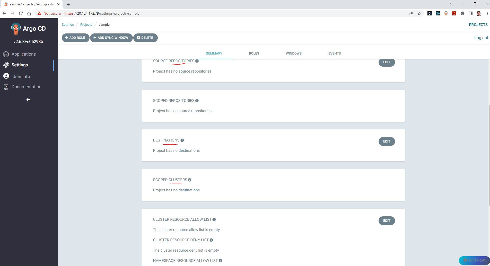

## Introduction

**Argo CD Projects explained**

ArgoCD Projects are a way to group related applications together in order to manage them as a single unit. When you create a project, you can define access control policies that limit which users or teams can access and deploy applications within the project. You can also define shared configuration settings that are applied to all applications within the project. This can help to ensure consistency across deployments and reduce the risk of misconfigurations.

ArgoCD Projects provide a logical boundary for organizing and managing deployments. 

ArgoCD Projects are a key feature of ArgoCD that provide a powerful tool for managing deployments and enforcing security policies across complex environments.


Projects provide a logical grouping of applications, which is useful when Argo CD is used by multiple teams.

for example: 

- Project-1
    - Application-1
    - Application-2
    - Application-3
    - Application-4

- Project-2
    - Application-5
    - Application-6
    - Application-7
    - Application-8

Projects provide the following features:

- Restrict `what` may be deployed (trusted Git source repositories)
- Restrict `where` apps may be deployed to (destination AKS clusters and namespaces)
- Restrict what `kinds of objects` may or may not be deployed (e.g., RBAC, CRDs, DaemonSets, NetworkPolicy etc…)


By default, argo cd comes with “default” project.

**Default Project**

Every application belongs to a single project. If unspecified, an application belongs to the default project, which is created automatically and by default, permits deployments from any source repo to any cluster, and all resource Kinds. The default project can be modified, but not deleted. When initially created, it’s specification is configured to be the most permissive:


```
spec:
  sourceRepos:
  - '*'
  destinations:
  - namespace: '*'
    server: '*'
  clusterResourceWhitelist:
  - group: '*'
    kind: '*'
```


Project can be created in 3 ways in ArgoCD:

- Declarative
- CLI
- Web UI
  

## Prerequisites

- login to Azure
- Connect to AKS cluster
- Login to argocd
- Login to azure devops


## Implementation Details

In this exercise we will accomplish & learn how to `Create a new project in ArgoCD using Web UI`

1. Log in to the ArgoCD web UI.
2. Click on the "Settings" icon in the left sidebar.
3. Select "Projects" from the dropdown menu.
4. Click the "New Project" button.
5. Enter a name for the new project.
6. (Optional) Add a description for the project.
7. Specify the source of the project. You can select a Git repository or a Helm chart repository as the source.
8. (Optional) Set up SSO or RBAC for the project.
9. Click "Create" to create the new project.

[{:style="border: 1px solid black; border-radius: 10px;"}](images/image-10.jpg){:target="_blank"}

[{:style="border: 1px solid black; border-radius: 10px;"}](images/image-11.jpg){:target="_blank"}

Once the project is created, you can use it to manage and deploy applications. You can add applications to the project by either connecting to a Git repository or adding them manually.
