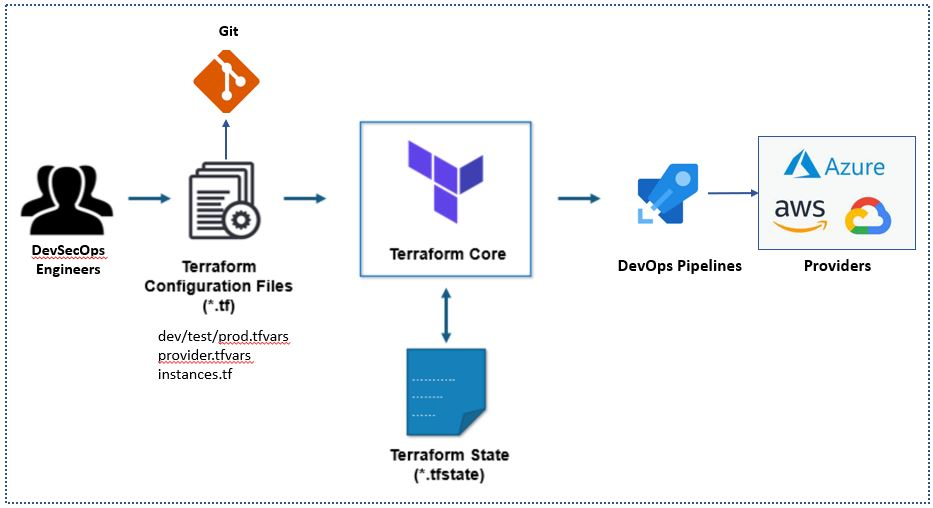

# Chapter 1: Fundamentals of Infrastructure as Code (IaC)

This is the first chapter of the book. In this chapter, you will learn the fundamental concepts related to **Infrastructure as Code (IaC)**, including what it is, its benefits, and why it matters. You’ll also explore the differences between declarative and imperative approaches, followed by an introduction to **Terraform**—its advantages, key concepts, installation steps, and best practices.


## What is Infrastructure as Code (IaC)?

**Infrastructure as Code (IaC)** is the practice of managing and provisioning cloud resources using code-based, rather than configuring them manually. IaC enables you to define, deploy, and maintain infrastructure using code — much like how developers write and manage application code.

This approach transforms cloud infrastructure into a **version-controlled**, **repeatable**, and **automated** process—reducing manual effort, minimizing errors, and significantly increasing deployment speed.


## Architecture Diagram 

The following diagram shows the high level architecture of IaC process.

[{:style="border: 1px solid black; border-radius: 10px;"}](images/image-35.jpg){:target="_blank"}

## Benefits of IaC

Some benefits of IaC include:

- **Faster deployment:** IaC allows for rapid and consistent deployment of infrastructure, reducing the time it takes to set up and configure environments.
- **Improved reliability:** By automating the deployment and management of infrastructure, IaC reduces the risk of human error and ensures consistency across environments.
- **Increased scalability:** IaC enables teams to easily scale infrastructure resources up or down as needed, without manual intervention.
- **Better collaboration:** By storing infrastructure code in version control, teams can collaborate on changes and track changes over time.
- **Greater agility:** IaC allows for more agile development and deployment, making it easier to iterate quickly and respond to changing requirements.

There are several tools available for implementing IaC, including Terraform, AWS CloudFormation, and Ansible. These tools allow teams to define infrastructure as code and manage the deployment and configuration of infrastructure resources in an automated and repeatable way.

## Why Infrastructure as Code Matters

Traditional infrastructure setup involved manually configuring servers, databases, networks, and more. This approach was slow, error-prone, and inconsistent across environments.

With IaC, you can:

* Provision resources quickly and consistently
* Track changes using version control systems like Git
* Eliminate configuration drift between environments
* Enable collaboration between teams using shared code
* Integrate infrastructure into CI/CD pipelines


## Declarative vs. Imperative Approaches

IaC tools follow either a **declarative** or **imperative** style.

* **Declarative (e.g., Terraform, Pulumi):**
  You describe *what* the desired state of the infrastructure should be. The tool figures out *how* to achieve that state.

  Example: "I want an AKS cluster with 3 nodes and a PostgreSQL server in region X."

* **Imperative (e.g., Ansible scripts, Bash):**
  You define *step-by-step instructions* to reach the target infrastructure state.

  Example: "First create a virtual network, then create a subnet, then deploy the AKS cluster."

Terraform uses a **declarative** approach, which results in **idempotent** operations—you can run the same code multiple times with the same result.


## Introducing Terraform

**Terraform**, by HashiCorp, is one of the most widely adopted Infrastructure as Code tools. It allows you to:

* Define infrastructure in a high-level **.tf configuration language**
* Apply configurations across multiple cloud providers (Azure, AWS, GCP)
* Use **modules** to organize reusable code
* Manage changes with a robust **execution plan and state management system**

Terraform becomes the **source of truth** for your infrastructure.

Here are some advantages of Terraform over other tools:

- **Multi-cloud support:** Terraform supports multiple cloud providers, including AWS, Azure, Google Cloud, and more. This allows users to manage resources across multiple providers using a single configuration language and tool.
- **Declarative syntax:** Terraform uses a declarative syntax to define infrastructure resources. This makes it easy to understand and maintain infrastructure code over time, as well as to collaborate on changes with team members.
- **Infrastructure as code best practices:** Terraform follows infrastructure as code best practices, such as version control, code review, and testing, making it easier to manage infrastructure as part of a software development process.
- **Modularity and reusability:** Terraform allows users to define reusable modules that can be shared across multiple infrastructure projects. This promotes code reuse and simplifies the process of managing infrastructure resources.
- **Community support:** Terraform has a large and active community of users who contribute to the development of the tool, as well as share best practices, tips, and modules. This provides a wealth of resources and support for users of the tool.

## Key Concepts in Terraform

Before diving into code, let’s understand the core building blocks:

| Concept       | Description                                                                                             |
| ------------- | ------------------------------------------------------------------------------------------------------- |
| **Providers** | Interfaces to manage resources in a specific platform (e.g., Azure, AWS).                               |
| **Resources** | Individual infrastructure components (e.g., `azurerm_kubernetes_cluster`, `azurerm_postgresql_server`). |
| **Modules**   | Reusable containers for multiple resources grouped together.                                            |
| **Variables** | Input parameters to customize deployments.                                                              |
| **State**     | Terraform keeps track of real-world infrastructure using a `.tfstate` file.                             |
| **Plan**      | Shows the changes Terraform will make before applying.                                                  |
| **Apply**     | Executes the changes to match the desired state.                                                        |


## Installing and Configuring Terraform

Let’s set up Terraform on your local machine.

**Step 1: Install Terraform**

Follow the official [Terraform installation guide](https://developer.hashicorp.com/terraform/downloads) or use the CLI below:

```bash
# macOS (Homebrew)
brew tap hashicorp/tap
brew install hashicorp/tap/terraform

# Windows (Chocolatey)
choco install terraform

```

**Step 2: Verify the Installation**

```bash
terraform version
```

You should see the installed version printed on your terminal.


## Writing Your First Terraform Script

Let’s create a minimal Terraform file to deploy a simple resource (we’ll expand this in labs):

```hcl
provider "azurerm" {
  features {}
}

resource "azurerm_resource_group" "example" {
  name     = "example-resources"
  location = "East US"
}
```

Save this as `main.tf`.

Then run:

```bash
terraform init      # Initializes the project
terraform plan      # Shows what will be created
terraform apply     # Applies the configuration
```


## Best Practices for IaC Projects

* Use **remote state storage** for collaboration (e.g., Azure Storage Account)
* Structure your project using **modules** and **environments**
* Keep secrets out of code—use **Azure Key Vault**
* Store configurations in **Git** for version control
* Integrate Terraform into **CI/CD pipelines**
* Use **tags** for cost tracking and resource governance


## Summary

In this chapter, we introduced the fundamentals of Infrastructure as Code and Terraform. You learned about:

* The value of IaC in building scalable infrastructure
* The difference between declarative and imperative approaches
* Terraform’s key components and workflow
* How to install and run your first Terraform configuration

In the next chapter, we’ll dive into the Azure-specific setup and start building the foundation for our microservices infrastructure using Terraform.

