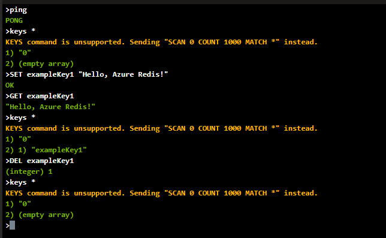
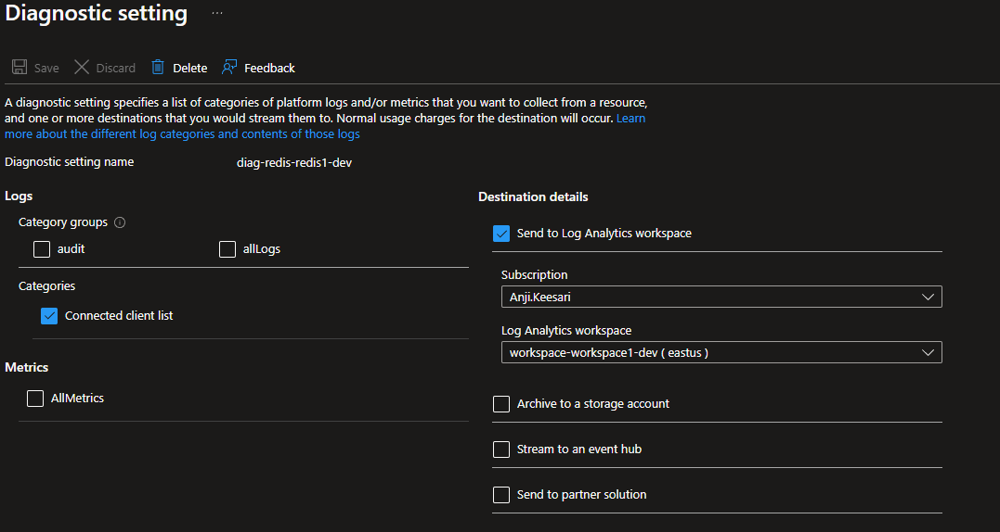
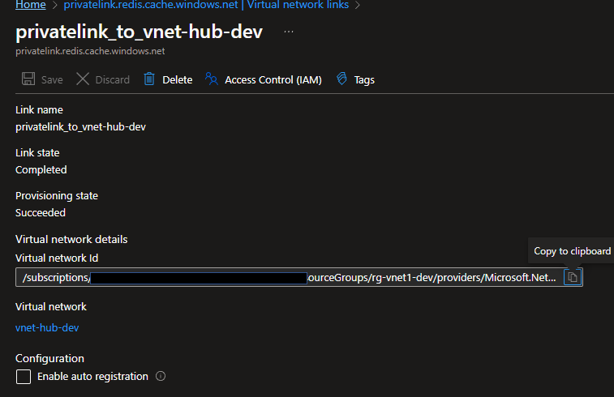
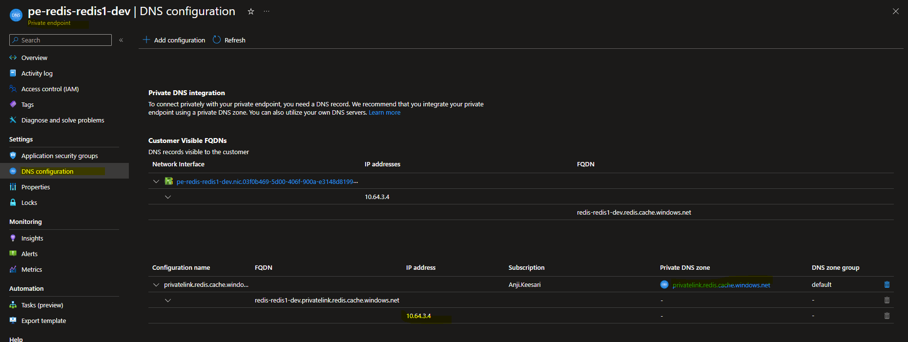

## Introduction

Azure Cache for Redis is a fully managed, in-memory data store that provides high throughput and low-latency access to cached data. In this lab, we will use Terraform's Infrastructure as Code (IaC) capabilities to provision and configure the Azure Cache for Redis resource.

## Technical Scenario

As a `Cloud Architecture` you have been asked to provide a solution on caching mechanism to improve performance and reduce database load in Microservices Architecture. Azure Cache for Redis offers an ideal solution, allowing us to store frequently accessed data in memory for fast retrieval.

## Objective

In this exercise we will accomplish & learn how to implement following:

- Task-1: Define and declare Azure Cache for Redis variable
- Task-2: Create Azure Cache for Redis using terraform
- Task-3: Configure diagnostic settings for Azure Cache for Redis using terraform
- Task-4: Create private DNS zone for Redis Cache using terraform
- Task-5: Create virtual network link to associate redis private DNS zone to vnet
- Task-6: Configure private endpoint for Azure Cache for Redis using terraform 


## Architecture diagram

The following diagram illustrates the architecture of our setup:

[Insert architecture diagram here]

## Prerequisites

Before proceeding with this lab, ensure that you have the following prerequisites in place:

  - Download & Install Terraform
  - Download & Install Azure CLI
  - Azure subscription
  - Visual studio code
  - Log Analytics workspace - for configuring diagnostic settings
  - Virtual Network with subnet - for configuring private endpoint
  - Basic knowledge of Terraform and Azure concepts

## Implementation details

Let's dive into the step-by-step implementation details:

## Task-1: Define and declare virtual network variables

In this task, we will define and declare the necessary variables for creating the Azure Cache for Redis resource. These variables will be used to specify the azure redis cache resource settings and customize the values according to our requirements in each environment.

**Variable declaration:** 

``` bash title="variables.tf"
variable "redis_cache_enabled" {
  description = "(Optional) Whether to enable or disable redis_cache resource creations"
  type        = bool
  default     = true
}
variable "redis_cache_prefix" {
  type        = string
  default     = "redis"
  description = "Prefix of the Redis cache name that's combined with name of the Redis Cache."
}

variable "redis_cache_name" {
  description = "(Required) The name of the Redis instance."
  type        = string
}

variable "redis_cache_sku" {
  description = " (Required) The SKU of Redis to use. Possible values are Basic, Standard and Premium."
  type        = string
}

variable "redis_cache_capacity" {
  description = "(Required) The size of the Redis cache to deploy. Valid values for a SKU family of C (Basic/Standard) are 0, 1, 2, 3, 4, 5, 6, and for P (Premium) family are 1, 2, 3, 4, 5."
  type        = string
}

variable "redis_cache_family" {
  description = " (Required) The SKU family/pricing group to use. Valid values are C (for Basic/Standard SKU family) and P (for Premium)"
  type        = string
}
variable "request_message" {
  description = "(Optional) Specifies a message passed to the owner of the remote resource when the private endpoint attempts to establish the connection to the remote resource."
  type        = string
  default     = null
}

variable "redis_public_network_access_enabled" {
  description = " (Optional) Whether or not public network access is allowed for this Redis Cache. true means this resource could be accessed by both public and private endpoint. false means only private endpoint access is allowed. Defaults to true."
  type        = bool
  default     = false
}
variable "redis_enable_authentication" {
  description = " (Optional) If set to false, the Redis instance will be accessible without authentication. Defaults to true."
  type        = bool
  default     = true
}
variable "redis_pe_core_enabled" {
  description = " (Optional) Enable core subscription private endpoint"
  type        = bool
  default     = false
}
variable "private_endpoint_prefix" {
  type        = string
  default     = "pe"
  description = "Prefix of the Private Endpoint name that's combined with name of the Private Endpoint."
}
```

**Variable Definition:**

```bash
# Redis Cache
redis_cache_name                   = "redis1"
redis_cache_capacity               = 1
redis_cache_family                 = "C" 
redis_cache_sku                    = "Basic"
redis_public_network_access_enabled= true
redis_enable_authentication        = true
redis_pe_core_enabled              = true
```

## Task-2: Create Azure Cache for Redis using terraform

In this task, we will use Terraform to create the Azure Cache for Redis instance with the desired configuration.

``` bash title="redis_cache.tf"
# Create Azure Cache for Redis using terraform
resource "azurerm_redis_cache" "redis" {
  # count                         = var.redis_cache_enabled ? 1 : 0
  name                          = lower("${var.redis_cache_prefix}-${var.redis_cache_name}-${local.environment}")
  resource_group_name           = azurerm_resource_group.rg.name
  location                      = azurerm_resource_group.rg.location
  capacity                      = var.redis_cache_capacity
  family                        = var.redis_cache_family
  sku_name                      = var.redis_cache_sku
  enable_non_ssl_port           = false
  minimum_tls_version           = "1.2"
  public_network_access_enabled = var.redis_public_network_access_enabled
  # subnet_id = azurerm_subnet.redis.id
  tags = merge(local.default_tags)
  redis_configuration {
    enable_authentication = var.redis_enable_authentication
  }
  lifecycle {
    ignore_changes = [
      tags
    ]
  }
  depends_on = [
    azurerm_resource_group.rg,
  ]
}
```
run terraform validate & format

``` bash
terraform validate
terraform fmt
```

run terraform plan & apply

``` bash
terraform plan -out=dev-plan -var-file="./environments/dev-variables.tfvars"
terraform apply dev-plan
```

azure cache for redis creation takes close to 30 mins.

```bash
azurerm_redis_cache.redis[0]: Creation complete after 25m14s
```
Azure Cache for Redis - Overview blade 


Azure Cache for Redis - Console


Azure Cache for Redis - Console command

## Task-3: Configure diagnostic settings for Azure Cache for Redis using terraform

By configuring diagnostic settings, we can monitor and analyze the performance and behavior of the Azure Cache for Redis instance, helping us optimize its usage.

``` bash title="redis_cache.tf"
# Create diagnostic settings for Azure Cache for Redis
resource "azurerm_monitor_diagnostic_setting" "diag_redis" {
  name                       = lower("${var.diag_prefix}-${azurerm_redis_cache.redis.name}")
  target_resource_id         = azurerm_redis_cache.redis.id
  log_analytics_workspace_id = azurerm_log_analytics_workspace.workspace.id

  log {
    category = "ConnectedClientList"
    enabled  = true
  }

  metric {
    category = "AllMetrics"
    enabled  = false

  }
  lifecycle {
    ignore_changes = [
      log
    ]
  }

  depends_on = [
    azurerm_redis_cache.redis,
    azurerm_log_analytics_workspace.workspace
  ]
}

```

run terraform validate & format

``` bash
terraform validate
terraform fmt
```

run terraform plan & apply

``` bash
terraform plan -out=dev-plan -var-file="./environments/dev-variables.tfvars"
terraform apply dev-plan
```


Azure Cache for Redis - Diagnostic settings from left nav


Azure Cache for Redis - Diagnostic settings


## Azure Cache for Redis network isolation options

**Private Link for Azure Cache for Redis**

Azure Private Endpoint is a network interface that connects you privately and securely to Azure Cache for Redis powered by Azure Private Link.

You can restrict public access to the private endpoint of your cache by disabling the PublicNetworkAccess flag.

Private endpoint is supported on cache tiers Basic, Standard, Premium, and Enterprise. We recommend using private endpoint instead of VNets. Private endpoints are easy to set up or remove, are supported on all tiers, and can connect your cache to multiple different VNets at once.

For more details: [Azure Cache for Redis with Azure Private Link](https://docs.microsoft.com/en-us/azure/azure-cache-for-redis/cache-private-link)


## Task-4: Create private DNS zone for Redis Cache using terraform

This private DNS zone will enable us to access the Redis Cache using a custom domain name within our virtual network.

``` bash title="private_dns.tf"
# Create private DNS zone for Redis Cache
resource "azurerm_private_dns_zone" "pdz_redis" {
  name                = "privatelink.redis.cache.windows.net"
  resource_group_name = azurerm_virtual_network.vnet.resource_group_name
  tags                = merge(local.default_tags)
  lifecycle {
    ignore_changes = [
      tags
    ]
  }
  depends_on = [
    azurerm_virtual_network.vnet
  ]
}
```
run terraform validate & format

``` bash
terraform validate
terraform fmt
```

run terraform plan & apply

``` bash
terraform plan -out=dev-plan -var-file="./environments/dev-variables.tfvars"
terraform apply dev-plan
```


Azure Cache for Redis - Private DNS zone


## Task-5: Create virtual network link to associate redis private DNS zone to vnet

In this task, we will create a virtual network link to associate the Redis private DNS zone with our virtual network. This link enables DNS resolution for the Redis Cache within the virtual network.

``` bash title="private_dns.tf"
# Create private virtual network link to vnet
resource "azurerm_private_dns_zone_virtual_network_link" "redis_pdz_vnet_link" {
  name                  = "privatelink_to_${azurerm_virtual_network.hub_vnet.name}"
  resource_group_name   = azurerm_resource_group.vnet.name
  virtual_network_id    = azurerm_virtual_network.hub_vnet.id
  private_dns_zone_name = azurerm_private_dns_zone.pdz_redis.name

  lifecycle {
    ignore_changes = [
      tags
    ]
  }
  depends_on = [
    azurerm_resource_group.vnet,
    azurerm_virtual_network.hub_vnet,
    azurerm_private_dns_zone.pdz_redis
  ]
}

```
run terraform validate & format

``` bash
terraform validate
terraform fmt
```

run terraform plan & apply

``` bash
terraform plan -out=dev-plan -var-file="./environments/dev-variables.tfvars"
terraform apply dev-plan
```

Azure Cache for Redis - Private DNS zone - Virtual network links


Azure Cache for Redis - Private DNS zone - Virtual network links details


By creating a virtual network link, we enable DNS resolution for the Redis Cache within our virtual network, allowing seamless communication.


## Task-5: Configure private endpoint for Azure Cache for Redis using terraform

By configuring a private endpoint, we ensure that the Azure Cache for Redis instance is accessible securely within the virtual network, minimizing exposure to the public internet.

``` bash title="redis_cache.tf"
# Create private endpoint for Azure Cache for Redis
resource "azurerm_private_endpoint" "pe_redis_core" {
  name                = lower("${var.private_endpoint_prefix}-${azurerm_redis_cache.redis.name}")
  location            = azurerm_redis_cache.redis.location
  resource_group_name = azurerm_redis_cache.redis.resource_group_name
  subnet_id           = azurerm_subnet.jumpbox.id
  tags                = merge(local.default_tags)

  private_service_connection {
    name                           = "pe-${azurerm_redis_cache.redis.name}"
    private_connection_resource_id = azurerm_redis_cache.redis.id
    is_manual_connection           = false
    subresource_names              = ["redisCache"]
    request_message                = try(var.request_message, null)
  }

  private_dns_zone_group {
    name                 = "default"
    private_dns_zone_ids = [azurerm_private_dns_zone.pdz_redis.id]
  }

  lifecycle {
    ignore_changes = [
      tags
    ]
  }
  depends_on = [
    azurerm_subnet.jumpbox,
    azurerm_redis_cache.redis,
    azurerm_private_dns_zone.pdz_redis
  ]
}
```
run terraform validate & format

``` bash
terraform validate
terraform fmt
```

run terraform plan & apply

``` bash
terraform plan -out=dev-plan -var-file="./environments/dev-variables.tfvars"
terraform apply dev-plan
```

Azure Cache for Redis - Private endpoint


Azure Cache for Redis - Private endpoint


Azure Cache for Redis - Private endpoint - Network interface


## Reference

<!-- - https://registry.terraform.io/providers/hashicorp/azurerm/latest/docs/resources/redis_cache.html
- https://stackoverflow.com/questions/73544491/how-to-implement-in-terraform-azure-for-redis-with-private-endpoint
- https://www.youtube.com/watch?v=WexiwCm33Qs
- https://learn.microsoft.com/en-us/azure/azure-cache-for-redis/cache-private-link
- https://stackoverflow.com/questions/62556733/private-endpoint-for-redis-cache
- https://www.youtube.com/watch?v=WexiwCm33Qs -->