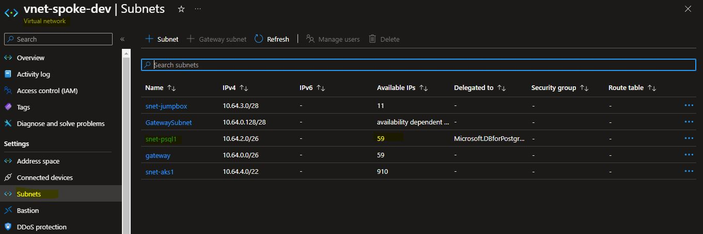
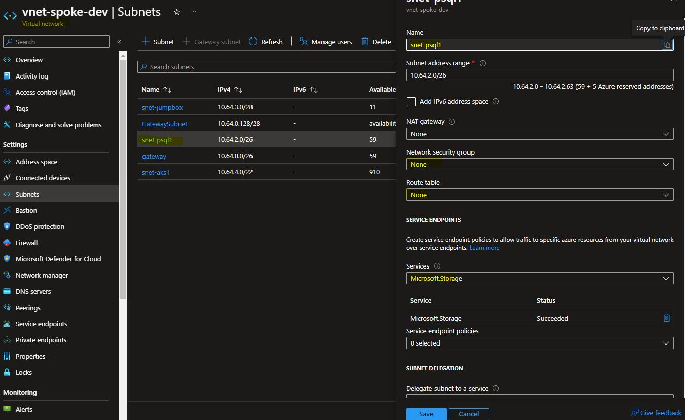
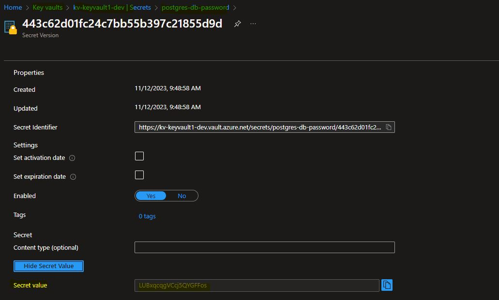
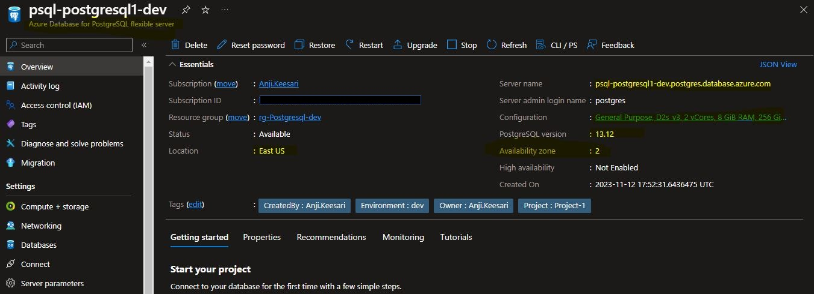
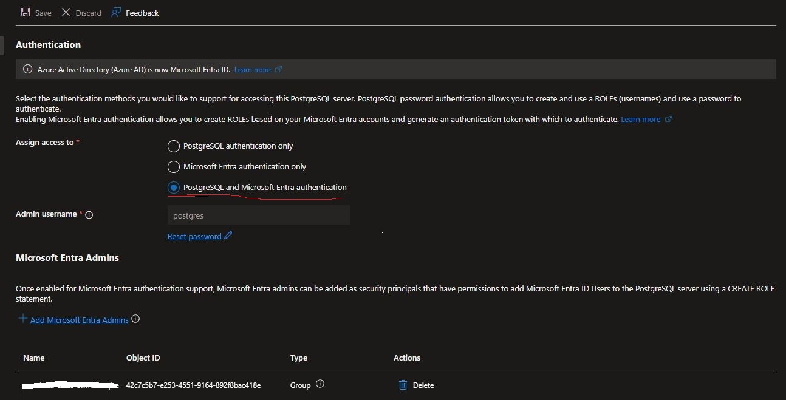

## Introduction

Azure Database for PostgreSQL - Flexible Server is a fully managed database service on the Microsoft Azure cloud platform, designed to host PostgreSQL databases. It provides a scalable, secure, and cost-effective solution for deploying, managing, and scaling PostgreSQL-based applications.

In this hands-on lab, I'll guide you through the process of creating an Azure PostgreSQL - Flexible Server using Terraform. We'll set up diagnostic settings to monitor this resource effectively and finally enhancing security through the use of private DNS zone.

Key features of Azure Database for PostgreSQL - Flexible Server:

1. **Managed Service:** It is a fully managed database service, meaning Microsoft Azure takes care of routine database management tasks, allowing developers to focus on building applications.

2. **Open Source Compatibility:** Based on the popular open-source PostgreSQL database engine, ensuring compatibility with PostgreSQL and support for a wide range of PostgreSQL features.

3. **Scalability:** Offers flexible compute and storage configurations to scale resources based on application requirements, providing the ability to scale up or down as needed.

4. **High Availability:** Provides built-in high availability with automatic backups and the ability to restore to any point in time within the retention period.

5. **Security Features:**
    - Supports Azure Active Directory authentication for enhanced security.
    - Enables data encryption in transit and at rest.
    - Firewall rules and Virtual Network Service Endpoints enhance network security.

6. **Automatic Patching:** Azure handles routine maintenance tasks, including software patching, ensuring that the database is up-to-date and secure.

7. **Monitoring and Diagnostics:** Integration with Azure Monitor provides real-time performance monitoring, diagnostics, and insights into the database's health and performance.

8. **Geo-replication:** Allows for setting up read replicas in different Azure regions for improved read scalability and disaster recovery.

9. **Flexible Deployment Options:** Supports deploying databases across different Azure regions and availability zones for better performance and fault tolerance.

10. **Developer Tools Integration:** Seamless integration with popular developer tools and frameworks, making it easy for developers to work with their preferred tools.

11. **Cost Management:** Provides cost-effective pricing models based on the chosen configuration, allowing users to optimize costs based on their application needs.

12. **Compatibility with Azure Services:** Integrates with other Azure services, such as Azure Logic Apps, Azure Functions, and more, for building end-to-end solutions.


## Technical Scenario
As a `Cloud Architect`, the task is to design and implement a database solution that aligns with the principles of microservices architecture. The solution should be robust, scalable, cost-effective, and includes key considerations such as scalability, high availability, security, geo-replication, and seamless integration with microservices.


## Objective

In this exercise we will accomplish & learn how to implement following:

- **Task-1:** Define and declare PostgreSQL - Flexible Server variables
- **Task-2:** Create an Azure resource group for PostgreSQL
- **Task-3:** Create or use existing Virtual Network 
- **Task-4:** Create a subnet for PostgreSQL
- **Task-5:** Create private DNS zone for PostgreSQL 
- **Task-6:** Associate PostgreSQL Private DNS zone with virtual network
- **Task-7:** Generate PostgreSQL admin random password & store in Key Vault
- **Task-8:** Create Azure PostgreSQL - Flexible Server using Terraform
- **Task-9:** Configure Diagnostic settings for PostgreSQL - Flexible Server
- **Task-10:** Set a user or group as the AD administrator for a PostgreSQL Flexible Server.
- **Task-11:** Create new Databases in PostgreSQL Server
- **Task-12:** Create AD groups for database access

Through these tasks, you will gain practical experience on Azure PostgreSQL - Flexible Server.

## Architecture diagram 

The following diagram illustrates the high level architecture of PostgreSQL - Flexible Server:

[{:style="border: 1px solid black; border-radius: 10px;"}](images/image-62.png){:target="_blank"}

## Prerequisites

Before proceeding with this lab, make sure you have the following prerequisites in place:

1. Download and Install Terraform.
2. Download and Install Azure CLI.
3. Azure subscription.
4. Visual Studio Code.
5. Log Analytics workspace - for configuring diagnostic settings.
6. Virtual Network with subnet
7. Basic knowledge of Terraform and Azure concepts.

## Implementation details

Here's a step-by-step guide on how to create an Azure PostgreSQL - Flexible Server using Terraform


**login to Azure**

Verify that you are logged into the right Azure subscription before start anything in visual studio code

```bash
# Login to Azure
az login 

# Shows current Azure subscription
az account show

# Lists all available Azure subscriptions
az account list

# Sets Azure subscription to desired subscription using ID
az account set -s "anji.keesari"
```

## Task-1: Define and declare PostgreSQL - Flexible Server variables

In this task, we will define and declare the necessary variables for creating the Azure PostgreSQL - Flexible Server resource. These variables will be used to specify the resource settings and customize the values according to our requirements in each environment.

This table presents the variables along with their descriptions, data types, and default values:

| Variable Name               | Description                                                       | Type            | Default Value  |
|-----------------------------|-------------------------------------------------------------------|-----------------|----------------|
| `psql_prefix`               | Prefix of the PostgreSQL server name that's combined with the name of the PostgreSQL server | `string`        | `"psql"`        |
| `psql_rg_name`              | (Required) The name of the Resource Group where the PostgreSQL Flexible Server should exist | `string`        | `"rg-postgresql-dev"` |
| `psql_location`             | (Required) The Azure Region where the PostgreSQL Flexible Server should exist | `string`        | `"East US"`     |
| `psql_name`                 | (Required) The name which should be used for this PostgreSQL Flexible Server  | `string`        | `"psql-postgresql1-dev"` |
| `psql_sku_name`             | (Optional) The SKU Name for the PostgreSQL Flexible Server                    | `string`        | `"GP_Standard_D2s_v3"` |
| `psql_tags`                 | (Optional) A mapping of tags which should be assigned to the PostgreSQL Flexible Server | `map(any)`      | `{}`           |
| `psql_admin_password`       | (Optional) Admin password of the PostgreSQL server                            | `string`        | `"Test1234t"`  |
| `psql_admin_login`          | (Optional) Admin username of the PostgreSQL server                            | `string`        | `"postgres"`   |
| `psql_version`              | (Optional) The version of PostgreSQL Flexible Server to use                   | `string`        | `"15"`         |
| `psql_storage_mb`           | (Optional) The max storage allowed for the PostgreSQL Flexible Server         | `string`        | `"262144"`     |
| `postgresql_configurations` | (Optional) PostgreSQL configurations to enable                               | `map(string)`   | See the default value in the code |


*Variable declaration:*

``` bash title="variables.tf"
// ========================== PostgreSQL ==========================

variable "psql_prefix" {
  type        = string
  default     = "psql"
  description = "Prefix of the PostgreSQL server name that's combined with name of the PostgreSQL server."
}
variable "psql_rg_name" {
  description = "(Required) The name of the Resource Group where the PostgreSQL Flexible Server should exist."
  type        = string
  default     = "rg-postgresql-dev"
}
variable "psql_location" {
  description = "(Required) The Azure Region where the PostgreSQL Flexible Server should exist."
  type        = string
  default     = "East US"
}
variable "psql_name" {
  description = "(Required) The name which should be used for this PostgreSQL Flexible Server."
  type        = string
  default     = "psql-postgresql1-dev"
}
variable "psql_sku_name" {
  description = "(Optional) The SKU Name for the PostgreSQL Flexible Server. The name of the SKU, follows the tier + name pattern (e.g. B_Standard_B1ms, GP_Standard_D2s_v3, MO_Standard_E4s_v3). "
  type        = string
  default     = "GP_Standard_D2s_v3"

  validation {
    condition     = contains(["B_Standard_B1ms", "GP_Standard_D2s_v3", "MO_Standard_E4s_v3"], var.psql_sku_name)
    error_message = "The value of the sku name property of the PostgreSQL is invalid."
  }
}
variable "psql_tags" {
  description = "(Optional) A mapping of tags which should be assigned to the PostgreSQL Flexible Server."
  type        = map(any)
  default     = {}
}
variable "psql_admin_password" {
  description = "(Optional) Admin password of the PostgreSQL server"
  type        = string
  default     = "Test1234t"
}
variable "psql_admin_login" {
  description = "(Optional) Admin username of the PostgreSQL server"
  type        = string
  default     = "postgres"
}
variable "psql_version" {
  description = "(Optional) The version of PostgreSQL Flexible Server to use. Possible values are 11,12, 13, 14 and 15. Required when create_mode is Default."
  type        = string
  default     = "15"
  validation {
    condition     = contains(["11", "12", "13", "14", "15"], var.psql_version)
    error_message = "The value of the version property of the PostgreSQL is invalid."
  }
}
variable "psql_storage_mb" {
  description = "(Optional) The max storage allowed for the PostgreSQL Flexible Server. Possible values are 32768, 65536, 131072, 262144, 524288, 1048576, 2097152, 4193280, 4194304, 8388608, 16777216 and 33553408."
  type        = string
  default     = "262144"
}
variable "postgresql_configurations" {
  description = "PostgreSQL configurations to enable."
  type        = map(string)
  default = {
    "pgbouncer.enabled" = "true",
    "azure.extensions"  = "PG_TRGM"
  }
}
```

*Variable Definition:*

``` bash title="dev-variables.tfvars"
# PostgreSQL
psql_rg_name                        = "Postgresql"
psql_name                           = "Postgresql1"
psql_sku_name                       = "GP_Standard_D2s_v3"
psql_admin_login                    = "postgres"
psql_admin_password                 = "Test1234t"
psql_version                        = "13"
psql_storage_mb                     = "262144"
```

## Task-2: Create an Azure resource group for PostgreSQL

Create a dedicated Azure Resource Group to logically group and manage the resources related to your PostgreSQL Flexible Server.

``` bash title="postgresql.tf"
# Create an Azure resource group for PostgreSQL
resource "azurerm_resource_group" "rg_psql" {
  name     = "${var.rg_prefix}-${var.psql_rg_name}-${local.environment}"
  location = var.psql_location
  tags = merge(local.default_tags,
    {
      "CreatedBy" = "Anji.Keesari"
  })
  lifecycle {
    ignore_changes = [
      tags,
    ]
  }
}
```

run terraform validate & format

``` bash
terraform validate
terraform fmt
```

run terraform plan & apply

``` bash
terraform plan -out=dev-plan -var-file="./environments/dev-variables.tfvars"
terraform apply dev-plan
```

Azure PostgreSQL - Flexible Server - resource group

[{:style="border: 1px solid black; border-radius: 10px;"}](images/image-63.jpg){:target="_blank"}

## Task-3: Create an Azure Virtual Network 

Decide whether to use an existing Virtual Network or create a new one. A Virtual Network provides the network infrastructure for PostgreSQL Flexible Server.

``` bash title="postgresql.tf"
# Create spoke virtual network
resource "azurerm_virtual_network" "vnet" {
  name                = lower("${var.vnet_prefix}-${var.spoke_vnet_name}-${local.environment}")
  address_space       = var.spoke_vnet_address_space
  resource_group_name = azurerm_resource_group.vnet.name
  location            = azurerm_resource_group.vnet.location

  tags = merge(local.default_tags,
    {
      "CreatedBy" = "Anji.Keesari"
  })
  lifecycle {
    ignore_changes = [
      # tags,
    ]
  }
  depends_on = [
    azurerm_resource_group.vnet,
  ]
}
```

run terraform validate & format

``` bash
terraform validate
terraform fmt
```

run terraform plan & apply

``` bash
terraform plan -out=dev-plan -var-file="./environments/dev-variables.tfvars"
terraform apply dev-plan
```

Azure PostgreSQL - Flexible Server - Virtual network

[{:style="border: 1px solid black; border-radius: 10px;"}](images/image-64.jpg){:target="_blank"}

## Task-4: Create an Azure Subnet for PostgreSQL 

Create a subnet within the chosen Virtual Network to host your PostgreSQL Flexible Server. This is a dedicated subnet of the network for PostgreSQL Flexible Server..

``` bash title="postgresql.tf"
// Create a subnet for PostgreSQL
resource "azurerm_subnet" "psql" {
  name                                          = lower("${var.subnet_prefix}-${var.psql_subnet_name}")
  resource_group_name                           = azurerm_virtual_network.vnet.resource_group_name
  virtual_network_name                          = azurerm_virtual_network.vnet.name
  address_prefixes                              = [var.psql_address_prefixes]
  private_endpoint_network_policies_enabled     = false
  private_link_service_network_policies_enabled = false
  service_endpoints                             = ["Microsoft.Storage"]
  delegation {
    name = "fs"
    service_delegation {
      name = "Microsoft.DBforPostgreSQL/flexibleServers"
      actions = [
        "Microsoft.Network/virtualNetworks/subnets/join/action",
      ]
    }
  }
  depends_on = [
    azurerm_virtual_network.vnet
  ]
}
```

run terraform validate & format

``` bash
terraform validate
terraform fmt
```

run terraform plan & apply

``` bash
terraform plan -out=dev-plan -var-file="./environments/dev-variables.tfvars"
terraform apply dev-plan
```

Azure PostgreSQL - Flexible Server - subnet

[{:style="border: 1px solid black; border-radius: 10px;"}](images/image-65.jpg){:target="_blank"}


## Task-5: Create a Private DNS zone for PostgreSQL

Azure Private DNS offers a reliable and secure DNS service for your virtual network. It effectively manages and resolves domain names within the virtual network, eliminating the need for a custom DNS solution.

When utilizing private network access in an Azure virtual network, it is mandatory to provide private DNS zone information for DNS resolution. For the creation of a new Azure Database for PostgreSQL Flexible Server with private network access, private DNS zones must be utilized during the configuration of flexible servers.

In this lab, we will use terraform to create private DNS zones and incorporate them into the configuration of flexible servers with private access.


``` bash title="postgresql.tf"
# Create private DNS zone for PostgreSQL 
resource "azurerm_private_dns_zone" "psql_dns_zone" {
  name                = "${var.psql_prefix}-${var.psql_name}-${local.environment}.private.postgres.database.azure.com"
  resource_group_name = azurerm_virtual_network.vnet.resource_group_name
  tags                = merge(local.default_tags, var.psql_tags)
  lifecycle {
    ignore_changes = [
      # tags
    ]
  }
  depends_on = [
    azurerm_virtual_network.vnet
  ]
}

```

run terraform validate & format

``` bash
terraform validate
terraform fmt
```

run terraform plan & apply

``` bash
terraform plan -out=dev-plan -var-file="./environments/dev-variables.tfvars"
terraform apply dev-plan
```

Azure PostgreSQL - Flexible Server - Private DNS zone

[{:style="border: 1px solid black; border-radius: 10px;"}](images/image-66.jpg){:target="_blank"}


## Task-6: Associate PostgreSQL Private DNS zone with virtual network

Associate the private DNS zone you created with the Virtual Network. This ensures that DNS queries for your PostgreSQL resources are resolved within the network.

``` bash title="postgresql.tf"
# Associate PostgreSQL Private DNS zone with virtual network
resource "azurerm_private_dns_zone_virtual_network_link" "psql_dns_zone_vnet_associate" {
  name                  = "link_to_${azurerm_virtual_network.vnet.name}"
  resource_group_name   = azurerm_virtual_network.vnet.resource_group_name
  private_dns_zone_name = azurerm_private_dns_zone.psql_dns_zone.name
  virtual_network_id    = azurerm_virtual_network.vnet.id

  tags = merge(local.default_tags,var.psql_tags)
  lifecycle {
    ignore_changes = [
      # tags
    ]
  }

  depends_on = [
    azurerm_virtual_network.vnet,
    azurerm_private_dns_zone.psql_dns_zone
  ]
}
```

run terraform validate & format

``` bash
terraform validate
terraform fmt
```

run terraform plan & apply

``` bash
terraform plan -out=dev-plan -var-file="./environments/dev-variables.tfvars"
terraform apply dev-plan
```

Azure PostgreSQL - Flexible Server - virtual_network_link

[{:style="border: 1px solid black; border-radius: 10px;"}](images/image-67.jpg){:target="_blank"}


## Task-7: Generate PostgreSQL admin random password & store in Key Vault

In this task, we will generate a random strong password for the PostgreSQL admin. The password will be securely stored in Azure Key Vault, ensuring that it remains confidential and can be accessed programmatically when needed.

``` bash title="postgresql.tf"
# Generate PostgreSQL admin random password
resource "random_password" "psql_admin_password" {
  length           = 20
  special          = true
  lower            = true
  upper            = true
  override_special = "!#$"
}

# Store PostgreSQL admin password in Azuure Key Vault
resource "azurerm_key_vault_secret" "psql_admin_password" {
  name         = "postgres-db-password"
  value        = random_password.psql_admin_password.result
  key_vault_id = azurerm_key_vault.kv.id
  tags         = {}
  depends_on = [
    azurerm_key_vault.kv,
    random_password.psql_admin_password,
  ]
}
```

run terraform validate & format

``` bash
terraform validate
terraform fmt
```

run terraform plan & apply

``` bash
terraform plan -out=dev-plan -var-file="./environments/dev-variables.tfvars"
terraform apply dev-plan
```

Azure PostgreSQL - Flexible Server - PostgreSQL admin password


[{:style="border: 1px solid black; border-radius: 10px;"}](images/image-68.jpg){:target="_blank"}

## Task-8: Create Azure PostgreSQL - Flexible Server using Terraform

Utilize Terraform to deploy your Azure PostgreSQL Flexible Server. This includes specifying server settings, configuration options, and connection details.

``` bash title="postgresql.tf"
# Create the Azure PostgreSQL - Flexible Server using terraform
resource "azurerm_postgresql_flexible_server" "psql" {
  name                   = lower("${var.psql_prefix}-${var.psql_name}-${local.environment}")
  resource_group_name    = azurerm_resource_group.rg_psql.name
  location               = azurerm_resource_group.rg_psql.location
  version                = var.psql_version
  delegated_subnet_id    = azurerm_subnet.psql.id
  private_dns_zone_id    = azurerm_private_dns_zone.psql_dns_zone.id
  administrator_login    = var.psql_admin_login
  administrator_password = azurerm_key_vault_secret.psql_admin_password.value
  # zone                    = "1"
  storage_mb = var.psql_storage_mb

  # Set the backup retention policy to 7 for non-prod, and 30 for prod
  backup_retention_days = 7

  sku_name = var.psql_sku_name
  depends_on = [
    azurerm_resource_group.rg_psql,
    azurerm_subnet.psql,
    azurerm_private_dns_zone.psql_dns_zone,
    azurerm_key_vault_secret.psql_admin_password
  ]
  tags = merge(local.default_tags, var.psql_tags)
  lifecycle {
    ignore_changes = [
      # tags,
      # private_dns_zone_id
    ]
  }
}
```
Run Terraform validation and formatting:

``` bash
terraform validate
terraform fmt
```

run terraform plan & apply

``` bash
terraform plan -out=dev-plan -var-file="./environments/dev-variables.tfvars"
terraform apply dev-plan
```

Azure PostgreSQL - Flexible Server - Overview blade 

[{:style="border: 1px solid black; border-radius: 10px;"}](images/image-69.jpg){:target="_blank"}


Azure PostgreSQL - Flexible Server - Private DNS Zone

[{:style="border: 1px solid black; border-radius: 10px;"}](images/image-70.jpg){:target="_blank"}

## Task-9: Configure Diagnostic Settings for Azure PostgreSQL - Flexible Server

Set up diagnostic settings to collect and store logs and metrics from your PostgreSQL Flexible Server. This is crucial for monitoring and troubleshooting.

``` bash title="postgresql.tf"

# Create diagnostic settings for PostgreSQL server
resource "azurerm_monitor_diagnostic_setting" "diag_psql" {
  name                       = lower("${var.diag_prefix}-${azurerm_postgresql_flexible_server.psql.name}")
  target_resource_id         = azurerm_postgresql_flexible_server.psql.id
  log_analytics_workspace_id = azurerm_log_analytics_workspace.workspace.id
  enabled_log {
    category = "PostgreSQLFlexDatabaseXacts"

    retention_policy {
      days    = 0
      enabled = false
    }
  }
  enabled_log {
    category = "PostgreSQLFlexQueryStoreRuntime"

    retention_policy {
      days    = 0
      enabled = false
    }
  }
  enabled_log {
    category = "PostgreSQLFlexQueryStoreWaitStats"

    retention_policy {
      days    = 0
      enabled = false
    }
  }
  enabled_log {
    category = "PostgreSQLFlexSessions"

    retention_policy {
      days    = 0
      enabled = false
    }
  }
  enabled_log {
    category = "PostgreSQLFlexTableStats"

    retention_policy {
      days    = 0
      enabled = false
    }
  }
  enabled_log {
    category = "PostgreSQLLogs"

    retention_policy {
      days    = 0
      enabled = true
    }
  }
  metric {
    category = "AllMetrics"
    enabled  = true

    retention_policy {
      days    = 0
      enabled = false
    }
  }
  lifecycle {
    ignore_changes = [
      # log
    ]
  }
  depends_on = [
    azurerm_postgresql_flexible_server.psql,
    azurerm_log_analytics_workspace.workspace
  ]
}
```

run terraform validate & format

``` bash
terraform validate
terraform fmt
```

run terraform plan & apply

``` bash
terraform plan -out=dev-plan -var-file="./environments/dev-variables.tfvars"
terraform apply dev-plan
```


Azure PostgreSQL - Flexible Server - Diagnostic Settings from left nav

[{:style="border: 1px solid black; border-radius: 10px;"}](images/image-70.jpg){:target="_blank"}

## Task-10: Set a user or group as the AD administrator for a PostgreSQL Flexible Server

Specify an Azure AD user or group as the administrator for your PostgreSQL Flexible Server, allowing them to manage the server.

``` bash title="postgresql.tf"
# Set a user or group as the AD administrator for a PostgreSQL Flexible Server.
data "azuread_group" "azuread_psql_admin_group" {
  display_name     = "psql-admin-group"
  security_enabled = true
}
resource "azurerm_postgresql_flexible_server_active_directory_administrator" "psql" {
  server_name         = azurerm_postgresql_flexible_server.psql.name
  resource_group_name = azurerm_resource_group.rg_psql.name
  tenant_id           = data.azurerm_client_config.current.tenant_id
  object_id           = data.azuread_group.azuread_psql_admin_group.object_id
  principal_name      = data.azuread_group.azuread_psql_admin_group.display_name
  principal_type      = "Group"
}
```
run terraform validate & format

``` bash
terraform validate
terraform fmt
```

run terraform plan & apply

``` bash
terraform plan -out=dev-plan -var-file="./environments/dev-variables.tfvars"
terraform apply dev-plan
```

Azure PostgreSQL - Flexible Server - AD administrator 

[{:style="border: 1px solid black; border-radius: 10px;"}](images/image-72.jpg){:target="_blank"}


## Task-11: Create new Databases in PostgreSQL Server

Use Terraform to create new databases within your PostgreSQL Flexible Server, providing segregated spaces for each database

``` bash title="postgresql.tf"
# create databases in PostgreSQL Server
variable "database_names" {
  type    = list(string)
  default = ["database1", "database2", "database3"]
}

resource "azurerm_postgresql_flexible_server_database" "psql_db" {
  for_each  = { for name in var.database_names : name => name }
  name      = each.key
  server_id = azurerm_postgresql_flexible_server.psql.id
  charset   = "utf8"
  collation = "en_US.utf8"
  depends_on = [
    azurerm_postgresql_flexible_server.psql
  ]
}
```
run terraform validate & format

``` bash
terraform validate
terraform fmt
```

run terraform plan & apply

``` bash
terraform plan -out=dev-plan -var-file="./environments/dev-variables.tfvars"
terraform apply dev-plan
```

Azure PostgreSQL - Flexible Server - Databases

[{:style="border: 1px solid black; border-radius: 10px;"}](images/image-73.jpg){:target="_blank"}


## Task-12: Create AD groups for database access

Establish Azure AD groups to manage access to your databases. This enhances security and simplifies permissions management.

``` bash title="postgresql.tf"
# Create azure ad groups for database access
resource "azuread_group" "psql_ad_group" {
  for_each         = toset(["readonly", "readwrite", "administrators"])
  display_name     = lower("${azurerm_postgresql_flexible_server.psql.name}-${each.key}-${local.environment}")
  owners           = [data.azurerm_client_config.current.object_id]
  security_enabled = true

  lifecycle {
    ignore_changes = [owners]
  }
}
```
run terraform validate & format

``` bash
terraform validate
terraform fmt
```

run terraform plan & apply

``` bash
terraform plan -out=dev-plan -var-file="./environments/dev-variables.tfvars"
terraform apply dev-plan
```

## Reference
- [Microsoft MSDN - Azure Database for PostgreSQL documentation](https://learn.microsoft.com/en-us/azure/postgresql/){:target="_blank"}
- [Microsoft MSDN - Deploy a PostgreSQL Flexible Server Database using Terraform](https://learn.microsoft.com/en-us/azure/aks/concepts-network){:target="_blank"}
- [Microsoft MSDN - Azure Database for PostgreSQL pricing](https://azure.microsoft.com/en-us/pricing/details/postgresql/flexible-server/){:target="_blank"}
- [Terraform Registry - azurerm_resource_group](https://registry.terraform.io/providers/hashicorp/azurerm/latest/docs/resources/resource_group){:target="_blank"}
- [Terraform Registry - azurerm_virtual_network](https://registry.terraform.io/providers/hashicorp/azurerm/latest/docs/resources/virtual_network){:target="_blank"}
- [Terraform Registry - azurerm_subnet](https://registry.terraform.io/providers/hashicorp/azurerm/latest/docs/resources/subnet){:target="_blank"}
- [Terraform Registry - azurerm_private_dns_zone](https://registry.terraform.io/providers/hashicorp/azurerm/latest/docs/resources/private_dns_zone){:target="_blank"}
- [Terraform Registry - azurerm_private_dns_zone_virtual_network_link](https://registry.terraform.io/providers/hashicorp/azurerm/latest/docs/resources/private_dns_zone_virtual_network_link){:target="_blank"}
- [Terraform Registry - random_password ](https://registry.terraform.io/providers/hashicorp/random/latest/docs/resources/password.html){:target="_blank"}
- [Terraform Registry - azurerm_key_vault_secret ](https://registry.terraform.io/providers/hashicorp/azurerm/latest/docs/resources/key_vault_secret){:target="_blank"}
- [Terraform Registry - azurerm_postgresql_flexible_server](https://registry.terraform.io/providers/hashicorp/azurerm/latest/docs/resources/postgresql_flexible_server){:target="_blank"}
- [Terraform Registry - azurerm_postgresql_flexible_server_database](https://registry.terraform.io/providers/hashicorp/azurerm/latest/docs/resources/postgresql_flexible_server_database){:target="_blank"}
- [Terraform Registry - azurerm_postgresql_flexible_server_active_directory_administrator](https://registry.terraform.io/providers/hashicorp/azurerm/latest/docs/resources/postgresql_flexible_server_active_directory_administrator){:target="_blank"}
- [Terraform Registry - azurerm_monitor_diagnostic_setting](https://registry.terraform.io/providers/hashicorp/azurerm/latest/docs/resources/monitor_diagnostic_setting){:target="_blank"}
- [Terraform Registry - azurerm_management_lock](https://registry.terraform.io/providers/hashicorp/azurerm/latest/docs/resources/management_lock){:target="_blank"}
- [Azure Terraform Quickstart/201-postgresql-fs-db](https://github.com/Azure/terraform/tree/master/quickstart/201-postgresql-fs-db){:target="_blank"}
<!-- 
- https://www.youtube.com/watch?v=fzVROh-xgto
- https://github.com/claranet/terraform-azurerm-db-postgresql-flexible/blob/master/variables.tf
 -->
