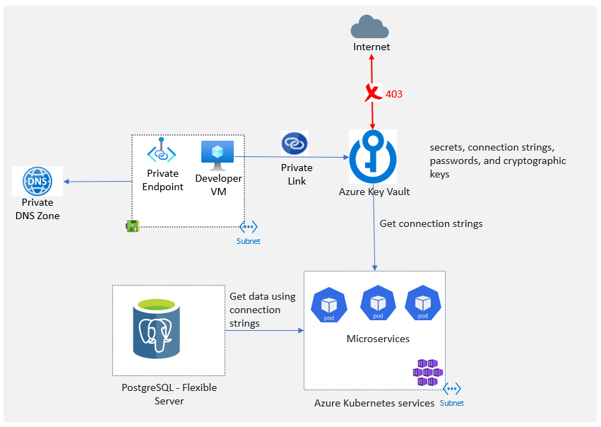
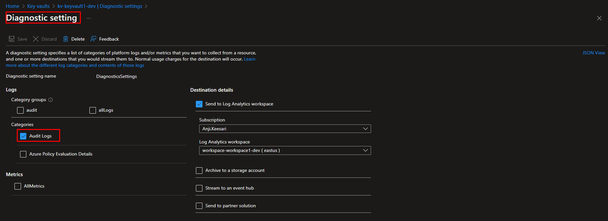
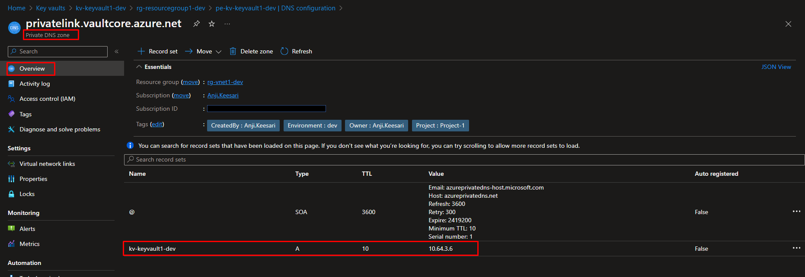
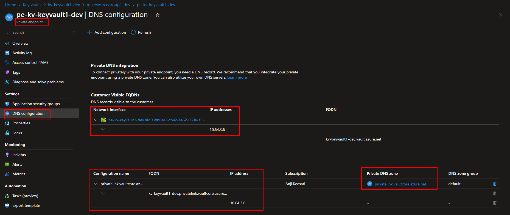

## Introduction

Azure Key Vault is a cloud service provided by Microsoft Azure that allows you to securely store and manage sensitive information such as secrets, encryption keys, and certificates. It provides a centralized and secure storage location for managing application secrets, connection strings, passwords, and cryptographic keys used in containerized microservices applications and services.

In this hands-on lab, I'll guide you through the process of creating an Azure Key Vault using Terraform. We'll set up diagnostic settings to monitor this resource effectively. also, we'll ensure that access policies are configured to allow developers access to the secrets stored in the Azure Key Vault and finally enhancing security through the use of private endpoints.

## Key Features
Here are some key features of Azure Key Vault:

1. **Secrets Management:** Azure Key Vault can be used to securely store and manage sensitive information such as API keys, passwords, and connection strings.

2. **Key Management:** It supports the creation, import, storage, and management of cryptographic keys used for encryption, decryption, and signing of data.

3. **Certificate Management:** Key Vault enables the management of X.509 certificates, making it easier to provision and manage SSL/TLS certificates used for securing applications.

4. **Role-Based Access Control (RBAC):** Access to Key Vault resources is controlled through Azure Active Directory (Azure AD). RBAC allows you to grant specific permissions to users, groups, or applications.

5. **Integration with Azure Services:** Key Vault seamlessly integrates with other Azure services such as AKS in our case, making it easy to use stored secrets, keys, and certificates in microservice applications

Azure Key Vault enhances the security of microservice applications by reducing the need to store sensitive information in the source code or configuration files. Instead, microservice applications can retrieve sensitive information from Key Vault at runtime.


## Technical Scenario
As a `Cloud Architect`, I need to design and implement a robust solution to address the secure storage and management of sensitive information within our microservices architecture hosted in Azure Kubernetes Service (AKS). This solution should ensure that application secrets, connection strings, passwords, and cryptographic keys are stored centrally and accessed securely by our services.


## Objective

In this exercise we will accomplish & learn how to implement following:

- **Task-1:** Define and declare Azure Key Vault variables
- **Task-2:** Create Azure Key Vault using Terraform
- **Task-3:** Configure diagnostic settings for Azure Key Vault using Terraform
- **Task-4:** Configure access policy for developer in Azure Key Vault
- **Task-5:** Restrict Access Using Private Endpoint
- **Task-5.1:** Configure the Private DNS Zone
- **Task-5.2:** Create a Virtual Network Link Association
- **Task-5.3:** Create a Private Endpoint Using Terraform
- **Task-5.4:** Validate private link connection using `nslookup` or `dig`
- **Task-6:** Created azure Key Vault secrets for sensitive information

Through these tasks, you will gain practical experience on Azure Key Vault.

## Architecture diagram

The following diagram illustrates the high level architecture of key vault usage:

[{:style="border: 1px solid black; border-radius: 10px;"}](images/kv/image-1.png){:target="_blank"}

## Prerequisites

Before proceeding with this lab, make sure you have the following prerequisites in place:

1. Download and Install Terraform.
2. Download and Install Azure CLI.
3. Azure subscription.
4. Visual Studio Code.
5. Log Analytics workspace - for configuring diagnostic settings.
6. Virtual Network with subnet - for configuring a private endpoint.
7. Basic knowledge of Terraform and Azure concepts.

## Implementation details

Here's a step-by-step guide on how to create an Azure Key Vault using Terraform


**login to Azure**

Verify that you are logged into the right Azure subscription before start anything in visual studio code

```bash
# Login to Azure
az login 

# Shows current Azure subscription
az account show

# Lists all available Azure subscriptions
az account list

# Sets Azure subscription to desired subscription using ID
az account set -s "anji.keesari"
```

## Task-1: Define and declare Azure Key vault variables

In this task, we will define and declare the necessary variables for creating the Azure Key vault resource. These variables will be used to specify the resource settings and customize the values according to our requirements in each environment.

This table presents the variables along with their descriptions, data types, and default values:


| Variable Name                      | Description                                                                                                                                      | Type      | Default Value                                                      |
|------------------------------------|--------------------------------------------------------------------------------------------------------------------------------------------------|-----------|--------------------------------------------------------------------|
| kv_prefix                          | Prefix of the Azure key vault.                                                                                                                   | string    | "kv"                                                               |
| kv_name                            | (Required) Specifies the name of the key vault.                                                                                                  | string    | "keyvault1"                                                        |
| kv_resource_group_name             | (Required) Specifies the resource group name of the key vault.                                                                                    | string    | "replace me" (use if you need a separate resource group)           |
| kv_location                        | (Required) Specifies the location where the key vault will be deployed.                                                                         | string    | "replace me" (use if you need a separate location for the key vault) |
| tenant_id                          | (Required) The Azure Active Directory tenant ID for authenticating requests to the key vault.                                                  | string    | "replace me" (use if you need a separate tenant id)                |
| kv_owner_object_id                 | (Required) Object IDs of the key vault owners who need access to the key vault.                                                                  | string    | "d0abdc5c-2ba6-4868-8387-d700969c786f"                             |
| kv_sku_name                        | (Required) The Name of the SKU used for this Key Vault. Possible values are standard and premium.                                                | string    | "standard"                                                         |
| kv_tags                            | (Optional) Specifies the tags of the key vault.                                                                                                  | map(any)  | {}                                                                 |
| enabled_for_deployment             | (Optional) Boolean flag specifying whether Azure Virtual Machines are permitted to retrieve certificates stored as secrets from the key vault.   | bool      | false                                                              |
| enabled_for_disk_encryption        | (Optional) Boolean flag specifying whether Azure Disk Encryption is permitted to retrieve secrets from the vault and unwrap keys.                 | bool      | false                                                              |
| enabled_for_template_deployment    | (Optional) Boolean flag specifying whether Azure Resource Manager is permitted to retrieve secrets from the key vault.                             | bool      | false                                                              |
| enable_rbac_authorization          | (Optional) Boolean flag specifying whether Azure Key Vault uses Role-Based Access Control (RBAC) for authorization of data actions.             | bool      | false                                                              |
| purge_protection_enabled           | (Optional) Is Purge Protection enabled for this Key Vault?                                                                                      | bool      | false                                                              |
| soft_delete_retention_days         | (Optional) The number of days that items should be retained once soft-deleted. This value can be between 7 and 90 (the default) days.             | number    | 30                                                                 |
| bypass                             | (Required) Specifies which traffic can bypass the network rules. Possible values are AzureServices and None.                                    | string    | "AzureServices"                                                    |
| kv_default_action                  | (Required) The Default Action to use when no rules match from ip_rules / virtual_network_subnet_ids. Possible values are Allow and Deny.           | string    | "Allow"                                                            |
| kv_ip_rules                        | (Optional) One or more IP Addresses or CIDR Blocks that should be able to access the Key Vault.                                                 | list      | []                                                                 |
| kv_virtual_network_subnet_ids      | (Optional) One or more Subnet IDs that should be able to access this Key Vault.                                                                  | list      | [] (use if virtual networking is provisioned separately)          |
| kv_log_analytics_workspace_id      | Specifies the log analytics workspace id.                                                                                                      | string    | "replace me" (use if log analytics is provisioned separately)      |
| kv_log_analytics_retention_days    | Specifies the number of days of the retention policy.                                                                                          | number    | 7                                                                  |
| kv_key_permissions_full            | List of full key permissions. Must be one or more from the following: backup, create, decrypt, delete, encrypt, get, import, list, purge, recover, restore, sign, unwrapKey, update, verify, and wrapKey. | list | ["Backup", "Create", "Decrypt", "Delete", "Encrypt", "Get", "Import", "List", "Purge", "Recover", "Restore", "Sign", "UnwrapKey", "Update", "Verify", "WrapKey", "Release", "Rotate", "GetRotationPolicy", "SetRotationPolicy"] |
| kv_secret_permissions_full         | List of full secret permissions. Must be one or more from the following: backup, delete, get, list, purge, recover, restore, and set.              | list      | ["Backup", "Delete", "Get", "List", "Purge", "Recover", "Restore", "Set"] |
| kv_certificate_permissions_full    | List of full certificate permissions. Must be one or more from the following: backup, create, delete, deleteissuers, get, getissuers, import, list, listissuers, managecontacts, manageissuers, purge, recover, restore, setissuers, and update. | list | ["Backup", "Create", "Delete", "DeleteIssuers", "Get", "GetIssuers", "Import", "List", "ListIssuers", "ManageContacts", "ManageIssuers", "Purge", "Recover", "Restore", "SetIssuers", "Update"] |
| kv_storage_permissions_full        | List of full storage permissions. Must be one or more from the following: backup, delete, deletesas, get, getsas, list, listsas, purge, recover, regeneratekey, restore, set, setsas, and update. | list | ["Backup", "Delete", "DeleteSAS", "Get", "GetSAS", "List", "ListSAS", "Purge", "Recover", "RegenerateKey", "Restore", "Set", "SetSAS", "Update"] |


*Variable declaration:*

``` bash title="variables.tf"
// ========================== Key Vault ==========================
data "azurerm_client_config" "current" {}

variable "kv_prefix" {
  type        = string
  default     = "kv"
  description = "Prefix of the Azure key vault."
}
variable "kv_name" {
  description = "(Required) Specifies the name of the key vault."
  type        = string
  default     = "keyvault1"
}

variable "kv_resource_group_name" {
  description = "(Required) Specifies the resource group name of the key vault."
  type        = string
  default     = "replace me" # use this if you need separate resource group for key vault
}

variable "kv_location" {
  description = "(Required) Specifies the location where the key vault will be deployed."
  type        = string
  default     = "replace me" # use this if you need separate location for key vault
}

variable "tenant_id" {
  description = "(Required) The Azure Active Directory tenant ID that should be used for authenticating requests to the key vault."
  type        = string
  default     = "replace me" # use this if you need separate tenant id for key vault
}

variable "kv_owner_object_id" {
  description = "(Required) object ids of the key vault owners who needs access to key vault."
  type        = string
  default     = "d0abdc5c-2ba6-4868-8387-d700969c786f"
}
variable "kv_sku_name" {
  description = "(Required) The Name of the SKU used for this Key Vault. Possible values are standard and premium."
  type        = string
  default     = "standard"

  validation {
    condition     = contains(["standard", "premium"], var.kv_sku_name)
    error_message = "The value of the sku name property of the key vault is invalid."
  }
}

variable "kv_tags" {
  description = "(Optional) Specifies the tags of the key vault"
  type        = map(any)
  default     = {}
}

variable "enabled_for_deployment" {
  description = "(Optional) Boolean flag to specify whether Azure Virtual Machines are permitted to retrieve certificates stored as secrets from the key vault. Defaults to false."
  type        = bool
  default     = false
}

variable "enabled_for_disk_encryption" {
  description = " (Optional) Boolean flag to specify whether Azure Disk Encryption is permitted to retrieve secrets from the vault and unwrap keys. Defaults to false."
  type        = bool
  default     = false
}

variable "enabled_for_template_deployment" {
  description = "(Optional) Boolean flag to specify whether Azure Resource Manager is permitted to retrieve secrets from the key vault. Defaults to false."
  type        = bool
  default     = false
}

variable "enable_rbac_authorization" {
  description = "(Optional) Boolean flag to specify whether Azure Key Vault uses Role Based Access Control (RBAC) for authorization of data actions. Defaults to false."
  type        = bool
  default     = false
}

variable "purge_protection_enabled" {
  description = "(Optional) Is Purge Protection enabled for this Key Vault? Defaults to false."
  type        = bool
  default     = false
}

variable "soft_delete_retention_days" {
  description = "(Optional) The number of days that items should be retained for once soft-deleted. This value can be between 7 and 90 (the default) days."
  type        = number
  default     = 30
}

variable "bypass" {
  description = "(Required) Specifies which traffic can bypass the network rules. Possible values are AzureServices and None."
  type        = string
  default     = "AzureServices"

  validation {
    condition     = contains(["AzureServices", "None"], var.bypass)
    error_message = "The valut of the bypass property of the key vault is invalid."
  }
}

variable "kv_default_action" {
  description = "(Required) The Default Action to use when no rules match from ip_rules / virtual_network_subnet_ids. Possible values are Allow and Deny."
  type        = string
  default     = "Allow"

  validation {
    condition     = contains(["Allow", "Deny"], var.kv_default_action)
    error_message = "The value of the default action property of the key vault is invalid."
  }
}

variable "kv_ip_rules" {
  description = "(Optional) One or more IP Addresses, or CIDR Blocks which should be able to access the Key Vault."
  default     = []
}

variable "kv_virtual_network_subnet_ids" {
  description = "(Optional) One or more Subnet ID's which should be able to access this Key Vault."
  default     = [] # use this if virtual networking provisioned separately
}

variable "kv_log_analytics_workspace_id" {
  description = "Specifies the log analytics workspace id"
  type        = string
  default     = "replace me" # use this if log anaytics provisioned separately
}

variable "kv_log_analytics_retention_days" {
  description = "Specifies the number of days of the retention policy"
  type        = number
  default     = 7
}
variable "kv_key_permissions_full" {
  type        = list(string)
  description = "List of full key permissions, must be one or more from the following: backup, create, decrypt, delete, encrypt, get, import, list, purge, recover, restore, sign, unwrapKey, update, verify and wrapKey."
  default     = ["Backup", "Create", "Decrypt", "Delete", "Encrypt", "Get", "Import", "List", "Purge", "Recover", "Restore", "Sign", "UnwrapKey", "Update", "Verify", "WrapKey", "Release", "Rotate", "GetRotationPolicy", "SetRotationPolicy"]
}

variable "kv_secret_permissions_full" {
  type        = list(string)
  description = "List of full secret permissions, must be one or more from the following: backup, delete, get, list, purge, recover, restore and set"
  default     = ["Backup", "Delete", "Get", "List", "Purge", "Recover", "Restore", "Set"]

}

variable "kv_certificate_permissions_full" {
  type        = list(string)
  description = "List of full certificate permissions, must be one or more from the following: backup, create, delete, deleteissuers, get, getissuers, import, list, listissuers, managecontacts, manageissuers, purge, recover, restore, setissuers and update"
  default     = ["Backup", "Create", "Delete", "DeleteIssuers", "Get", "GetIssuers", "Import", "List", "ListIssuers", "ManageContacts", "ManageIssuers", "Purge", "Recover", "Restore", "SetIssuers", "Update"]
}

variable "kv_storage_permissions_full" {
  type        = list(string)
  description = "List of full storage permissions, must be one or more from the following: backup, delete, deletesas, get, getsas, list, listsas, purge, recover, regeneratekey, restore, set, setsas and update"
  default     = ["Backup", "Delete", "DeleteSAS", "Get", "GetSAS", "List", "ListSAS", "Purge", "Recover", "RegenerateKey", "Restore", "Set", "SetSAS", "Update", ]
}
```

*Variable Definition:*

``` bash title="dev-variables.tfvars"
# key vault
kv_name                             = "keyvault1" 
kv_sku_name                         = "standard"
kv_owner_object_id                  = "d0abdc5c-2ba6-4868-8387-d700969c7111"
```

## Task-2: Create Azure Key Vault using Terraform

In this task, we will use Terraform to create the Azure Key Vault instance with the desired configuration.

``` bash title="keyvault.tf"
# Create Azure Key Vault using terraform
resource "azurerm_key_vault" "kv" {
  name                            = lower("${var.kv_prefix}-${var.kv_name}-${local.environment}")
  resource_group_name             = azurerm_resource_group.rg.name
  location                        = azurerm_resource_group.rg.location
  tenant_id                       = data.azurerm_client_config.current.tenant_id
  sku_name                        = var.kv_sku_name
  enabled_for_disk_encryption     = var.enabled_for_disk_encryption
  enabled_for_deployment          = var.enabled_for_deployment
  enabled_for_template_deployment = var.enabled_for_template_deployment
  enable_rbac_authorization       = var.enable_rbac_authorization
  purge_protection_enabled        = var.purge_protection_enabled
  soft_delete_retention_days      = var.soft_delete_retention_days
  timeouts {
    delete = "60m"
  }

  # network_acls {
  #   bypass                     = var.bypass
  #   default_action             = var.default_action
  #   ip_rules                   = var.ip_rules
  #   virtual_network_subnet_ids = var.virtual_network_subnet_ids
  # }
  access_policy {
    tenant_id = data.azurerm_client_config.current.tenant_id
    object_id = data.azurerm_client_config.current.object_id

    certificate_permissions = var.kv_certificate_permissions_full
    key_permissions         = var.kv_key_permissions_full
    secret_permissions      = var.kv_secret_permissions_full
    storage_permissions     = var.kv_storage_permissions_full
  }
  network_acls {
    default_action = "Allow"
    bypass         = "AzureServices"
  }

  tags = merge(local.default_tags, var.kv_tags)
  lifecycle {
    ignore_changes = [
      access_policy,
      tags
    ]
  }
  depends_on = [
    azurerm_resource_group.rg,
    data.azurerm_client_config.current
  ]
}
```
Run Terraform validation and formatting:

``` bash
terraform validate
terraform fmt
```

run terraform plan & apply

``` bash
terraform plan -out=dev-plan -var-file="./environments/dev-variables.tfvars"
terraform apply dev-plan
```

Azure Key Vault - Overview blade 

[{:style="border: 1px solid black; border-radius: 10px;"}](images/kv/image-2.png){:target="_blank"}

## Task-3: Configure diagnostic settings for Azure Key Vault using terraform

By configuring diagnostic settings, we can monitor and analyze the behavior of the Azure Key Vault instance.

``` bash title="keyvault.tf"
# create diagnostic setting for key vault
resource "azurerm_monitor_diagnostic_setting" "diag_kv" {
  name                       = lower("${var.diag_prefix}-${azurerm_key_vault.kv.name}")
  target_resource_id         = azurerm_key_vault.kv.id
  log_analytics_workspace_id = azurerm_log_analytics_workspace.workspace.id
  enabled_log {
    category = "AuditEvent"

    retention_policy {
      days    = 0
      enabled = true
    }
  }
  enabled_log {
    category = "AzurePolicyEvaluationDetails"

    retention_policy {
      days    = 0
      enabled = true
    }
  }

  metric {
    category = "AllMetrics"
    retention_policy {
      enabled = true
    }
  }
  lifecycle {
    ignore_changes = [
      log_analytics_destination_type,
    ]
  }
  depends_on = [
    azurerm_key_vault.kv,
    azurerm_log_analytics_workspace.workspace
  ]
}
```

run terraform validate & format

``` bash
terraform validate
terraform fmt
```

run terraform plan & apply

``` bash
terraform plan -out=dev-plan -var-file="./environments/dev-variables.tfvars"
terraform apply dev-plan
```


Azure Key vault - Diagnostic settings from left nav

[{:style="border: 1px solid black; border-radius: 10px;"}](images/kv/image-3.png){:target="_blank"}

## Task-4: Configure access policy for developer in Azure Key Vault

Azure Access Policies in Key Vault are essential for developer who is managing  & who can perform operations on the secrets, keys, and certificates stored in the Key Vault. 

``` bash title="keyvault.tf"
# provide access to the developer who is working on terraform for validation
resource "azurerm_key_vault_access_policy" "access_policy_developer" {
  key_vault_id = azurerm_key_vault.kv.id

  tenant_id = data.azurerm_client_config.current.tenant_id
  object_id = var.kv_owner_object_id

  certificate_permissions = var.kv_certificate_permissions_full
  key_permissions         = var.kv_key_permissions_full
  secret_permissions      = var.kv_secret_permissions_full
  storage_permissions     = var.kv_storage_permissions_full


  depends_on = [
    azurerm_key_vault.kv,
    data.azurerm_client_config.current
  ]
}
```
run terraform validate & format

``` bash
terraform validate
terraform fmt
```

run terraform plan & apply

``` bash
terraform plan -out=dev-plan -var-file="./environments/dev-variables.tfvars"
terraform apply dev-plan
```

Azure key vault - Azure Access Policies

[{:style="border: 1px solid black; border-radius: 10px;"}](images/kv/image-4.png){:target="_blank"}


## Task-5: Restrict Access Using Private Endpoint

To enhance security and limit access to an Azure Key Vault , you can utilize private endpoints and Azure Private Link. This approach assigns virtual network private IP addresses to the Key Vault endpoints, ensuring that network traffic between clients on the virtual network and the Key vault's private endpoints traverses a secure path on the Microsoft backbone network, eliminating exposure from the public internet.

Additionally, you can configure DNS settings for the Key vault's private endpoints, allowing clients and services in the network to access the Key vault using its fully qualified domain name, such as `privatelink.vaultcore.azure.net`.

This section guides you through configuring a private endpoint for your Key Vault using Terraform.

### Task-5.1: Configure the Private DNS Zone

``` bash title="keyvault.tf"
# Create private DNS zone for key vault
resource "azurerm_private_dns_zone" "pdz_kv" {
  name                = "privatelink.vaultcore.azure.net"
  resource_group_name = azurerm_virtual_network.vnet.resource_group_name
  tags                = merge(local.default_tags)

  lifecycle {
    ignore_changes = [
      tags
    ]
  }
  depends_on = [
    azurerm_virtual_network.vnet
  ]
}
```

run terraform validate & format

``` sh
terraform validate
terraform fmt
```

run terraform plan & apply

``` sh
terraform plan -out=dev-plan -var-file="./environments/dev-variables.tfvars"
terraform apply dev-plan
```

Confirm the Private DNS zone configuration

[{:style="border: 1px solid black; border-radius: 10px;"}](images/kv/image-5.png){:target="_blank"}

### Task-5.2: Create a Virtual Network Link Association

``` bash title="keyvault.tf"

# Create private virtual network link to spoke vnet
resource "azurerm_private_dns_zone_virtual_network_link" "kv_pdz_vnet_link" {
  name                  = "privatelink_to_${azurerm_virtual_network.vnet.name}"
  resource_group_name   = azurerm_resource_group.vnet.name
  virtual_network_id    = azurerm_virtual_network.vnet.id
  private_dns_zone_name = azurerm_private_dns_zone.pdz_kv.name

  lifecycle {
    ignore_changes = [
      tags
    ]
  }
  depends_on = [
    azurerm_resource_group.vnet,
    azurerm_virtual_network.vnet,
    azurerm_private_dns_zone.pdz_kv
  ]
}
```

run terraform validate & format

``` sh
terraform validate
terraform fmt
```

run terraform plan & apply

``` sh
terraform plan -out=dev-plan -var-file="./environments/dev-variables.tfvars"
terraform apply dev-plan
```

Confirm the Virtual network links configuration.

[{:style="border: 1px solid black; border-radius: 10px;"}](images/kv/image-6.png){:target="_blank"}


### Task-5.3: Create a Private Endpoint Using Terraform

``` bash title="keyvault.tf"

# Create private endpoint for key vault
resource "azurerm_private_endpoint" "pe_kv" {
  name                            = lower("${var.private_endpoint_prefix}-${azurerm_key_vault.kv.name}")  
  location            = azurerm_key_vault.kv.location
  resource_group_name = azurerm_key_vault.kv.resource_group_name
  subnet_id           = azurerm_subnet.jumpbox.id
  tags                = merge(local.default_tags, var.kv_tags)

  private_service_connection {
    name                           = "pe-${azurerm_key_vault.kv.name}"    
    private_connection_resource_id = azurerm_key_vault.kv.id
    is_manual_connection           = false
    subresource_names              = var.pe_kv_subresource_names
    request_message                = try(var.request_message, null)
  }

  private_dns_zone_group {
    name                 = "default" # var.pe_kv_private_dns_zone_group_name
    private_dns_zone_ids = [azurerm_private_dns_zone.pdz_kv.id]
  }

  lifecycle {
    ignore_changes = [
      tags
    ]
  }
  depends_on = [
    azurerm_key_vault.kv,
    azurerm_private_dns_zone.pdz_kv
  ]
}
```

run terraform validate & format

``` sh
terraform validate
terraform fmt
```

run terraform plan & apply

``` sh
terraform plan -out=dev-plan -var-file="./environments/dev-variables.tfvars"
terraform apply dev-plan
```

Confirm the endpoint configuration by navigating to `Key Vault -> Networking -> Private access` — you will see the new private endpoint details.

Navigate to `Private endpoint -> Overview` to verify the Virtual network/subnet and Network interface.

[{:style="border: 1px solid black; border-radius: 10px;"}](images/kv/image-7.png){:target="_blank"}

Navigate to `Private endpoint -> DNS Configuration` to verify the Network Interface and Configuration name.

[{:style="border: 1px solid black; border-radius: 10px;"}](images/kv/image-8.png){:target="_blank"}

Navigate to `Network interface -> Overview` to verify the private IP address attached to properties.


### Task-5.4: Validate private link connection using `nslookup` or `dig`

Connecting from internal VM (private access):

```sh
nslookup privatelink.vaultcore.azure.net
```
output

```sh
# expect the private IP Address: 10.64.3.6
```

Connecting from external (public access):

```sh
nslookup privatelink.vaultcore.azure.net
```

output

```sh
# should not expect the private IP Address: 10.64.3.6
```


This process ensures that the private link connection is successfully established and allows expected private IP address associated with our resource in the private virtual network.

## Task-6: Created azure Key Vault secrets for sensitive information

Let's create some sample Azure Key Vault secrets for sensitive information related to our PostgreSQL databases and storage account. These secrets will be securely stored and can be accessed programmatically from containerized microservices applications, ensuring robust security practices.

Create Key Vault secrets for each sensitive information:

**a. PostgreSQL Database Password**

``` bash title="keyvault.tf"
# generate random password for postgreSQL admin password
resource "random_password" "psql_admin_password" {
  length           = 20
  special          = true
  lower            = true
  upper            = true
  override_special = "!#$" //"!#$%&*()-_=+[]{}<>:?"
}

# Create key vault secret for postgres database password
resource "azurerm_key_vault_secret" "secret_1" {
  name         = "postgres-db-password"
  value        = random_password.psql_admin_password.result
  key_vault_id = azurerm_key_vault.kv.id
  tags         = {}
  depends_on = [
    azurerm_key_vault.kv,
  ]
}
```

**b. PostgreSQL Database Hostname**

``` bash title="keyvault.tf"
# Create key vault secret for postgres database hostname
resource "azurerm_key_vault_secret" "secret_2" {
  name  = "postgres-db-hostname"
  value = "psql-postgresql1-dev.postgres.database.azure.com"
  # value        = "${azurerm_postgresql_flexible_server.psql.name}.postgres.database.azure.com"
  key_vault_id = azurerm_key_vault.kv.id
  tags         = {}
  depends_on = [
    azurerm_key_vault.kv,
    # azurerm_postgresql_flexible_server.psql
  ]
}
```

**c. Database1 Connection String**

``` bash title="keyvault.tf"
# Create key vault secret for database1-connection-string
resource "azurerm_key_vault_secret" "secret_3" {
  name  = "database1-db-connection-string"
  value = "User ID=postgres;Password=xxxxxx;Host=psql-postgresql1-dev.postgres.database.azure.com;database=database1;Port=5432;"
  # value        = "User ID=postgres;Password=${azurerm_postgresql_flexible_server.psql.administrator_password};Host=${azurerm_postgresql_flexible_server.psql.name}.postgres.database.azure.com;database=database1;Port=5432;"
  key_vault_id = azurerm_key_vault.kv.id
  tags         = {}
  depends_on = [
    azurerm_key_vault.kv,
    # azurerm_postgresql_flexible_server.psql
  ]
}
```

**d. Storage Account Access Key**

``` bash title="keyvault.tf"
# Create key vault secret for storage account accesskey
resource "azurerm_key_vault_secret" "secret_4" {
  name         = "storage-account-accesskey"
  value        = azurerm_storage_account.st.primary_access_key
  key_vault_id = azurerm_key_vault.kv.id
  tags         = {}
  depends_on = [
    azurerm_key_vault.kv,
    azurerm_storage_account.st
  ]
}
```


run terraform validate & format

``` bash
terraform validate
terraform fmt
```

run terraform plan & apply

``` bash
terraform plan -out=dev-plan -var-file="./environments/dev-variables.tfvars"
terraform apply dev-plan
```

Azure Key vault secrets:

[{:style="border: 1px solid black; border-radius: 10px;"}](images/kv/image-9.png){:target="_blank"}

## Reference
- [Microsoft MSDN - Azure Key Vault documentation](https://learn.microsoft.com/en-us/azure/key-vault/general/){:target="_blank"}
- [Terraform Registry - azurerm_key_vault](https://registry.terraform.io/providers/hashicorp/azurerm/latest/docs/resources/key_vault){:target="_blank"}
- [Terraform Registry - azurerm_key_vault_access_policy](https://registry.terraform.io/providers/hashicorp/azurerm/latest/docs/resources/key_vault_access_policy){:target="_blank"}
- [Terraform Registry - azurerm_monitor_diagnostic_setting](https://registry.terraform.io/providers/hashicorp/azurerm/latest/docs/resources/monitor_diagnostic_setting){:target="_blank"}
- [Terraform Registry - azurerm_private_dns_zone](https://registry.terraform.io/providers/hashicorp/azurerm/latest/docs/resources/private_dns_zone){:target="_blank"}
- [Terraform Registry - azurerm_private_dns_zone_virtual_network_link](https://registry.terraform.io/providers/hashicorp/azurerm/latest/docs/resources/private_dns_zone_virtual_network_link){:target="_blank"}
- [Terraform Registry - azurerm_private_endpoint](https://registry.terraform.io/providers/hashicorp/azurerm/latest/docs/resources/private_endpoint){:target="_blank"}
- [Terraform Registry - azurerm_key_vault_secret](https://registry.terraform.io/providers/hashicorp/azurerm/latest/docs/resources/key_vault_secret){:target="_blank"}
- [Azure Terraform Quickstart/101-key-vault-key](https://github.com/Azure/terraform/tree/master/quickstart/101-key-vault-key){:target="_blank"}