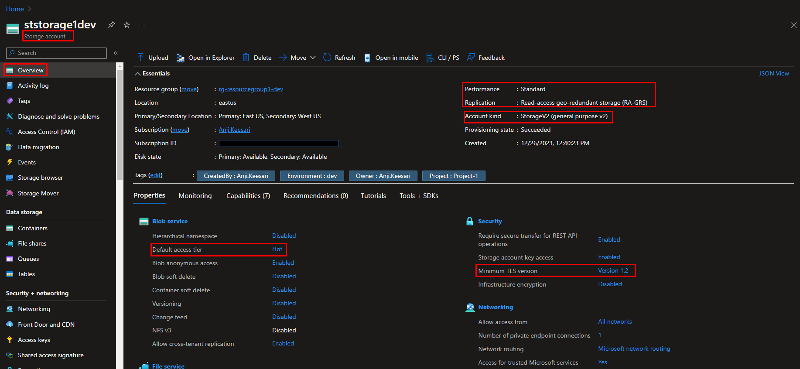
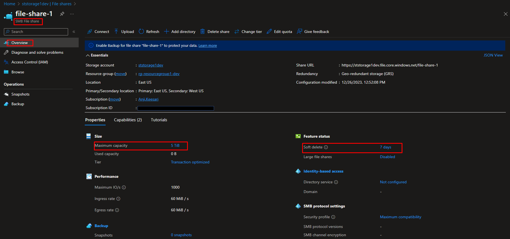
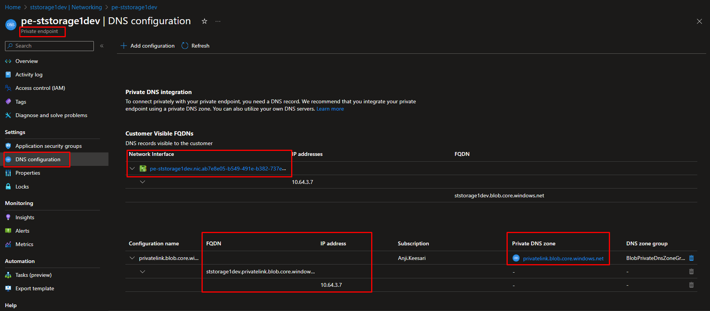

## Introduction

Azure `Storage` is a cloud-based storage solution provided by Microsoft Azure, offering a scalable, secure, and highly available storage infrastructure for various types of data. Azure Storage allows users to store and retrieve data in the cloud using various storage services, and at the core of this storage ecosystem is the `Azure Storage Account`.

In this hands-on lab, I'll guide you through the process of creating an azure storage account using Terraform. we'll cover the creation of a storage account container and the configuration of diagnostic settings. setting up a files share, and enhancing security through the use of private endpoints.

Through these tasks, you will gain practical experience on azure storage account.

## Key Features

Key Features of azure storage account includes:

**Scalability:** azure storage accounts provide a highly scalable solution, enabling users to scale their storage needs as their data requirements grow. The storage capacity can dynamically scale up or down based on demand.

**Durable and Highly Available:** Azure Storage ensures the durability and availability of data through redundancy. Data is replicated across multiple data centers to protect against hardware failures and ensure data integrity.

**Data Redundancy Options:** Users can choose redundancy options such as Locally Redundant Storage (LRS), Geo-Redundant Storage (GRS), Zone-Redundant Storage (ZRS), and more, depending on their specific needs for data redundancy and availability.

**Blob Storage:** Azure Storage supports various data types, and Blob Storage is designed for storing large amounts of unstructured data, such as documents, images, videos, and logs.

**File Storage:** Azure Storage provides a fully managed file share in the cloud, accessible via the Server Message Block (SMB) protocol. This is ideal for organizations that need a scalable file share that can be accessed from multiple virtual machines.

**Table Storage:** A NoSQL data store for semi-structured data, Azure Table Storage is suitable for applications that require high-speed access to large amounts of data.

**Queue Storage:** Azure Queue Storage is a message queuing service that enables communication between application components. It provides a scalable message queue for asynchronous processing.

**Security and Access Control:** Azure Storage offers robust security features, including encryption at rest, encryption in transit, and role-based access control (RBAC) to manage access permissions.

**Integration with Azure Services:** Azure Storage seamlessly integrates with various Azure services, making it a central component for applications deployed in the Azure cloud.

In the context of Microservices architecture and Azure Kubernetes Service (AKS), azure storage account plays a pivotal role in providing scalable and reliable storage solutions for the diverse data requirements of microservices-based applications. 

## Technical Scenario

As a `Cloud Architect`, I need to design and implement a robust solution to address persistent storage challenges in my Microservices Architecture deployed on Azure Kubernetes Service (AKS). Using azure storage account, specifically Azure File Storage, becomes handy to provide Persistent Volumes (PV),Persistent Volumes claims(PVC) as per the need in my Microservices. Additionally, I plan to utilize Storage Account containers for capturing Azure Event Hub (Kafka) messages, ensuring a seamless and well-integrated storage strategy within the broader microservices ecosystem.

## Objective

In this exercise we will accomplish & learn how to implement following:

- **Task-1:** Define and declare azure storage account variables
- **Task-2:** Create azure storage account using terraform
- **Task-3:** Create azure storage account container using terraform
- **Task-4:** Configure diagnostic settings for azure storage account using terraform
- **Task-5:** Configure diagnostic settings for azure storage account container using terraform
- **Task-6:** Create storage account's files share using terraform
- **Task-7:** Restrict Access Using Private Endpoint
- **Task-7.1:** Configure the Private DNS Zone
- **Task-7.2:** Create a Virtual Network Link Association
- **Task-7.3:** Create Private Endpoints for azure Storage
- **Task-7.4:** Validate private link connection using nslookup or dig

## Architecture diagram

The following diagram illustrates the high level architecture of Storage Account usage:

<!-- [](images/storage/image-1.png){:target="_blank"} -->

## Prerequisites

Before proceeding with this lab, make sure you have the following prerequisites in place:

1. Download and Install Terraform.
2. Download and Install Azure CLI.
3. Azure subscription.
4. Visual Studio Code.
5. Log Analytics workspace - for configuring diagnostic settings.
6. Virtual Network with subnet - for configuring a private endpoint.
7. Basic knowledge of terraform and Azure concepts.

## Implementation details

Here's a step-by-step guide on how to create an azure storage account using terraform

**login to Azure**

Verify that you are logged into the right Azure subscription before start anything in visual studio code

```bash
# Login to Azure
az login 

# Shows current Azure subscription
az account show

# Lists all available Azure subscriptions
az account list

# Sets Azure subscription to desired subscription using ID
az account set -s "anji.keesari"
```

## Task-1: Define and declare azure storage account variables

In this task, we will define and declare the necessary variables for creating the azure storage account resource. 

This table presents the variables along with their descriptions, and default values:


| Variable Name                     | Description                                                                                                      | Default Value                       |
| --------------------------------- | ---------------------------------------------------------------------------------------------------------------- | ----------------------------------- |
| storage_name                      | (Required) Specifies the name of the storage account                                                              | "storage1"                          |
| storage_account_kind              | (Optional) Specifies the account kind of the storage account                                                      | "StorageV2"                         |
| storage_access_tier               | (Optional) Defines the access tier for BlobStorage, FileStorage, and StorageV2 accounts. Valid options are Hot and Cool, defaults to Hot. | "Hot"                               |
| storage_account_tier              | (Optional) Specifies the account tier of the storage account                                                      | "Standard"                          |
| storage_allow_blob_public_access   | (Optional) Specifies the public access type for blob storage                                                      | false                               |
| storage_replication_type          | (Optional) Specifies the replication type of the storage account                                                  | "LRS"                               |
| storage_is_hns_enabled            | (Optional) Specifies whether Hierarchical Namespace (HNS) is enabled for the storage account                        | false                               |
| storage_default_action            | Allow or disallow public access to all blobs or containers in the storage accounts. The default interpretation is true for this property. | "Allow"                             |
| storage_ip_rules                  | Specifies IP rules for the storage account                                                                      | []                                  |
| storage_virtual_network_subnet_ids | Specifies a list of resource ids for subnets                                                                    | []                                  |
| storage_kind                      | (Optional) Specifies the kind of the storage account                                                            | ""                                  |
| storage_container_name            | (Required) The name of the Container within the Blob Storage Account where Kafka messages should be captured     | "container1"                        |
| storage_file_share_name           | (Required) The name of the File Share within the Storage Account where Files should be stored                    | "file-share-1"                      |
| storage_tags                      | (Optional) Specifies the tags of the storage account                                                             | {}                                  |
| pe_blob_subresource_names         | (Optional) Specifies subresource names to which the Private Endpoint can connect for Blob                         | ["blob"]                            |
| pe_blob_private_dns_zone_group_name| (Required) Specifies the Name of the Private DNS Zone Group for Blob                                             | "BlobPrivateDnsZoneGroup"          |


*Variable declaration:*

``` bash title="variables.tf"

// ========================== storage account variables ==========================
variable "storage_name" {
  description = "(Required) Specifies the name of the storage account"
  default     = "storage1"
  type        = string
}
variable "storage_account_kind" {
  description = "(Optional) Specifies the account kind of the storage account"
  default     = "StorageV2"
  type        = string

  validation {
    condition     = contains(["Storage", "StorageV2", "BlobStorage", "BlockBlobStorage", "FileStorage"], var.storage_account_kind)
    error_message = "The account kind of the storage account is invalid."
  }
}
variable "storage_access_tier" {
  description = "(Optional) Defines the access tier for BlobStorage, FileStorage and StorageV2 accounts. Valid options are Hot and Cool, defaults to Hot."
  default     = "Hot"
  type        = string

  validation {
    condition     = contains(["Hot", "Cool"], var.storage_access_tier)
    error_message = "The access tier of the storage account is invalid."
  }
}
variable "storage_account_tier" {
  description = "(Optional) Specifies the account tier of the storage account"
  default     = "Standard"
  type        = string

  validation {
    condition     = contains(["Standard", "Premium"], var.storage_account_tier)
    error_message = "The account tier of the storage account is invalid."
  }
}
variable "storage_allow_blob_public_access" {
  description = "(Optional) Specifies the public access type for blob storage"
  default     = false
  type        = bool
}
variable "storage_replication_type" {
  description = "(Optional) Specifies the replication type of the storage account"
  default     = "LRS"
  type        = string

  validation {
    condition     = contains(["LRS", "GRS", "RAGRS", "ZRS", "GZRS", "RAGZRS"], var.storage_replication_type)
    error_message = "The replication type of the storage account is invalid."
  }
}
variable "storage_is_hns_enabled" {
  description = "(Optional) Specifies the replication type of the storage account"
  default     = false
  type        = bool
}
variable "storage_default_action" {
  description = "Allow or disallow public access to all blobs or containers in the storage accounts. The default interpretation is true for this property."
  default     = "Allow"
  type        = string
}
variable "storage_ip_rules" {
  description = "Specifies IP rules for the storage account"
  default     = []
  type        = list(string)
}
variable "storage_virtual_network_subnet_ids" {
  description = "Specifies a list of resource ids for subnets"
  default     = []
  type        = list(string)
}
variable "storage_kind" {
  description = "(Optional) Specifies the kind of the storage account"
  default     = ""
}
variable "storage_container_name" {
  description = " (Required) The name of the Container within the Blob Storage Account where kafka messages should be captured"
  type        = string
  default     = "container1"
}
variable "storage_file_share_name" {
  description = " (Required) The name of the File Share within the Storage Account where Files should be stored"
  type        = string
  default     = "file-share-1"
}
variable "storage_tags" {
  description = "(Optional) Specifies the tags of the storage account"
  type        = map(any)
  default     = {}
}
variable "pe_blob_subresource_names" {
  description = "(Optional) Specifies a subresource names which the Private Endpoint is able to connect to Blob."
  type        = list(string)
  default     = ["blob"]
}
variable "pe_blob_private_dns_zone_group_name" {
  description = "(Required) Specifies the Name of the Private DNS Zone Group for Blob. "
  type        = string
  default     = "BlobPrivateDnsZoneGroup"
}
```

*Variable Definition:*

``` bash title="dev-variables.tfvars"
# storage account
storage_access_tier                = "Hot"
storage_account_kind               = "StorageV2"
storage_replication_type           = "RAGRS"
storage_account_tier               = "Standard"
storage_allow_blob_public_access   = true
storage_container_name             = "container1"
storage_file_share_name            = "file-share-1"
```

## Task-2: Create azure storage account using terraform

In this task, we will use terraform to create the azure storage account instance with the desired configuration.

``` bash title="storage.tf"
# create azure storage account
resource "azurerm_storage_account" "st" {
  name                     = "st${var.storage_name}${local.environment}"
  resource_group_name      = azurerm_resource_group.rg.name
  location                 = azurerm_resource_group.rg.location
  access_tier              = var.storage_access_tier
  account_kind             = var.storage_account_kind
  account_tier             = var.storage_account_tier
  account_replication_type = var.storage_replication_type
  is_hns_enabled           = var.storage_is_hns_enabled
  tags                     = merge(local.default_tags, var.storage_tags)
  network_rules {
    default_action             = (length(var.storage_ip_rules) + length(var.storage_virtual_network_subnet_ids)) > 0 ? "Deny" : var.storage_default_action
    ip_rules                   = var.storage_ip_rules
    virtual_network_subnet_ids = var.storage_virtual_network_subnet_ids
  }

  identity {
    type = "SystemAssigned"
  }

  lifecycle {
    ignore_changes = [
      tags
    ]
  }
  depends_on = [
    azurerm_resource_group.rg
  ]
}
```
Run terraform validation and formatting:

``` bash
terraform validate
terraform fmt
```

run terraform plan & apply

``` bash
terraform plan -out=dev-plan -var-file="./environments/dev-variables.tfvars"
terraform apply dev-plan
```

azure storage account - Overview blade 

[](images/storage/image-2.png){:target="_blank"}


## Task-3: Create azure storage account `container` using terraform

In this task, we will use terraform to create the azure storage account container 

``` bash title="storage.tf"
# storage account container for Azure Event Hub capture
resource "azurerm_storage_container" "st_container_eh" {
  name                  = lower("${var.storage_container_name}")
  storage_account_name  = azurerm_storage_account.st.name
  container_access_type = "private"
  depends_on = [
    azurerm_storage_account.st
  ]
}
```
run terraform validation and formatting:

``` bash
terraform validate
terraform fmt
```

run terraform plan & apply

``` bash
terraform plan -out=dev-plan -var-file="./environments/dev-variables.tfvars"
terraform apply dev-plan
```

azure storage account container

[](images/storage/image-3.png){:target="_blank"}

[](images/storage/image-3.1.png){:target="_blank"}

## Task-4: Configure diagnostic settings for azure storage account using terraform

By configuring diagnostic settings, we can monitor and analyze the behavior of the azure storage account instance.

``` bash title="storage.tf"
# Create diagnostic settings for Storage Account
resource "azurerm_monitor_diagnostic_setting" "diag_st" {
  name                       = lower("${var.diag_prefix}-${azurerm_storage_account.st.name}")
  target_resource_id         = azurerm_storage_account.st.id
  log_analytics_workspace_id = azurerm_log_analytics_workspace.workspace.id

  metric {
    category = "Transaction"
    retention_policy {
      enabled = true
    }
  }

  lifecycle {
    ignore_changes = [
      log,
      metric
    ]
  }
  depends_on = [
    azurerm_storage_account.st,
    azurerm_log_analytics_workspace.workspace
  ]
}
```

run terraform validate & format

``` bash
terraform validate
terraform fmt
```

run terraform plan & apply

``` bash
terraform plan -out=dev-plan -var-file="./environments/dev-variables.tfvars"
terraform apply dev-plan
```

azure storage account - diagnostic settings from left nav

[](images/storage/image-4.png){:target="_blank"}

## Task-5: Configure diagnostic settings for azure storage account container using terraform

By configuring diagnostic settings, we can monitor and analyze the behavior of the azure storage account container.

``` bash title="storage.tf"
# Create diagnostic settings at the blob level
resource "azurerm_monitor_diagnostic_setting" "diag_st_container" {
  name                       = lower("${var.diag_prefix}-${azurerm_storage_account.st.name}-blob")
  target_resource_id         = "${azurerm_storage_account.st.id}/blobServices/default/"
  log_analytics_workspace_id = azurerm_log_analytics_workspace.workspace.id
  log {
    category = "StorageRead"
    enabled  = true
  }

  log {
    category = "StorageWrite"
    enabled  = true
  }

  log {
    category = "StorageDelete"
    enabled  = true
  }

  metric {
    category = "Transaction"
  }

  lifecycle {
    ignore_changes = [
      log,
      metric
    ]
  }
  depends_on = [
    azurerm_storage_account.st,
    azurerm_log_analytics_workspace.workspace
  ]
}
```

run terraform validate & format

``` bash
terraform validate
terraform fmt
```

run terraform plan & apply

``` bash
terraform plan -out=dev-plan -var-file="./environments/dev-variables.tfvars"
terraform apply dev-plan
```

azure storage account container- diagnostic settings from left nav

[](images/storage/image-5.png){:target="_blank"}

## Task-6: Create  storage account's `files share` using terraform

Azure Storage File Share is commonly used for scenarios such as file sharing among multiple VMs, storing configuration files, hosting application data, and providing a centralized location for shared content in the cloud.

``` bash title="storage.tf"
# Create  storage account's `files share` using terraform
resource "azurerm_storage_share" "azure_storage" {
  name                 = var.storage_file_share_name
  storage_account_name = azurerm_storage_account.st.name
  quota                = 10
  depends_on = [
    azurerm_storage_account.st
  ]
}
```

run terraform validate & format

``` bash
terraform validate
terraform fmt
```

run terraform plan & apply

``` bash
terraform plan -out=dev-plan -var-file="./environments/dev-variables.tfvars"
terraform apply dev-plan
```

[](images/storage/image-6.png){:target="_blank"}

[](images/storage/image-6.1.png){:target="_blank"}

## Task-7: Restrict access using Private Endpoint

To enhance security and limit access to an Azure storage account , you can utilize private endpoints and Azure Private Link. This approach assigns virtual network private IP addresses to the storage account endpoints, ensuring that network traffic between clients on the virtual network and the storage account's private endpoints traverses a secure path on the Microsoft backbone network, eliminating exposure from the public internet.

Additionally, you can configure DNS settings for the storage account's private endpoints, allowing clients and services in the network to access the storage account using its fully qualified domain name, such as `privatelink.blob.core.windows.net`.

This section guides you through configuring a private endpoint for your storage account using Terraform.

### Task-7.1: Configure the Private DNS Zone

``` bash title="storage.tf"
# Create private DNS zone for blob storage account
resource "azurerm_private_dns_zone" "pdz_blob" {
  name                = "privatelink.blob.core.windows.net"
  resource_group_name = azurerm_virtual_network.vnet.resource_group_name
  tags                = merge(local.default_tags)

  lifecycle {
    ignore_changes = [
      tags
    ]
  }
  depends_on = [
    azurerm_virtual_network.vnet
  ]
}
```

run terraform validate & format

``` sh
terraform validate
terraform fmt
```

run terraform plan & apply

``` sh
terraform plan -out=dev-plan -var-file="./environments/dev-variables.tfvars"
terraform apply dev-plan
```

Confirm the private DNS zone configuration.

[](images/storage/image-7.png){:target="_blank"}

### Task-7.2: Create a Virtual Network Link Association

``` bash title="storage.tf"
# Create private virtual network link to prod vnet
resource "azurerm_private_dns_zone_virtual_network_link" "blob_pdz_vnet_link" {
  name                  = "privatelink_to_${azurerm_virtual_network.vnet.name}"
  resource_group_name   = azurerm_resource_group.vnet.name
  virtual_network_id    = azurerm_virtual_network.vnet.id
  private_dns_zone_name = azurerm_private_dns_zone.pdz_blob.name

  lifecycle {
    ignore_changes = [
      tags
    ]
  }
  depends_on = [
    azurerm_resource_group.vnet,
    azurerm_virtual_network.vnet,
    azurerm_private_dns_zone.pdz_blob
  ]
}
```

run terraform validate & format

``` sh
terraform validate
terraform fmt
```

run terraform plan & apply

``` sh
terraform plan -out=dev-plan -var-file="./environments/dev-variables.tfvars"
terraform apply dev-plan
```

Confirm the Virtual network links configuration.

[](images/storage/image-8.png){:target="_blank"}


### Task-7.3: Create Private Endpoints for azure Storage

By configuring Create private endpoints for Azure Storage, we can secure storage account from public access.

``` bash title="storage.tf"

# Create private endpoint for blob storage account
resource "azurerm_private_endpoint" "pe_blob" {
  name                = lower("${var.private_endpoint_prefix}-${azurerm_storage_account.st.name}")
  location            = azurerm_storage_account.st.location
  resource_group_name = azurerm_storage_account.st.resource_group_name
  subnet_id           = azurerm_subnet.jumpbox.id
  tags                = merge(local.default_tags, var.storage_tags)

  private_service_connection {
    name                           = lower("${var.private_endpoint_prefix}-${azurerm_storage_account.st.name}")
    private_connection_resource_id = azurerm_storage_account.st.id
    is_manual_connection           = false
    subresource_names              = var.pe_blob_subresource_names
    request_message                = try(var.request_message, null)
  }

  private_dns_zone_group {
    name                 = var.pe_blob_private_dns_zone_group_name
    private_dns_zone_ids = [azurerm_private_dns_zone.pdz_blob.id]
  }

  lifecycle {
    ignore_changes = [
      tags
    ]
  }
  depends_on = [
    azurerm_storage_account.st,
    azurerm_private_dns_zone.pdz_blob
  ]
}
```

run terraform validate & format

``` bash
terraform validate
terraform fmt
```

run terraform plan & apply

``` bash
terraform plan -out=dev-plan -var-file="./environments/dev-variables.tfvars"
terraform apply dev-plan
```
[](images/storage/image-9.png){:target="_blank"}

[](images/storage/image-9.1.png){:target="_blank"}

[](images/storage/image-9.2.png){:target="_blank"}

### Task-7.4: Validate private link connection using `nslookup` or `dig`

Connecting from internal VM (private access):

```sh
nslookup privatelink.blob.core.windows.net
nslookup ststorage1dev.privatelink.blob.core.windows.net
```
output

```sh
# expect the private IP Address: 10.64.3.6
```

Connecting from external (public access):

```sh
nslookup privatelink.blob.core.windows.net
nslookup ststorage1dev.privatelink.blob.core.windows.net
```

output

```sh
# should not expect the private IP Address: 10.64.3.6
```

This process ensures that the private link connection is successfully established and allows expected private IP address associated with our resource in the private virtual network.

## Reference
- [Microsoft MSDN - Azure Blob Storage documentation](https://learn.microsoft.com/en-us/azure/storage/blobs/){:target="_blank"}
- [Microsoft MSDN - Create a storage account](https://learn.microsoft.com/en-us/azure/storage/common/storage-account-create?tabs=azure-portal){:target="_blank"}
- [Microsoft MSDN - Storage account overview](https://learn.microsoft.com/en-us/azure/storage/common/storage-account-overview){:target="_blank"}
- [Microsoft MSDN - Create a container](https://learn.microsoft.com/en-us/azure/storage/blobs/blob-containers-portal){:target="_blank"}
- [Microsoft MSDN - Use private endpoints for Azure Storage](https://learn.microsoft.com/en-us/azure/storage/common/storage-private-endpoints){:target="_blank"}
- [Terraform Registry - azurerm_storage_account](https://registry.terraform.io/providers/hashicorp/azurerm/latest/docs/resources/storage_account){:target="_blank"}
- [Terraform Registry - azurerm_storage_container](https://registry.terraform.io/providers/hashicorp/azurerm/latest/docs/resources/storage_container){:target="_blank"}
- [Terraform Registry - azurerm_storage_share](https://registry.terraform.io/providers/hashicorp/azurerm/latest/docs/resources/storage_share){:target="_blank"}
- [Terraform Registry - azurerm_monitor_diagnostic_setting](https://registry.terraform.io/providers/hashicorp/azurerm/latest/docs/resources/monitor_diagnostic_setting){:target="_blank"}
- [Terraform Registry - azurerm_private_dns_zone](https://registry.terraform.io/providers/hashicorp/azurerm/latest/docs/resources/private_dns_zone){:target="_blank"}
- [Terraform Registry - azurerm_private_dns_zone_virtual_network_link](https://registry.terraform.io/providers/hashicorp/azurerm/latest/docs/resources/private_dns_zone_virtual_network_link){:target="_blank"}
- [Terraform Registry - azurerm_private_endpoint](https://registry.terraform.io/providers/hashicorp/azurerm/latest/docs/resources/private_endpoint){:target="_blank"}