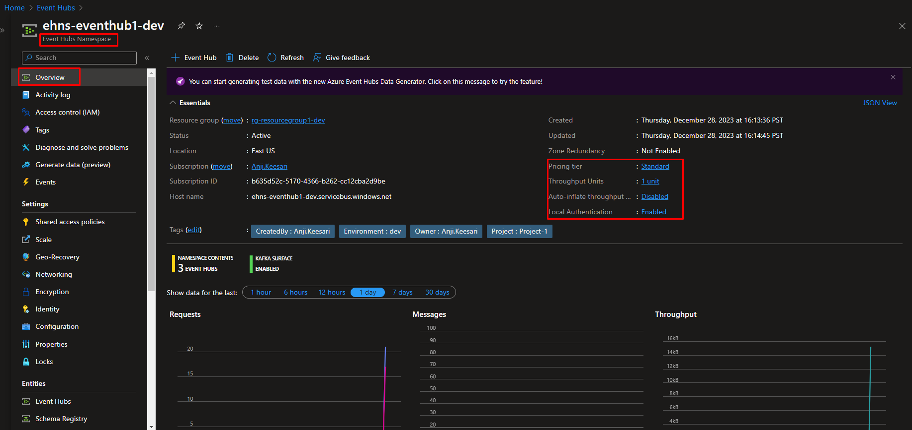
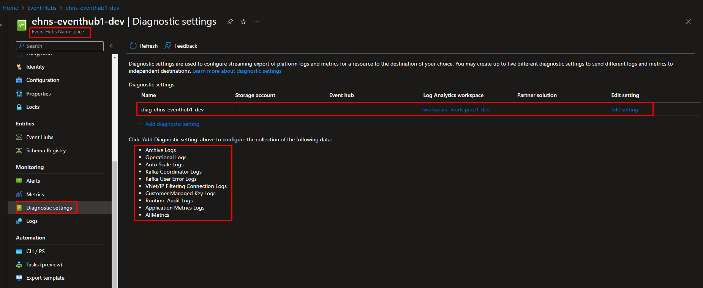
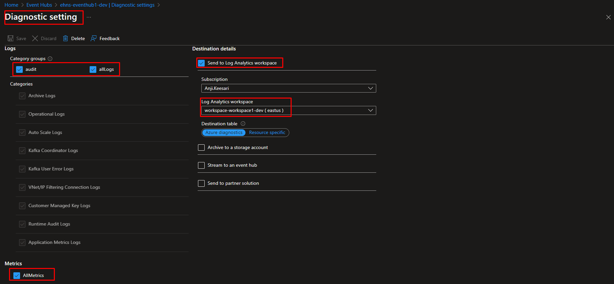
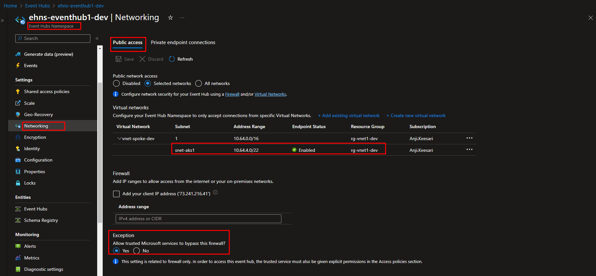
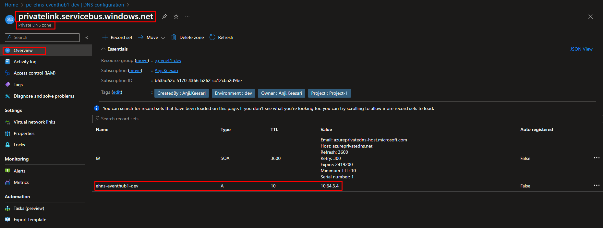
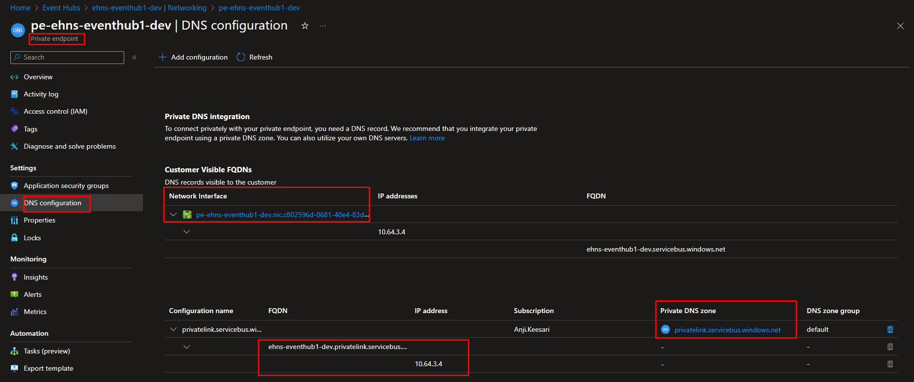
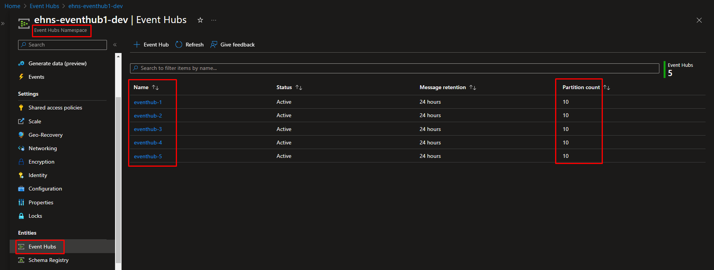

# Create Azure Event Hubs for Apache Kafka using Terraform Part-2

## Introduction

Azure Event Hubs is a cloud-based, scalable data streaming platform provided by Microsoft Azure. It is designed to ingest and process large volumes of streaming data from various sources in real-time. Event Hubs is part of the Azure messaging services and is particularly well-suited for scenarios involving event-driven architectures and big data analytics.

In this hands-on lab, I'll guide you through the process of creating an `Azure Event Hub namespace`, `Azure event hubs` using terraform, create diagnostic settings, create shared access policies and finally enhancing security through the use of private endpoints.

## Technical Scenario (Use case)

As a `Cloud Architect`, I have been tasked with designing a robust solution for a big data streaming platform, migrating data from our legacy platform to a modern SaaS multi-tenant platform following microservices architecture hosted on Azure Kubernetes Service (AKS) using an event-driven approach. The primary focus of this migration is to enhance agility, scalability, and maintainability, with `Azure Event Hubs` identified as the big data streaming platform migrating from the legacy to the new platform.


- **Background**: Our organization has relied on a legacy platform for an extended period sincde year, and our architecture board has recently finalized the design for a digital transformation initiative. To achieve this transformation, we have embraced a containerized microservices architecture deployed on Azure Kubernetes Service (AKS) along with Azure event hub for big data streaming platform. The adoption of this modern architecture aims to bring about increased agility, scalability, and maintainability.

- **Legacy System**: The legacy system currently holds a substantial volume of data that requires migration to the new microservices-based platform.

- **Microservices Architecture**: Our new platform is composed of multiple microservices, each dedicated to specific business functionalities. These microservices are meticulously designed to be loosely coupled and independently deployable, aligning with best practices in modern software architecture.

- **Azure Event Hubs Integration**: To enable real-time data streaming from the legacy system to the new containerized microservices, we have strategically chosen azure event hubs as our central event streaming platform.

- **Publisher Applications** (Legacy System): Publisher applications play a pivotal role in this migration by handling the responsibility of publishing data events to dedicated event hubs within azure event hubs. Each publisher application corresponds to a specific data domain or entity type, ensuring a granular and organized approach to data migration.

- **Event Serialization and Schema**: For efficient data serialization, producer applications utilize frameworks such as Avro to serialize data into a common schema. This schema is registered in Azure Schema Registry, guaranteeing consistency in data representation and format across the migration process.

- **Consumer Applications** (New Microservices): On the new microservices platform, consumer applications are designed to seamlessly consume events related to their specific business domains. These microservices subscribe to the event hub, allowing them to receive real-time updates as data is streamed from the legacy system.


## Objective

In this exercise we will accomplish & learn how to implement following:

- **Task-1:** Define and declare azure event hubs variables
- **Task-2:** Create storage account resources using terraform
- **Task-3:** Create kafka azure event hubs namespace
- **Task-4:** Create diagnostic settings for event hub namespace
- **Task-5:** Shared access policies for event hub namespace Level
- **Task-5.1:** Create shared access policy rule for listen
- **Task-5.2:** Create shared access policy rule for send
- **Task-5.3:** Create shared access policy rule for manage
- **Task-6:** Restrict access using private endpoint & virtual network
- **Task-6.1:** Configure the private DNS zone
- **Task-6.2:** Create a virtual network link association
- **Task-6.3:** Create private endpoints for azure event hubs
- **Task-6.4:** Validate private link connection using nslookup or dig
- **Task-7:** Create azure event hubs or kafka topics

## Architecture diagram

The following diagram illustrates the key components of azure event hubs architecture

[](images/event-hubs/image-1.png){:target="_blank"}

<!--  -->

<!-- [](images/event-hubs/image-1.png){:target="_blank"} -->

## Prerequisites

Before proceeding with this lab, make sure you have the following prerequisites in place:

1. Download and Install Terraform.
2. Download and Install Azure CLI.
3. Azure subscription.
4. Visual Studio Code.
5. Log Analytics workspace - for configuring diagnostic settings.
6. Virtual Network with subnet - for configuring a private endpoint.
7. Basic knowledge of terraform and azure concepts.

## Implementation details

Here's a step-by-step guide on how to create an azure event hub namespace and azure event hubs using Terraform

**login to Azure**

Verify that you are logged into the right Azure subscription before start anything in visual studio code

```bash
# Login to Azure
az login 

# Shows current Azure subscription
az account show

# Lists all available Azure subscriptions
az account list

# Sets Azure subscription to desired subscription using ID
az account set -s "anji.keesari"
```

## Task-1: Define and declare azure event hubs variables

In this task, we will define and declare the necessary variables for creating the azure event hub namespace and azure event hub resources. 

This table summarizes the key information about each variable, including its name, description, and default value.

| Variable Name                 | Description                                                                                                          | Default Value   |
|-------------------------------|----------------------------------------------------------------------------------------------------------------------|-----------------|
| kafka_eh_prefix               | Prefix of the Azure Event Hub (Kafka) name that's combined with the name of the event hub namespace.                 | "ehns"          |
| kafka_eh_namespace_name       | (Required) Specifies the resource group name of the Event Hub namespace name that's combined with the name of the event hub namespace. | "eventhub1" |
| kafka_eh_resource_group_name  | (Required) Specifies the resource group name of the Event Hub.                                                         | "replace me"    |
| kafka_eh_location             | (Required) Specifies the location where the Event Hub will be deployed.                                                | "replace me"    |
| kafka_eh_sku                  | (Required) Defines which tier to use. Valid options are Basic, Standard, and Premium. Please note that setting this field to Premium will force the creation of a new resource. | "Standard"   |
| kafka_eh_capacity             | (Optional) Specifies the Capacity / Throughput Units for a Standard SKU namespace. Default capacity has a maximum of 2 but can be increased in blocks of 2 on a committed purchase basis. | 2           |
| kafka_eh_partition_count      | (Optional) Specifies the number of partitions for a Kafka topic.                                                        | 10              |
| kafka_eh_message_retention    | (Optional) Specifies the number of message retention.                                                                  | 1               |
| kafka_eh_topics               | (Optional) An array of strings that indicates values of Kafka topics.                                                   | ["eventhub-1", "eventhub-2", "eventhub-3", "eventhub-4", "eventhub-5"] |
| kafka_eh_tags                 | (Optional) Specifies the tags of the Kafka event hub.                                                                 | {}              |


*Variable declaration:*

``` bash title="variables.tf"
// ==========================  azure event hubs variables ==========================
variable "kafka_eh_prefix" {
  type        = string
  default     = "ehns"
  description = "Prefix of the Azure Event Hub (Kafka) name that's combined with name of the event hub namespace."
}
variable "kafka_eh_namespace_name" {
  type        = string
  default     = "eventhub1"
  description = "(Required) Specifies the resource group name of the Event Hub namespace name that's combined with name of the event hub namespace."
}
variable "kafka_eh_resource_group_name" {
  description = "(Required) Specifies the resource group name of the Event Hub."
  type        = string
  default     = "replace me" 
}
variable "kafka_eh_location" {
  description = "(Required) Specifies the location where the Event Hub will be deployed."
  type        = string
  default     = "replace me" 
}
variable "kafka_eh_sku" {
  description = "(Required) Defines which tier to use. Valid options are Basic, Standard, and Premium. Please note that setting this field to Premium will force the creation of a new resource."
  type        = string
  default     = "Standard"
  validation {
    condition     = contains(["Standard", "Premium"], var.kafka_eh_sku)
    error_message = "The sku of the event hub is invalid."
  }
}
variable "kafka_eh_capacity" {
  description = "(Optional) Specifies the Capacity / Throughput Units for a Standard SKU namespace. Default capacity has a maximum of 2, but can be increased in blocks of 2 on a committed purchase basis."
  type        = number
  default     = 2
}
variable "kafka_eh_partition_count" {
  description = "(Optional) Specifies the  number of partitions for a Kafka topic."
  type        = number
  default     = 10
}
variable "kafka_eh_message_retention" {
  description = "(Optional) Specifies the  number of message_retention "
  type        = number
  default     = 1
}

variable "kafka_eh_topics" {
  description = "(Optional) An array of strings that indicates values of kafka topics."
  type        = list(string)
  default = [
    "eventhub-1",
    "eventhub-2",
    "eventhub-3",
    "eventhub-4",
    "eventhub-5",
  ]
}
variable "kafka_eh_tags" {
  description = "(Optional) Specifies the tags of the Kafka event hub"
  type        = map(any)
  default     = {}
}
```

*Variable Definition:*

``` bash title="dev-variables.tfvars"
# kafka event hub
kafka_eh_namespace_name             = "eventhub1"
kafka_eh_sku                        = "Standard"
kafka_eh_capacity                   = 1
kafka_eh_partition_count            = 10
kafka_eh_message_retention          = 1
```


## Task-2: Create storage account resources using terraform

In this task, the objective is to establish an Azure Storage Account specifically designed for capturing events from the Kafka system. As part of the 'Create Storage Account using Terraform' lab, we have already generated resources related to the storage account. For more detailed information, refer to the documentation provided in the 'Create Storage Account using Terraform' lab.

[Create Storage Account using Terraform](15-storage-account.md){:target="_blank"}


## Task-3: Create kafka azure event hubs namespace

Establishing an azure event hubs Namespace dedicated to a business unit ensures a centralized, scalable, and reliable platform for handling real-time event streaming. It acts as the core component for event ingestion and distribution.

``` bash title="eventhub.tf"
# Create azure event hub namespace using terraform
resource "azurerm_eventhub_namespace" "kafka_eh" {
  name                = lower("${var.kafka_eh_prefix}-${var.kafka_eh_namespace_name}-${local.environment}")
  resource_group_name = azurerm_resource_group.rg.name
  location            = azurerm_resource_group.rg.location
  sku                 = var.kafka_eh_sku
  capacity            = var.kafka_eh_capacity
  # auto_inflate_enabled     = true
  # maximum_throughput_units = 20
  network_rulesets {
    default_action                 = "Deny" //"Allow"
    trusted_service_access_enabled = true
    virtual_network_rule = [
      {
        subnet_id                                       = azurerm_subnet.aks.id
        ignore_missing_virtual_network_service_endpoint = false
    }]
  }

  tags = merge(local.default_tags, var.kafka_eh_tags)
  lifecycle {
    ignore_changes = [
      tags
    ]
  }
  depends_on = [
    azurerm_resource_group.rg,
  ]
}

```

Run terraform validate & format:
```bash
terraform validate
terraform fmt
```

Run terraform plan & apply:
```bash
terraform plan -out=dev-plan -var-file="./environments/dev-variables.tfvars"
terraform apply dev-plan
```

[](images/event-hubs/image-5.png){:target="_blank"}

## Task-4: Create diagnostic settings for event hub namespace

This task configures diagnostic settings but at the event hub namespace level. It captures logs specific to Kafka-related activities, providing visibility into the performance and health of the event hub.

``` bash title="eventhub.tf"
# Create azure event hub namespace diagnostic settings using terraform
resource "azurerm_monitor_diagnostic_setting" "diag_kafka_eh" {
  name                       = lower("${var.diag_prefix}-${azurerm_eventhub_namespace.kafka_eh.name}")
  target_resource_id         = azurerm_eventhub_namespace.kafka_eh.id
  log_analytics_workspace_id = azurerm_log_analytics_workspace.workspace.id
  enabled_log {
    category_group = "allLogs"

    retention_policy {
      days    = 0
      enabled = false
    }
  }
  enabled_log {
    category_group = "audit"

    retention_policy {
      days    = 0
      enabled = false
    }
  }

  metric {
    category = "AllMetrics"
    enabled  = true

    # retention_policy {
    #   enabled = true
    #   days    = var.kafka_eh_log_analytics_retention_days
    # }
  }
  lifecycle {
    ignore_changes = [
      # enabled_log
    ]
  }

  depends_on = [
    azurerm_eventhub_namespace.kafka_eh,
    azurerm_log_analytics_workspace.workspace
  ]
}
```

Run terraform validate & format:
```bash
terraform validate
terraform fmt
```

Run terraform plan & apply:
```bash
terraform plan -out=dev-plan -var-file="./environments/dev-variables.tfvars"
terraform apply dev-plan
```

[](images/event-hubs/image-6.png){:target="_blank"}

Diagnostic settings details:

[](images/event-hubs/image-6.1.png){:target="_blank"}

## Task-5: Shared access policies for event hub namespace Level

[](images/event-hubs/image-7.png){:target="_blank"}

### Task-5.1: Create shared access policy rule for listen

This task creates a shared access policy rule with listening permissions. It enables entities to consume events from the event hub namespace, supporting secure and controlled access to the streaming data.

``` bash title="eventhub.tf"
# Create shared access policy rule for listen
resource "azurerm_eventhub_namespace_authorization_rule" "ns_sap_listen" {
  name                = "ns_sap_listen-${local.environment}"
  namespace_name      = azurerm_eventhub_namespace.kafka_eh.name
  resource_group_name = azurerm_eventhub_namespace.kafka_eh.resource_group_name
  listen              = true // Grants listen access to this this Authorization Rule.
  send                = false
  manage              = false
}

```
Run terraform validate & format:
```bash
terraform validate
terraform fmt
```

Run terraform plan & apply:
```bash
terraform plan -out=dev-plan -var-file="./environments/dev-variables.tfvars"
terraform apply dev-plan
```

[](images/event-hubs/image-8.png){:target="_blank"}

### Task-5.2: Create shared access policy rule for send

Establishing a shared access policy rule with sending permissions allows entities to publish events to the event hub namespace. It ensures controlled data ingestion, preventing unauthorized entities from sending data.

``` bash title="eventhub.tf"
# Create shared access policy rule for send
resource "azurerm_eventhub_namespace_authorization_rule" "ns_sap_send" {
  name                = "ns_sap_send-${local.environment}"
  namespace_name      = azurerm_eventhub_namespace.kafka_eh.name
  resource_group_name = azurerm_eventhub_namespace.kafka_eh.resource_group_name
  listen              = true // Grants listen access to this this Authorization Rule.
  send                = true // Grants send access to this this Authorization Rule
  manage              = false
}
```

Run terraform validate & format:
```bash
terraform validate
terraform fmt
```

Run terraform plan & apply:
```bash
terraform plan -out=dev-plan -var-file="./environments/dev-variables.tfvars"
terraform apply dev-plan
```

[](images/event-hubs/image-9.png){:target="_blank"}

### Task-5.3: Create shared access policy rule for manage

Creating a shared access policy rule with management permissions provides entities the capability to manage and administer the event hub namespace. It's crucial for maintaining the security and configuration of the event hub.

``` bash title="eventhub.tf"
# Create shared access policy rule for manage
resource "azurerm_eventhub_namespace_authorization_rule" "ns_sap_manage" {
  name                = "ns_sap_manage-${local.environment}"
  namespace_name      = azurerm_eventhub_namespace.kafka_eh.name
  resource_group_name = azurerm_eventhub_namespace.kafka_eh.resource_group_name
  listen              = true // Grants listen access to this this Authorization Rule.
  send                = true // Grants send access to this this Authorization Rule.
  manage              = true // Grants manage access to this this Authorization Rule.
}
```

Run terraform validate & format:
```bash
terraform validate
terraform fmt
```

Run terraform plan & apply:
```bash
terraform plan -out=dev-plan -var-file="./environments/dev-variables.tfvars"
terraform apply dev-plan
```

[](images/event-hubs/image-10.png){:target="_blank"}

## Task-6: Restrict access using private endpoint & virtual network

To enhance security and limit access to an Azure Event Hubs namespace, you can utilize private endpoints and Azure Private Link. This approach assigns virtual network private IP addresses to the Azure Event Hubs namespace endpoints, ensuring that network traffic between clients on the virtual network and the Azure Event Hubs namespace's private endpoints traverses a secure path on the Microsoft backbone network, eliminating exposure from the public internet.

[](images/event-hubs/image-13.png){:target="_blank"}

### Task-6.1: Configure the private DNS zone

Creating a private DNS zone enhances security by allowing resolution of azure event hubs privately. It's a prerequisite for establishing a private link between the virtual network and the azure event hubs.


``` bash title="eventhub.tf"
# Create private DNS zone for azure event hub namespace
resource "azurerm_private_dns_zone" "pdz_ehns" {
  name                = "privatelink.servicebus.windows.net"
  resource_group_name = azurerm_virtual_network.vnet.resource_group_name
  tags                = merge(local.default_tags)
  lifecycle {
    ignore_changes = [
      tags
    ]
  }
  depends_on = [
    azurerm_virtual_network.vnet
  ]
}
```

Run terraform validate & format:
```bash
terraform validate
terraform fmt
```

Run terraform plan & apply:
```bash
terraform plan -out=dev-plan -var-file="./environments/dev-variables.tfvars"
terraform apply dev-plan
```

[](images/event-hubs/image-11.png){:target="_blank"}

### Task-6.2: Create a virtual network link association

This task associates the virtual network with the private DNS zone, enabling DNS resolution of Azure azure event hubs services within the virtual network. It's a key step for establishing a private link.

``` bash title="eventhub.tf"
# Create private virtual network link to virtual network
resource "azurerm_private_dns_zone_virtual_network_link" "ehns_pdz_vnet_link" {
  name                  = "privatelink_to_${azurerm_virtual_network.vnet.name}"
  resource_group_name   = azurerm_resource_group.vnet.name
  virtual_network_id    = azurerm_virtual_network.vnet.id
  private_dns_zone_name = azurerm_private_dns_zone.pdz_ehns.name

  lifecycle {
    ignore_changes = [
      tags
    ]
  }
  depends_on = [
    azurerm_resource_group.vnet,
    azurerm_virtual_network.vnet,
    azurerm_private_dns_zone.pdz_ehns
  ]
}
```

Run terraform validate & format:
```bash
terraform validate
terraform fmt
```

Run terraform plan & apply:
```bash
terraform plan -out=dev-plan -var-file="./environments/dev-variables.tfvars"
terraform apply dev-plan
```

[](images/event-hubs/image-12.png){:target="_blank"}

### Task-6.3: Create private endpoints for azure event hubs

Creating private endpoints for Azure azure event hubs ensures that data traffic between the virtual network and azure event hubs remains within the Microsoft Azure network. It enhances security by avoiding exposure to the public internet.

``` bash title="eventhub.tf"

# Create private endpoint for Event Hubs Namespace
resource "azurerm_private_endpoint" "pe_ehns" {
  name                = lower("${var.private_endpoint_prefix}-${azurerm_eventhub_namespace.kafka_eh.name}")
  location            = azurerm_eventhub_namespace.kafka_eh.location
  resource_group_name = azurerm_eventhub_namespace.kafka_eh.resource_group_name
  subnet_id           = azurerm_subnet.jumpbox.id
  tags                = merge(local.default_tags, var.kafka_eh_tags)

  private_service_connection {
    name                           = "pe-${azurerm_eventhub_namespace.kafka_eh.name}"
    private_connection_resource_id = azurerm_eventhub_namespace.kafka_eh.id
    is_manual_connection           = false
    subresource_names              = ["namespace"]
    request_message                = try(var.request_message, null)
  }

  private_dns_zone_group {
    name                 = "default"
    private_dns_zone_ids = [azurerm_private_dns_zone.pdz_ehns.id]
  }

  lifecycle {
    ignore_changes = [
      tags,
    ]
  }
  depends_on = [
    azurerm_eventhub_namespace.kafka_eh,
    azurerm_private_dns_zone.pdz_ehns
  ]
}

```

Run terraform validate & format:
```bash
terraform validate
terraform fmt
```

Run terraform plan & apply:
```bash
terraform plan -out=dev-plan -var-file="./environments/dev-variables.tfvars"
terraform apply dev-plan
```


[](images/event-hubs/image-14.png){:target="_blank"}

[](images/event-hubs/image-15.png){:target="_blank"}

[](images/event-hubs/image-16.png){:target="_blank"}

### Task-6.4: Validate private link connection using nslookup or dig

Manually validating the private link connection ensures that the private endpoints are properly configured and functioning. using nslookup or dig confirms the successful resolution of the private endpoint's DNS name within the virtual network.

This process ensures that the private link connection is successfully established and allows expected private IP address associated with our resource in the private virtual network.


## Task-7: Create azure event hubs or kafka topics

This task involves the creation of Azure Event Hubs or Kafka Topics, providing a crucial foundation for applications to efficiently consume events from these messaging platforms. The objective is to demonstrate the capability of creating multiple topics systematically. In the course of this task, we will create five topics, showcasing a approach to establishing and managing multiple topics within a loop.

``` bash title="eventhub.tf"
# Create azure event hubs or Kafka Topics
resource "azurerm_eventhub" "eventhubs" {
  for_each = toset([
    "eventhub-1",
    "eventhub-2",
    "eventhub-3",
    "eventhub-4",
    "eventhub-5",
  ])
  name                = each.key
  namespace_name      = azurerm_eventhub_namespace.kafka_eh.name
  resource_group_name = azurerm_eventhub_namespace.kafka_eh.resource_group_name
  partition_count     = var.kafka_eh_partition_count
  message_retention   = var.kafka_eh_message_retention
  capture_description {
    enabled  = true
    encoding = "Avro"
    destination {
      archive_name_format = "{Namespace}/{EventHub}/{PartitionId}/{Year}_{Month}_{Day}/{Hour}_{Minute}_{Second}"
      name                = "EventHubArchive.AzureBlockBlob"
      blob_container_name = azurerm_storage_container.st_container_eh.name
      storage_account_id  = azurerm_storage_account.st.id
    }
  }
  lifecycle {
    ignore_changes = [
      # tags
    ]
  }
  depends_on = [
    azurerm_eventhub_namespace.kafka_eh,
    azurerm_storage_account.st,
    azurerm_storage_container.st_container_eh
  ]
}
```

Run terraform validate & format:
```bash
terraform validate
terraform fmt
```

Run terraform plan & apply:
```bash
terraform plan -out=dev-plan -var-file="./environments/dev-variables.tfvars"
terraform apply dev-plan
```

[](images/event-hubs/image-17.png){:target="_blank"}

## Reference
- [Microsoft MSDN - Azure Event Hubs documentation](https://learn.microsoft.com/en-us/azure/event-hubs/){:target="_blank"}
- [Microsoft MSDN - Azure Blob Storage documentation](https://learn.microsoft.com/en-us/azure/storage/blobs/){:target="_blank"}
- [Microsoft MSDN - Create a storage account](https://learn.microsoft.com/en-us/azure/storage/common/storage-account-create?tabs=azure-portal){:target="_blank"}
- [Microsoft MSDN - Storage account overview](https://learn.microsoft.com/en-us/azure/storage/common/storage-account-overview){:target="_blank"}
- [Microsoft MSDN - Create a container](https://learn.microsoft.com/en-us/azure/storage/blobs/blob-containers-portal){:target="_blank"}
- [Terraform Registry - azurerm_storage_account](https://registry.terraform.io/providers/hashicorp/azurerm/latest/docs/resources/storage_account){:target="_blank"}
- [Terraform Registry - azurerm_storage_container](https://registry.terraform.io/providers/hashicorp/azurerm/latest/docs/resources/storage_container){:target="_blank"}
- [Terraform Registry - azurerm_storage_share](https://registry.terraform.io/providers/hashicorp/azurerm/latest/docs/resources/storage_share){:target="_blank"}
- [Terraform Registry - azurerm_monitor_diagnostic_setting](https://registry.terraform.io/providers/hashicorp/azurerm/latest/docs/resources/monitor_diagnostic_setting){:target="_blank"}
- [Terraform Registry - azurerm_eventhub_namespace](https://registry.terraform.io/providers/hashicorp/azurerm/latest/docs/resources/eventhub_namespace){:target="_blank"}
- [Terraform Registry - azurerm_eventhub_namespace_authorization_rule](https://registry.terraform.io/providers/hashicorp/azurerm/latest/docs/resources/eventhub_namespace_authorization_rule){:target="_blank"}
- [Terraform Registry - azurerm_private_dns_zone](https://registry.terraform.io/providers/hashicorp/azurerm/latest/docs/resources/private_dns_zone){:target="_blank"}
- [Terraform Registry - azurerm_private_dns_zone_virtual_network_link](https://registry.terraform.io/providers/hashicorp/azurerm/latest/docs/resources/private_dns_zone_virtual_network_link){:target="_blank"}
- [Terraform Registry - azurerm_private_endpoint](https://registry.terraform.io/providers/hashicorp/azurerm/latest/docs/resources/private_endpoint){:target="_blank"}

<!-- https://github.com/clemensv/messaging/tree/main/presentations -->