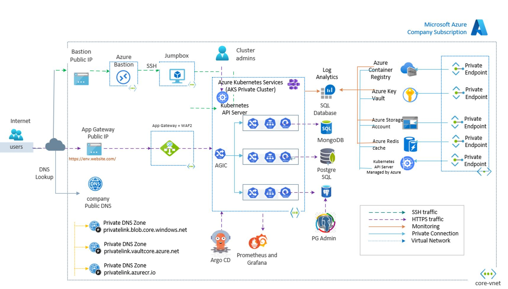

# Chapter 2: Microservices on Kubernetes

This is the second chapter of the book. In this chapter, you will explore why Kubernetes is the ideal platform for building and running microservices in the cloud. You'll learn how Kubernetes simplifies container orchestration, enhances scalability, and ensures service reliability. The chapter also introduces a suite of essential Azure services—such as AKS, ACR, Key Vault, PostgreSQL, Redis, Application Gateway and Front Door—that complement Kubernetes and collectively form a scalable, secure, and production-ready infrastructure for microservices architecture.

## Introduction

Modern software development has evolved from building monolithic applications to designing distributed, decoupled systems known as microservices. Microservices architecture enables teams to build, test, and deploy services independently, fostering agility, scalability, and resilience. However, managing these services at scale requires a robust orchestration platform—this is where Kubernetes comes into the picture.

Kubernetes, or K8s in our case it is Azure Kubernetes Services (AKS), is a container orchestration system that manages the deployment, scaling, and operation of application containers. It is specifically designed to handle microservices-based applications in dynamic cloud environments, suitable for running containers in production.

## High Level Architecture

The following diagram shows the high level reference architecture for `Building Scalable Kubernertes Infrastructure for Microservices`. this also show the essential cloud components and how they interact with AKS.

[{:style="border: 1px solid black; border-radius: 10px;"}](images/image-36.jpg){:target="_blank"}

## Why Kubernetes for Microservices?

**Decoupling and Scalability**

Kubernetes treats each microservice as a Pod, which encapsulates one or more containers. This encapsulation allows teams to scale individual services based on demand without affecting others. Kubernetes handles horizontal scaling through its native mechanisms like the **Horizontal Pod Autoscaler (HPA)**, ensuring that each microservice can grow independently.

**Resilience and Self-Healing**

Kubernetes automatically restarts failed Pods, replaces unresponsive nodes, and ensures that the desired number of replicas are always running. This makes the platform inherently resilient—critical for microservices where individual component failure should not impact the entire system.

**Declarative Configuration**

Using YAML manifests or tools like Terraform, Argocd, Helmcharts, teams can define the desired state of their applications and infrastructure. Kubernetes constantly reconciles the actual state with the desired state, simplifying configuration management and continuous delivery.

**Load Balancing**

With built-in service discovery, Kubernetes assigns each Pod a DNS name and automatically load balances traffic across healthy instances. This is crucial for microservices to communicate internally without hardcoding IP addresses or managing custom registries.

**Rolling Updates and Canary Deployments**

Kubernetes supports zero-downtime deployments through rolling updates, enabling developers to release features incrementally and roll back in case of issues. This ensures stability and smooth upgrades for live applications.

## AKS Reference Architecture Components

While Kubernetes provides orchestration, it needs a strong supporting infrastructure to meet the demands of real-world microservices applications. Below, we explore key Azure resources and how they integrate with AKS to create a reliable, scalable, and secure platform.

**Azure Log Analytics Workspace**

*Purpose*: Centralized logging and telemetry collection.

*Role in Microservices*: Observability is crucial in distributed systems. Log Analytics integrates with Azure Monitor and Kubernetes to collect logs, metrics, and performance data from your clusters. It helps developers and operations teams quickly diagnose issues, understand system behavior, and make informed decisions.

**Azure Virtual Network (VNet)**

*Purpose*: Secure, isolated network space in Azure.

*Role in Microservices*: Kubernetes nodes and Pods must communicate securely across services. A VNet provides the foundation for network isolation, inter-service communication**, private endpoints, and hybrid connectivity to on-prem resources or other cloud regions.

**Application Gateway:**

The Application Gateway serves as the entry point for client requests from the public DNS. It acts as a reverse proxy and load balancer, routing requests to the appropriate backend services. With features like SSL/TLS termination and backend pool configuration, the Application Gateway helps to decouple clients from services.

**Azure Front Door and CDN Profile**

*Purpose*: Global HTTP load balancer with intelligent routing and content delivery network.

*Role in Microservices*: Front Door distributes traffic to Kubernetes services across regions with built-in **SSL offloading**, **caching**, and **Web Application Firewall (WAF)**. It ensures high availability, low latency, and secure access for frontend services or APIs exposed to the internet.

**Azure Container Registry (ACR)**

*Purpose*: Private registry to store and manage Docker container images.

*Role in Microservices*: Every microservice deployed in Kubernetes is packaged as a container. ACR serves as a secure, scalable place to host these container images. It integrates seamlessly with AKS for faster, more secure deployments.

**Azure Kubernetes Service (AKS)**

*Purpose*: Managed Kubernetes platform on Azure.

*Role in Microservices*: AKS is the heart of your cloud-native infrastructure. It abstracts away the complexity of Kubernetes management—handling upgrades, scaling, monitoring, and security—so you can focus on building and running microservices efficiently.

**Azure PostgreSQL Flexible Server**

*Purpose*: Managed PostgreSQL database service with high availability and performance.

*Role in Microservices*: Many microservices need structured, relational data storage. PostgreSQL Flexible Server offers a cost-effective, scalable, and secure backend for services that require ACID-compliant databases. It also supports VNet integration and private access for enhanced security.

**Azure Key Vault**

*Purpose*: Securely store and manage secrets, certificates, and encryption keys.

*Role in Microservices*: Secure configuration is a must in production. Key Vault allows your services to retrieve sensitive data like database connection strings, API keys, and certificates securely without hardcoding them in containers or source code.

**Azure Cache for Redis**

*Purpose*: In-memory data store for fast data access.

*Role in Microservices*: Microservices often benefit from caching to reduce latency and offload backend services. Azure Cache for Redis acts as a shared, high-performance cache layer—perfect for session storage, frequent reads, and pub/sub messaging patterns.

**Azure Storage Account**

*Purpose*: Massively scalable object, file, and blob storage.

*Role in Microservices*: Services may need persistent storage for logs, file uploads, images, or large binary data. Azure Storage supports secure and cost-effective options like **Blob Storage**, **File Share**, and **Queue Storage**, easily accessible from AKS Pods via private endpoints or identity-based access.

## How It All Comes Together

By combining Kubernetes with these Azure services, you build a **cloud-native ecosystem** where:

* **Code** runs in containers on AKS
* **Data** is managed using PostgreSQL and Storage Accounts
* **Secrets** are secured in Key Vault
* **Networking** is isolated via VNets and enhanced by Front Door
* **Observability** is achieved through Log Analytics
* **Performance** is optimized with Redis Caching and ACR-hosted images

This architecture provides the foundation for a **resilient, secure, observable, and scalable** microservices platform—aligned perfectly with our mission: **`Building Scalable Cloud Infrastructure for Microservices.`**

## Why Choose Azure for Microservices Infrastructure

Microsoft Azure has deep support for containerized applications, DevOps workflows, and distributed systems. For building microservices, Azure offers:

* **Azure Kubernetes Service (AKS)** – A fully managed Kubernetes platform
* **Azure Container Registry (ACR)** – Private container image storage
* **Azure Key Vault** – Centralized secrets and key management
* **PostgreSQL Flexible Server** – Managed database optimized for microservices
* **Event Hubs, Redis, and Storage** – Core services for messaging, caching, and persistence

Microsoft's broad service ecosystem, global availability, and tight integration with identity, security, and monitoring tools make it ideal for deploying modern applications at scale.

## Terraform + Azure = Production-Ready IaC

Terraform offers a powerful way to manage Azure infrastructure as code. With the **Azure Provider** (`azurerm`), you can use Terraform to create and maintain everything from resource groups to Kubernetes clusters.

Key benefits of using Terraform with Azure:

* **Automated Provisioning**: Define your entire environment in `.tf` files and deploy with a single command.
* **Consistent Environments**: Avoid manual configuration errors and environment drift.
* **Reusable Code**: Use modules to replicate best practices across teams and projects.
* **Change Management**: Use `terraform plan` to preview changes before applying.
* **State Tracking**: Terraform keeps track of actual infrastructure using a `.tfstate` file.
* **Multi-Cloud Ready**: Same tool and language can extend across AWS, GCP, etc.

!!! Important
    Each lab in this book covers actual implementation details therefore it is always recommended to read the relevant MSDN documentation on particular azure service before start any lab so that is supper easy for you to work on these labs. you will see the links end of each lab for your reference.

## Reference
- [Microsoft MSDN - Microservices architecture on Azure Kubernetes Service](https://learn.microsoft.com/en-us/azure/architecture/reference-architectures/containers/aks-microservices/aks-microservices){:target="_blank"}