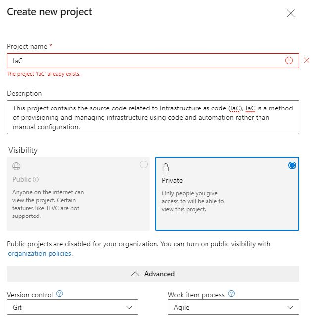
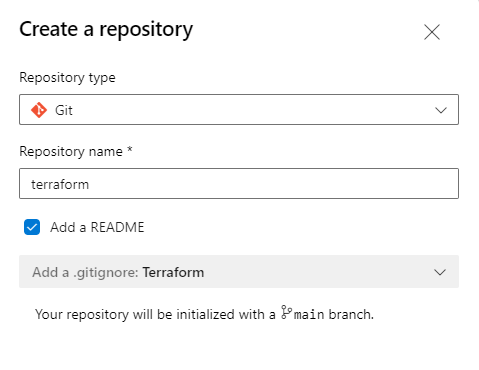
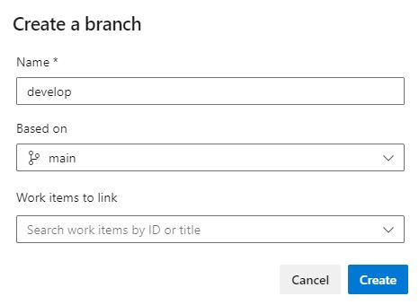

## Introduction

This is the the Part-1 of the terraform foundation, in this lab we will setup the terraform environment in Azure DevOps and Azure portal to run terraform configuration in the upcoming labs;

Terraform environment setup is onetime activity, once this is completed then we are ready for any kind of azure resource creation with IaC automation.

## Objective

In this exercise we will accomplish & learn following:

- **Azure DevOps setup**
    - Task-1: Create a new project in azure DevOps
    - Task-2: Create a new Azure DevOps Repo for terraform
    - Task-3: Clone a new git repo
    - Task-4: Add .gitignore file in the git repo for terraform

## Prerequisites
  - Download & Install Terraform
  - Download & Install Azure CLI
  - Azure subscription
  - Register resource providers in the subscription
  - Visual studio code
  - Download & Install Git tools

**Implementation details**

All the tasks listed above will be performed one by one in this section.

In this lab we will perform some tasks in Azure DevOps web portal and some tasks in Azure Portal.


## Task-1: Create a new project in azure DevOps

This new project will be used for IaC, later you can create multiple git repos in this project based on the need.

Project Name - `IaC`

Project Description - This project contains the source code related to Infrastructure as code (IaC), IaC is a method of provisioning and managing infrastructure using code and automation rather than manual configuration.

follow these steps for creating a new project in azure DevOps.

1. Sign in to your organization in Azure DevOps
1. Select New project.
1. Enter project name & description

Once the project is created then you can add following repos for managing all your IaC related scripts or configuration, some of the  example here are:

- `terraform` - you can use this repo for terraform configuration
- `scripts` - you can use this repo for managing all kinds of scripts like PowerShell, Bash and CLI etc..
- `Bicep` - you can use this repo for Microsoft Bicep scripts etc..



## Task-2: Create a new Azure DevOps Repo for terraform

You can use Azure DevOps to create a new Git repository to store and manage terraform configuration source code. Here are the steps to create a new Git repository in Azure DevOps:

- Login into azure DevOps -  <https://dev.azure.com/>
- Select the project where we want to create the repo
- Click on `Repos` left nav link
- From the repo drop-down, select `New repository`
- In the `Create a new repository` dialog, verify that Git is the repository type and enter a name for the new repository. 
- You can also add a README and create a `.gitignore` for the type of code you plan to manage in the repo.

- use lower case for the repos (best practice)
  - repo name - terraform 

for example: 



- Initialize the main branch with a README or gitignore

- Create new feature branch (develop) from main



## Task-3: Clone the git repo

There are multiple ways to clone the git repo to your computer.

Here we will use the Git CMD tool, open the app in admin mode and follow these commands to clone the code locally.

```
C:\Users\anji.keesari>cd c:\Source\Repos\IaC

c:\Source\Repos\IaC>git clone https://keesari.visualstudio.com/IaC/_git/terraform
Cloning into 'terraform'...
remote: Azure Repos
remote: Found 4 objects to send. (26 ms)
Unpacking objects: 100% (4/4), 1.22 KiB | 62.00 KiB/s, done.

c:\Source\Repos\IaC>cd terraform

# open the folder in VS code
c:\Source\Repos\IaC\terraform>code .

c:\Source\Repos\IaC\terraform>
```

## Task-4: Add .gitignore file in the git repo for terraform

Update or add (if not existing) .**gitignore** for terraform ignore - this will allow us not to commit unnecessary terraform files in to git repo.

for example: 

``` title=".gitignore"
# Local .terraform directories
**/.terraform/*

# .tfstate files
*.tfstate
*.tfstate.*

# Crash log files
crash.log

# Exclude all .tfvars files, which are likely to contain sentitive data, such as
# password, private keys, and other secrets. These should not be part of version 
# control as they are data points which are potentially sensitive and subject 
# to change depending on the environment.
#
*.tfvars

# Ignore override files as they are usually used to override resources locally and so
# are not checked in
override.tf
override.tf.json
*_override.tf
*_override.tf.json

# Include override files you do wish to add to version control using negated pattern
#
# !example_override.tf

# Include tfplan files to ignore the plan output of command: terraform plan -out=tfplan
# example: *tfplan*

# Ignore CLI configuration files
.terraformrc
terraform.rc
```


## References


- <https://learn.microsoft.com/en-us/azure/devops/organizations/projects/create-project?view=azure-devops&tabs=browser>
- <https://learn.microsoft.com/en-us/azure/devops/repos/git/create-new-repo?view=azure-devops>
- <https://learn.microsoft.com/en-us/power-apps/developer/data-platform/walkthrough-register-app-azure-active-directory>
