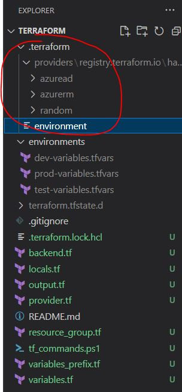
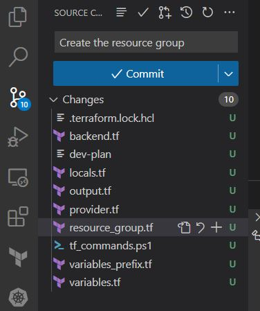

## Introduction

This is part-2 of the terraform foundation, in this module we will setup the terraform project or folder structure for running any kind of terraform configuration. this folder structure and terraform source code is required for creating any kind of azure resources using terraform.

## Technical Scenario
As a cloud engineer, you have been asked to start working on infrastructure as code (IaC) setup using terraform for your organization so that you can create any kind of azure cloud resources using the source code written in terraform. As part of the terraform project structure we will be creating our first resource group so that we can test the basic terraform setup or files created in this module.

we will start with bare minimum terraform configuration in this module and update the same files while creating more and more resources in the future modules.

## Objective

In this exercise we will accomplish & learn following:

- Task-1: Create terraform environment variables
- Task-2: Create terraform providers
- Task-3: Configure terraform backend state
- Task-4: Create terraform variables
- Task-5: Create locals file
- Task-6: Create azure resource group
- Task-7: Initialize Terraform
- Task-8: Create a Terraform execution plan
- Task-9: Apply a Terraform execution plan
- Task-10: Verify the results

## Architecture diagram


## Prerequisites
  - Download & Install Terraform
  - Download & Install Azure CLI
  - Azure subscription
  - Visual studio code
  - Azure DevOps project & repo

**Implementation details**

Before we start on any of the tasks listed below, we will clone the `terraform` git repo first from Azure devOps portal; this git repo was created in our previous module; Once it is cloned open VS code text editor and open the terraform folder.

## Task-1: Create terraform environment variables

Create new folder called `environments` and add following files in it. here we are creating *.tfvar files for each environment, these *.tfvar files will contains environment specific values in it.

use these files for controlling your environment specific setting in future labs;

let's start with adding service principal credentials in environment variables and later use these files for adding more environment specific variable as and when needed while creating new azure resources.

environments folder structure will look like below:
```
environments
  |_ dev-variables.tfvar 
  |_ test-variables.tfvar 
  |_ prod-variables.tfvar 
```

!!! important
    Replace these values with your environment specific values

```  tf title="dev-variables.tf"
sp-subscription-id = "test-6c89-4044-8a23-test"
sp-client-id = "test-645b-48f5-b586-test"
sp-client-secret = "test~oFskcGH6bno8kS~tet"
sp-tenant-id = "test-f87d-46ad-b4be-test"

```

```  tf title="test-variables.tf"
sp-subscription-id = "value will be replaced by key vault value"
sp-client-id = "value will be replaced by key vault value"
sp-client-secret = "value will be replaced by key vault value"
sp-tenant-id = "value will be replaced by key vault value"
```

```  tf title="prod-variables.tf"
sp-subscription-id = "value will be replaced by key vault value"
sp-client-id = "value will be replaced by key vault value"
sp-client-secret = "value will be replaced by key vault value"
sp-tenant-id = "value will be replaced by key vault value"
```

## Task-2: Create terraform providers

Terraform providers are plugins that allow Terraform to interact with different resources in different infrastructure providers (Azure, AWS, GCP) Here are the steps to create a provider in Terraform:

The `azurerm` Terraform Provider allows managing resources within Azure Resource Manager. When using version 3.0 of the AzureRM Provider we recommend using Terraform 1. x.

Here we will create a new file called `provider.tf` and register all the required providers for terraform to create required resources.

```  tf title="provider.tf"
terraform {

  required_version = ">=0.12"

  required_providers {
    azurerm = {
      source  = "hashicorp/azurerm"
      version = "~>3.31.0" //"~>2.0"
    }

    azuread = {
      version = ">= 2.26.0" // https://github.com/terraform-providers/terraform-provider-azuread/releases
    }
  }
}

provider "random" {}

provider "azurerm" {
  features {}
  skip_provider_registration = true
  subscription_id            = var.sp-subscription-id
  client_id                  = var.sp-client-id
  client_secret              = var.sp-client-secret
  tenant_id                  = var.sp-tenant-id
}

```

## Task-3: Configure terraform backend state

By default, Terraform state is stored locally, which isn't ideal, rather we should be storing using remote state which is in azure storage account so that multiple team members can work on the terraform project. here we will configure the terraform backend for remote state.

use the azure storage account created in part-1 of the terraform foundation and configure terraform backed state.

To configure the backend state, you need the following information:

- `resource_group_name`: The name of the azure resource group where Storage account is created.
- `storage_account_name`: The name of the Azure Storage account.
- `container_name`: The name of the blob container.
- `key`: The name of the state store file to be created.


```  tf title="backend.tf"
terraform {
  backend "azurerm" {
    resource_group_name  = "rg-tf-mgmt-project1"
    storage_account_name = "sttfstatesdev"
    container_name       = "terraformstates"
    key                  = "project1-state-"
  }
}

```
## Task-4: Create terraform variables

Terraform variables allow you to define reusable values in your Terraform configuration, which can be used to parameterize your Terraform code.

In terraform, variables are divided into inputs and outputs. let's create separate file for each one of them here.

`variables.tf` - use this file for input variables

```  tf title="variables.tf"
# Service Principal
variable "sp-subscription-id" {
  description = "Id of the azure subscription where all resources will be created"
  type        = string
}
variable "sp-client-id" {
  description = "Client Id of A Service Principal or Azure Active Directory application registration used for provisioning azure resources."
  type        = string
}
variable "sp-client-secret" {
  description = "Secret of A Service Principal or Azure Active Directory application registration used for provisioning azure resources."
  type        = string
}
variable "sp-tenant-id" {
  description = "Tenant Id of the azure account."
  type        = string
}
# Azure resources
variable "rg_name" {
  description = "Name of the main resource rroup name for project-1"
  type        = string
}

variable "location" {
  description = "Specifies the location for the resource group and all the resources"
  type        = string
  default     = "North Central US"
}

variable "default_tags" {
  type = map(any)
  default = {
    "Project"   = "Project-1"
    "Owner"     = "Anji.Keesari"
    "CreatedBy" = "Anji.Keesari"
  }
}
```

`output.tf` - use this files for output variables

``` tf title="output.tf"
output "resource_group_name" {
  value = azurerm_resource_group.rg.name
}

```

I am also going to create one more file for azure resource names naming conventions or standards across my organization. This file contains prefix of all the frequently used azure resource names as per the standards.

`variables_prefix.tf`


``` tf title="variables_prefix.tf"

variable "rg_prefix" {
  type        = string
  default     = "rg"
  description = "Prefix of the resource group name that's combined with name of the resource group."
}

```

## Task-5: Create locals file

This is optional but I'll create this file as place holder.

Use this file for storing all the locals in one place together for entire terraform project.


``` tf title="locals.tf"

locals {
  default_tags = merge(var.default_tags, { "Environment" = "${terraform.workspace}" })
  environment  = terraform.workspace != "default" ? terraform.workspace : ""
}

```

## Task-6: Create azure resource group

Finally let's create one sample azure resource group to make sure that all the terraform configuration we created above is actually working as expected.


``` tf  title="resource_group.tf"
# Create the resource group
resource "azurerm_resource_group" "rg" {
  name     = lower("${var.rg_prefix}-${var.rg_name}-${local.environment}")
  location = var.location
  tags = merge(local.default_tags,
    {
      "CreatedBy" = "Anji.Keesari"
  })
  lifecycle {
    ignore_changes = [
      tags,
    ]
  }
}

```

## Task-7: Store terraform commands

Create a separate file for storing all terraform commands here so that anyone working on this project can use them. 

This task is optional, but it will be really helpful especially new team members working on the same project.


``` tf  title="tf_commands.ps1"

# azure login related
az login

az account list --output table

az account set -s "anji.keesari"

az account show --output table

# terraform related
terraform init
# terraform init -reconfigure

terraform validate
terraform fmt
terraform plan -out=dev-plan -var-file="./environments/dev-variables.tfvars"
terraform apply dev-plan

terraform state list

# workspaces related
terraform workspace list

terraform workspace new dev

terraform workspace select dev

```

## Task-8: Initialize Terraform

Run `terraform init` to initialize the Terraform deployment. This command downloads the Azure modules required to manage your Azure resources.

**terraform init**

``` tf 
Initializing the backend...

Initializing provider plugins...
- Finding latest version of hashicorp/azurerm...
- Installing hashicorp/azurerm v3.40.0...
- Installed hashicorp/azurerm v3.40.0 (signed by HashiCorp)

Terraform has created a lock file .terraform.lock.hcl to record the provider
selections it made above. Include this file in your version control repository
any changes that are required for your infrastructure. All Terraform commands
should now work.

If you ever set or change modules or backend configuration for Terraform,
rerun this command to reinitialize your working directory. If you forget, other
commands will detect it and remind you to do so if necessary.
```

You will notice this new folder created when you run `terraform init` command executed



Also see the folder structure of the terraform project.

!!! important
    Verify to make sure that new state file got created in azure storage account blob container 

**terraform validate**

validate terraform code for syntax

```
Success! The configuration is valid.
```

**terraform fmt**

Formats terraform source code as per HCL canonical standard


## Task-9: Setup Terraform workspace

Terraform workspace is a feature in Terraform that allows you to manage multiple instances of the same Terraform configuration in a single Terraform state. Each workspace is effectively a separate and isolated environment, with its own state and variables. Here are the steps to create and manage workspaces in Terraform:

default workspace

```
Terraform workspace
```
output

```
* default
```
Create a new workspace

```
terraform workspace new dev
```

```
Created and switched to workspace "dev"!

You're now on a new, empty workspace. Workspaces isolate their state,
so if you run "terraform plan" Terraform will not see any existing state
for this configuration.

```
```
terraform workspace list   
```
output

```
  default
* dev

```
Use this to switch between workspaces

```
terraform workspace select dev
```


## Task-10: Create a Terraform execution plan

Run `terraform plan` to create an execution plan.


Key points:
- The terraform plan command creates an execution plan, but doesn't execute it. Instead, it determines what actions are necessary to create the configuration specified in your configuration files. This pattern allows you to verify whether the execution plan matches your expectations before making any changes to actual resources.
- The optional -out parameter allows you to specify an output file for the plan. Using the -out parameter ensures that the plan you reviewed is exactly what is applied.


**Terraform plan**

```
terraform plan -out=dev-plan -var-file="./environments/dev-variables.tfvars"
```
output

``` tf 

Terraform used the selected providers to generate the following execution plan. Resource actions are indicated with the following symbols:
  + create

Terraform will perform the following actions:

  # azurerm_resource_group.rg will be created
  + resource "azurerm_resource_group" "rg" {
      + id       = (known after apply)
      + location = "northcentralus"
      + name     = "rg-resourcegroup1-dev"
      + tags     = {
          + "CreatedBy"   = "Anji.Keesari"
          + "Environment" = "dev"
          + "Owner"       = "Anji.Keesari"
          + "Project"     = "Project-1"
        }
    }

Plan: 1 to add, 0 to change, 0 to destroy.

Changes to Outputs:
  + resource_group_name = "rg-resourcegroup1-dev"

Saved the plan to: dev-plan

To perform exactly these actions, run the following command to apply:
    terraform apply "dev-plan"

```

## Task-11: Apply a Terraform execution plan

Run `terraform apply` to apply the execution plan to your cloud infrastructure.

**Terraform apply**

```
azurerm_resource_group.rg: Creating...
azurerm_resource_group.rg: Creation complete after 2s [id=/subscriptions/test-5170-4366-b262-test/resourceGroups/rg-resourcegroup1-dev]

Apply complete! Resources: 1 added, 0 changed, 0 destroyed.

Outputs:

resource_group_name = "rg-resourcegroup1-dev"
```

## Task-12: Verify the results


Login into azure portal and validate azure resources created from terraform configuration.

Finally commit terraform source code to git repo before start next module.



## Reference

- https://learn.microsoft.com/en-us/azure/developer/terraform/create-resource-group?source=recommendations&tabs=azure-cli
- https://learn.microsoft.com/en-us/azure/developer/terraform/store-state-in-azure-storage?tabs=azure-cli
