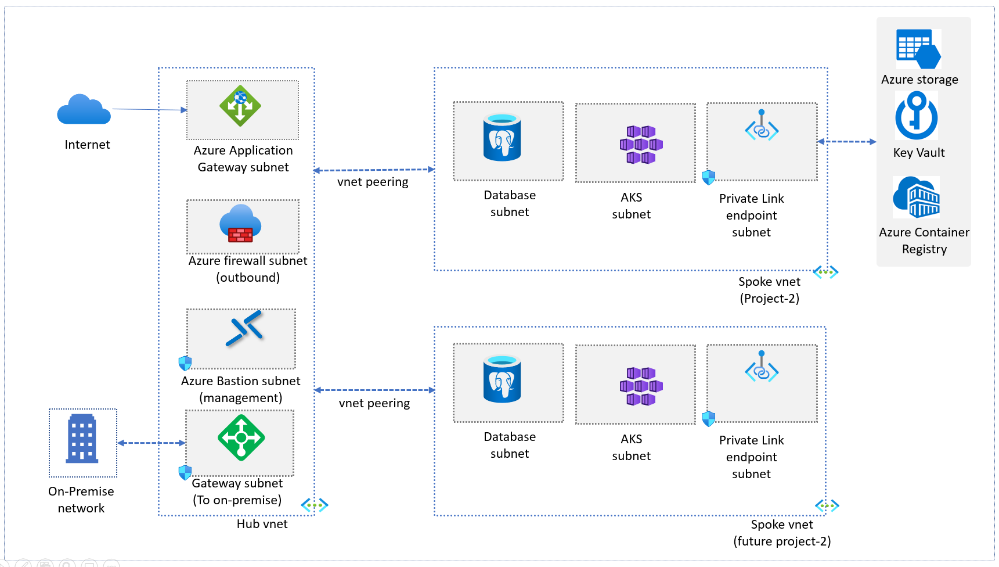
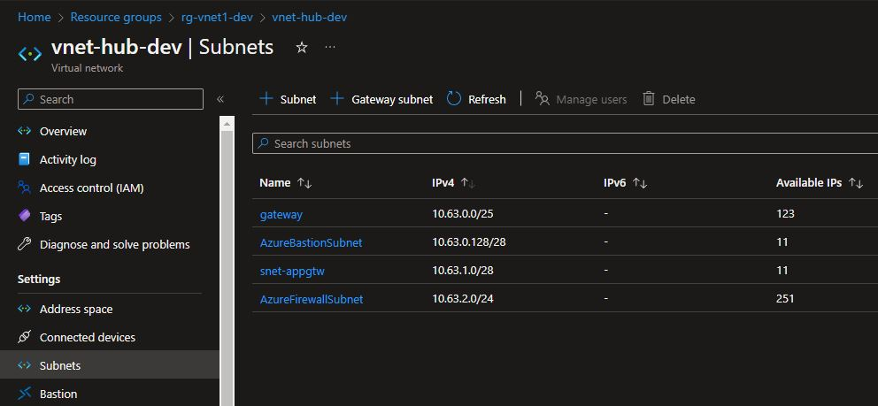
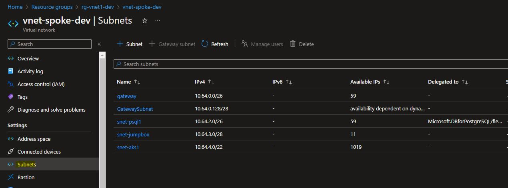
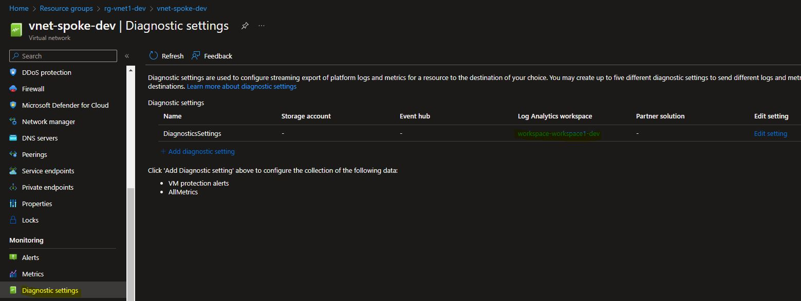
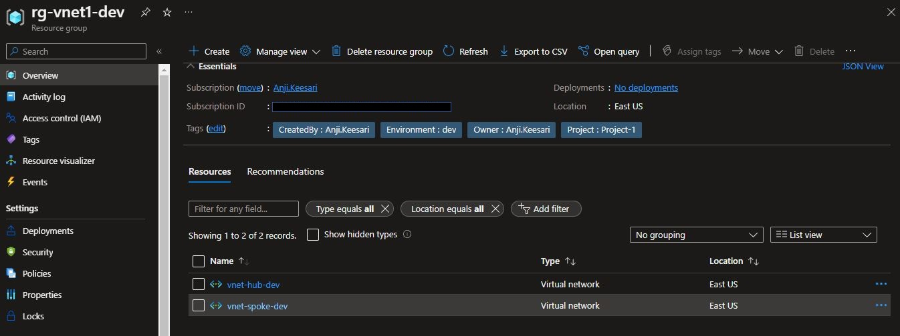

## Introduction

Azure Virtual Network also known as vnet is the fundamental building block for private network for securing the infrastructure, azure virtual network will be used for securely communicate with each other in the azure infrastructure and securely connecting from outside publicly, azure vnet will brings with it additional benefits of Azure's infrastructure such as scale, availability, and isolation.

In this lab, I will walk you through the steps to create an Azure Virtual Network for a hub-and-spoke model with subnets using Terraform. Additionally, I will show you how to confirm its successful deployment through the Azure portal.

## Technical Scenario

As a `Cloud Engineer`, you have been asked to deploy azure resources with fully secured and isolated networking capabilities, we will use the azure virtual network capabilities to protect azure virtual machines, AKS clusters, azure key vault services, azure storage account services using azure virtual network.

## Objective

In this exercise we will accomplish & learn how to implement following:

- Task-1: Define and declare virtual network variables
- Task-2: Create a resource group for virtual network
- Task-3: Create **hub** virtual network using terraform
- Task-4: Review hub virtual network resources
- Task-5: Create **spoke** virtual network using terraform   
- Task-6: Review spoke virtual network resources
<!-- - ## Task-5: Create Diagnostics Settings for Networking -->
- Task-7: Create vnet Peering from hub to spoke
- Task-8: Create vnet Peering from spoke to hub   
- Task-9: Lock virtual network resource group

## Architecture diagram

Here is the reference architecture diagram used for creating virtual network with hub & spoke model.

[](images/image-74.png){:target="_blank"}

<!--  -->


## Prerequisites
  - Download & Install Terraform
  - Download & Install Azure CLI
  - Azure subscription
  - Visual studio code
  - Azure DevOps Project & repo
  - Terraform Foundation
  - Log Analytics workspace

## Implementation details

In this lab we are going to create Hub & Spoke virtual network topology. Let's try to understand little bit about this here before jumping into the lab:

A hub and spoke virtual network architecture is a networking topology commonly used in cloud computing, and particularly in Microsoft Azure. In this architecture, a central "hub" virtual network is connected to one or more "spoke" virtual networks, forming a hub-and-spoke topology.

There are several benefits to using a hub and spoke virtual network architecture in Azure:

- Scalability: The hub and spoke architecture is highly scalable and can be easily extended as the needs of the organization change.
- Security: The centralized hub network can act as a secure boundary for the entire network, providing a single point of entry for traffic.
- Simplified management: The hub and spoke architecture simplifies network management, making it easier to monitor and manage traffic between the various spoke networks.
- Cost-effective: The hub and spoke architecture can help reduce costs by reducing the need for redundant networking infrastructure.

In Azure the hub network is created first, followed by the spoke networks which are then connected to the hub network.

Now let's start working on the lab.

Open the terraform project folder in Visual Studio code and creating new file named `virtual_network.tf` for Virtual Network specific azure resources;


**login to Azure**

Verify that you are logged into the right Azure subscription before start anything in visual studio code

``` sh
# Login to Azure
az login 

# Shows current Azure subscription
az account show

# Lists all available Azure subscriptions
az account list

# Sets Azure subscription to desired subscription using ID
az account set -s "anji.keesari"
```

## Task-1: Define and declare virtual network variables

This section covers list of variables used to create virtual network with detailed description and purpose of each variable with default values.


| **Name**                | **Description**                                              | **Values** |
| ------------------------| ------------------------------------------------------------ | ---------  |                                                           
| vnet_rg_name           | Name of the resource group name for virtual network | rg-vnet1-dev|
| vnet_location   |Location in which to deploy the virtual network | East US |
| hub_vnet_name| Specifies the name of the hub virtual virtual network | vnet-hub-dev |
| hub_vnet_address_space| Specifies the address space of the hub virtual virtual network| ["10.63.0.0/20"] |
| hub_gateway_subnet_name| Specifies the Name of the hub gateway subnet | gateway |
| hub_gateway_subnet_address_space| Specifies the address space of the hub gateway subnet |  ["10.63.0.0/25"]|
| hub_appgtw_subnet_name| Specifies the Name of the hub application gateway subnet | snet-appgtw1 |
| hub_appgtw_subnet_address_space| Specifies the address space of the hub application-gateway subnet |  ["10.63.1.0/28"]|
| hub_bastion_subnet_name| Specifies the Name of the hub bastion host subnet | AzureBastionSubnet |
| hub_bastion_subnet_address_space| Specifies the address space of the hub bastion host subnet |  ["10.63.2.0/28"]|
| spoke_vnet_name| Specifies the name of the spoke virtual virtual network | vnet-spoke-dev |
| spoke_vnet_address_space| Specifies the address space of the spoke virtual virtual network | ["10.64.0.0/16"] |
| spoke_gateway_subnet_name| Specifies the Name of the spoke gateway subnet | gateway |
| spoke_gateway_subnet_address_space| Specifies the address space of the gateway subnet | ["10.64.0.0/25"] |
| spoke_aks_subnet_name| Specifies the name of the aks cluster -1 name | snet-aks1 |
| spoke_aks_subnet_address_space| Specifies the address space of the gateway subnet | ["10.64.1.0/22"] |
| spoke_postgresql_subnet_name| Specifies the name of the postgresql name | snet-postgresql1 |
| spoke_postgresql_subnet_address_space| Specifies the address space of the postgresql subnet | ["10.64.2.0/26"] |


**Variables Prefixed**

Here is the list of new prefixes used in this lab

``` tf title="variables_prefix.tf"
variable "vnet_prefix" {
  type        = string
  default     = "vnet"
  description = "Prefix of the vnet name."
}
variable "subnet_prefix" {
  type        = string
  default     = "snet"
  description = "Prefix of the Subnet name."
}
```

**Declare Variables**

Here is the list of new variables used in this lab

``` tf title="variables.tf"

// ========================== virtual netowrking ==========================

variable "vnet_rg_name" {
  description = "Name of the resource group name for virtual network"
  type        = string
  default     = "rg-vnet1-dev"
}

variable "vnet_location" {
  description = "Location in which to deploy the virtual network"
  type        = string
  default     = "East US"
}

variable "hub_vnet_name" {
  description = "Specifies the name of the hub virtual virtual network"
  default     = "vnet-hub-dev"
  type        = string
}

variable "hub_vnet_address_space" {
  description = "Specifies the address space of the hub virtual virtual network"
  type        = list(string)
  default     = ["10.1.0.0/16"]
}


variable "hub_gateway_subnet_name" {
  description = "Specifies the name of the gateway subnet"
  default     = "gateway"
  type        = string
}

variable "hub_gateway_subnet_address_prefixes" {
  description = "Specifies the address prefix of the hub gateway subnet"
  type        = list(string)
}

variable "hub_bastion_subnet_name" {
  description = "Specifies the name of the hub vnet AzureBastion subnet"
  default     = "AzureBastionSubnet"
  type        = string
}
variable "hub_bastion_subnet_address_prefixes" {
  description = "Specifies the address prefix of the hub bastion host subnet"
  type        = list(string)
}
variable "hub_firewall_subnet_name" {
  description = "Specifies the name of the azure firewall subnet"
  type        = string
  default     = "AzureFirewallSubnet"
}
variable "hub_firewall_subnet_address_prefixes" {
  description = "Specifies the address prefix of the azure firewall subnet"
  type        = list(string)
}

variable "spoke_vnet_name" {
  description = "Specifies the name of the spoke virtual virtual network"
  type        = string
  default     = "vnet-spoke-dev"
}

variable "spoke_vnet_address_space" {
  description = "Specifies the address space of the spoke virtual virtual network"
  type        = list(string)
  default     = ["10.0.0.0/16"]
}

variable "jumpbox_subnet_name" {
  description = "Specifies the name of the jumpbox subnet"
  default     = "snet-jumpbox"
  type        = string
}

variable "jumpbox_subnet_address_prefix" {
  description = "Specifies the address prefix of the jumbox subnet"
  type        = list(string)
}


variable "aks_subnet_name" {}
variable "aks_address_prefixes" {}
variable "appgtw_subnet_name" {}
variable "appgtw_address_prefixes" {}
variable "psql_subnet_name" {}
variable "psql_address_prefixes" {}

variable "vnet_log_analytics_retention_days" {
  description = "Specifies the number of days of the retention policy"
  type        = number
  default     = 7
}

variable "vnet_tags" {
  description = "(Optional) Specifies the tags of the virtual network"
  type        = map(any)
  default     = {}
}
variable "gateway_address_prefixes" {
  type    = string
  default = "10.64.0.0/26"
}
variable "gatewaysubnet_address_prefixes" {
  type    = string
  default = "10.64.0.128/28"
}
```
**Define variables**

Here is the list of new variables used in this lab

`dev-variables.tfvar` - update this existing file for virtual network values for development environment.
``` tf title="dev-variables.tfvar"
# virtual network
vnet_rg_name                        = "vnet1"
vnet_location                       = "East US"
hub_vnet_name                       = "hub"
hub_vnet_address_space              = ["10.63.0.0/20"]
hub_gateway_subnet_name             = "gateway"
hub_gateway_subnet_address_prefixes = ["10.63.0.0/25"] // HostMin:   10.63.0.1 , HostMax:   10.63.0.126  
hub_bastion_subnet_name             = "AzureBastionSubnet"
hub_bastion_subnet_address_prefixes = ["10.63.0.128/28"] //HostMin:   10.63.0.129,HostMax:   10.63.0.142
appgtw_subnet_name                  = "appgtw"
appgtw_address_prefixes             = "10.63.1.0/28"
hub_firewall_subnet_name            = "AzureFirewallSubnet"
hub_firewall_subnet_address_prefixes= ["10.63.2.0/24"]
spoke_vnet_name                     = "spoke" //spoke_vnet_name
spoke_vnet_address_space            = ["10.64.0.0/16"]
aks_subnet_name                     = "aks1"
aks_address_prefixes                = "10.64.4.0/22"
psql_subnet_name                    = "psql1"
psql_address_prefixes               = "10.64.2.0/26"
jumpbox_subnet_name                 = "jumpbox"
jumpbox_subnet_address_prefix       = ["10.64.3.0/28"]

```

**output variables**

Here is the list of output variables used in this lab 

``` tf title="output.tf"

// ========================== virtual netowrking ==========================
output "vnet_name" {
  description = "Specifies the name of the virtual network"
  value       = azurerm_virtual_network.vnet.name
}

output "vnet_id" {
  description = "Specifies the resource id of the virtual network"
  value       = azurerm_virtual_network.vnet.id
}

output "subnet_gateway_id" {
  description = "Specifies the resource id of the gateway subnets"
  value       = azurerm_subnet.gateway.id
}
output "subnet_appgtw_id" {
  description = "Specifies the resource id of the appgtw subnets"
  value       = azurerm_subnet.appgtw.id
}
output "subnet_psql_id" {
  description = "Specifies the resource id of the psql subnets"
  value       = azurerm_subnet.psql.id
}
output "subnet_aks_id" {
  description = "Specifies the resource id of the tenantmgmt subnets"
  value       = azurerm_subnet.aks.id
}
```

## Task-2: Create a resource group for virtual network

We will create separate resource group for the all the networking related resources.

In this task, we will create Azure resource group by using the terraform 

``` tf title="network.tf"
# Create the resource group
resource "azurerm_resource_group" "vnet" {
  name     = lower("${var.rg_prefix}-${var.vnet_rg_name}-${local.environment}")
  location = var.vnet_location
  tags     = merge(local.default_tags, var.vnet_tags)
  lifecycle {
    ignore_changes = [
      tags
    ]
  }
}

```
run terraform validate & format

``` sh
terraform validate
terraform fmt
```

run terraform plan & apply

``` sh
terraform plan -out=dev-plan -var-file="./environments/dev-variables.tfvars"
terraform apply dev-plan
```

## Task-3: Create Hub virtual network using terraform

Once the resource group is ready, we will start creating the hub virtual network in that existing resource group.

**Calculate address ranges**

you may want to use this link to calculate the address rages required for your virtual networks.

<https://jodies.de/ipcalc>


here is the terraform configuration for Hub virtual network and subnets inside the hub vnet.

List of subnets created:

  - gateway subnet - default
  - subnet for application gateway
  - subnet for bastion subnet
  - subnet for azure firewall subnet

``` tf title="network.tf"
# Create hub virtual network (Management vnet)
resource "azurerm_virtual_network" "hub_vnet" {
  name                = lower("${var.vnet_prefix}-${var.hub_vnet_name}-${local.environment}")
  address_space       = var.hub_vnet_address_space
  resource_group_name = azurerm_resource_group.vnet.name
  location            = azurerm_resource_group.vnet.location
  depends_on = [
    azurerm_resource_group.vnet,
  ]
}

//Create hub vnet gateway subnet
resource "azurerm_subnet" "hub_gateway" {
  name                 = var.hub_gateway_subnet_name
  resource_group_name  = azurerm_virtual_network.hub_vnet.resource_group_name
  virtual_network_name = azurerm_virtual_network.hub_vnet.name
  address_prefixes     = var.hub_gateway_subnet_address_prefixes
  depends_on = [
    azurerm_virtual_network.hub_vnet
  ]
}

// Create hub bastion host subnet
resource "azurerm_subnet" "hub_bastion" {
  name                                          = var.hub_bastion_subnet_name
  resource_group_name                           = azurerm_virtual_network.hub_vnet.resource_group_name
  virtual_network_name                          = azurerm_virtual_network.hub_vnet.name
  address_prefixes                              = var.hub_bastion_subnet_address_prefixes
  private_endpoint_network_policies_enabled     = false
  private_link_service_network_policies_enabled = false
  depends_on = [
    azurerm_virtual_network.hub_vnet
  ]
}

// Create hub application gateway subnet
resource "azurerm_subnet" "appgtw" {
  name                                          = lower("${var.subnet_prefix}-${var.appgtw_subnet_name}")
  resource_group_name                           = azurerm_virtual_network.hub_vnet.resource_group_name
  virtual_network_name                          = azurerm_virtual_network.hub_vnet.name
  address_prefixes                              = [var.appgtw_address_prefixes]
  private_endpoint_network_policies_enabled     = false
  private_link_service_network_policies_enabled = false
  depends_on = [
    azurerm_virtual_network.hub_vnet
  ]
}

// Create hub azure firewall subnet
resource "azurerm_subnet" "firewall" {
  name                                          = var.hub_firewall_subnet_name
  resource_group_name                           = azurerm_virtual_network.hub_vnet.resource_group_name
  virtual_network_name                          = azurerm_virtual_network.hub_vnet.name
  address_prefixes                              = var.hub_firewall_subnet_address_prefixes
  private_endpoint_network_policies_enabled     = false
  private_link_service_network_policies_enabled = false
  depends_on = [
    azurerm_virtual_network.hub_vnet
  ]
}

```

run terraform validate & format

``` sh
terraform validate
terraform fmt
```

run terraform plan & apply

``` sh
terraform plan -out=dev-plan -var-file="./environments/dev-variables.tfvars"
terraform apply dev-plan
```
Address space

[](images/image-18.jpg){:target="_blank"}

subnets

 [](images/image-17.jpg){:target="_blank"}


## Task-4: Create Spoke virtual network using terraform

Once the hub vnet creation has been completed then we will start creating the spoke virtual network in that existing resource group.

again you can use the below link for calculating address spaces for spoke virtual network before creating it.

<https://jodies.de/ipcalc>


In this task, we will create a spoke virtual network and subnets by using the terraform

Here is the list of subnets created in spoke vnet:

  - gateway subnet - default
  - VPN gateway subnet
  - subnet for PostgreSQL
  - subnet for AKS cluster
  - jumpm VM server subnet
  

``` tf title="network.tf"
# Create spoke virtual network
resource "azurerm_virtual_network" "vnet" {
  name                = lower("${var.vnet_prefix}-${var.spoke_vnet_name}-${local.environment}")
  address_space       = var.spoke_vnet_address_space
  resource_group_name = azurerm_resource_group.vnet.name
  location            = azurerm_resource_group.vnet.location
  depends_on = [
    azurerm_resource_group.vnet,
  ]
}

// gateway subnet
resource "azurerm_subnet" "gateway" {
  name                 = "gateway"
  resource_group_name  = azurerm_virtual_network.vnet.resource_group_name
  virtual_network_name = azurerm_virtual_network.vnet.name
  address_prefixes     = [var.gateway_address_prefixes]
  depends_on = [
    azurerm_virtual_network.vnet
  ]
}

// VPN gateway subnet
resource "azurerm_subnet" "vpn_gateway" {
  name                 = "GatewaySubnet"
  resource_group_name  = azurerm_virtual_network.vnet.resource_group_name
  virtual_network_name = azurerm_virtual_network.vnet.name
  address_prefixes     = [var.gatewaysubnet_address_prefixes]
  depends_on = [
    azurerm_virtual_network.vnet
  ]
}

// postgreSQL subnet
resource "azurerm_subnet" "psql" {
  name                                          = lower("${var.subnet_prefix}-${var.psql_subnet_name}")
  resource_group_name                           = azurerm_virtual_network.vnet.resource_group_name
  virtual_network_name                          = azurerm_virtual_network.vnet.name
  address_prefixes                              = [var.psql_address_prefixes]
  private_endpoint_network_policies_enabled     = false
  private_link_service_network_policies_enabled = false
  service_endpoints                             = ["Microsoft.Storage"]
  delegation {
    name = "fs"
    service_delegation {
      name = "Microsoft.DBforPostgreSQL/flexibleServers"
      actions = [
        "Microsoft.Network/virtualNetworks/subnets/join/action",
      ]
    }
  }
  depends_on = [
    azurerm_virtual_network.vnet
  ]
}

// aks subnet
resource "azurerm_subnet" "aks" {
  name                                          = lower("${var.subnet_prefix}-${var.aks_subnet_name}")
  resource_group_name                           = azurerm_virtual_network.vnet.resource_group_name
  virtual_network_name                          = azurerm_virtual_network.vnet.name
  address_prefixes                              = [var.aks_address_prefixes]
  private_endpoint_network_policies_enabled     = false
  private_link_service_network_policies_enabled = false
  depends_on = [
    azurerm_virtual_network.vnet
  ]
}

// jumpm VM server subnet
resource "azurerm_subnet" "jumpbox" {
  name                                          = lower("${var.subnet_prefix}-${var.jumpbox_subnet_name}")
  resource_group_name                           = azurerm_virtual_network.vnet.resource_group_name
  virtual_network_name                          = azurerm_virtual_network.vnet.name
  address_prefixes                              = var.jumpbox_subnet_address_prefix
  private_endpoint_network_policies_enabled     = false
  private_link_service_network_policies_enabled = false
  depends_on = [
    azurerm_virtual_network.vnet
  ]
}
```

run terraform validate & format

``` sh
terraform validate
terraform fmt
```

run terraform plan & apply

``` sh
terraform plan -out=dev-plan -var-file="./environments/dev-variables.tfvars"
terraform apply dev-plan
```

Address space

 [](images/image-19.jpg){:target="_blank"}

subnets

 [](images/image-20.jpg){:target="_blank"}


## Task-5: Create Diagnostics Settings for Networking

We are going to create diagnostics setting for all the resources created as part of our labs. Once the diagnostics setting is created, Azure will begin collecting diagnostic logs for the selected categories and sending them to the designated destination. You can use these logs to monitor and troubleshoot your network resources, as well as to create custom alerts and dashboards for monitoring purposes.

``` tf title="network.tf"

# Create Diagnostics Settings for Networking
resource "azurerm_monitor_diagnostic_setting" "diag_vnet" {
  name                       = "DiagnosticsSettings"
  target_resource_id         = azurerm_virtual_network.vnet.id
  log_analytics_workspace_id = azurerm_log_analytics_workspace.workspace.id

  log {
    category = "VMProtectionAlerts"
    enabled  = true

    retention_policy {
      enabled = true
      days    = var.vnet_log_analytics_retention_days
    }
  }

  metric {
    category = "AllMetrics"

    retention_policy {
      enabled = true
      days    = var.log_analytics_retention_days
    }
  }
  depends_on = [
    azurerm_virtual_network.vnet,
    azurerm_log_analytics_workspace.workspace,
  ]
}
```
run terraform validate & format

``` sh
terraform validate
terraform fmt
```

run terraform plan & apply

``` sh
terraform plan -out=dev-plan -var-file="./environments/dev-variables.tfvars"
terraform apply dev-plan
```

[](images/image-21.jpg){:target="_blank"}


## Task-6: Lock the resource group

Finally, it is time to lock the resource group created part of this exercise, so that we can avoid the accidental deletion of the azure resources created here.

``` tf title="network.tf"
# Lock the resource group
resource "azurerm_management_lock" "vnet" {
  name       = "CanNotDelete"
  scope      = azurerm_resource_group.vnet.id
  lock_level = "CanNotDelete"
  notes      = "This resource group can not be deleted - lock set by Terraform"
  depends_on = [
    azurerm_resource_group.vnet,
  ]
}

```
run terraform validate & format

``` sh
terraform validate
terraform fmt
```

run terraform plan & apply

``` sh
terraform plan -out=dev-plan -var-file="./environments/dev-variables.tfvars"
terraform apply dev-plan
```
list of resources in the vnet resource group

[](images/image-23.jpg){:target="_blank"}


resource group lock.

[](images/image-22.jpg){:target="_blank"}


Now our Virtual Network is created and ready to use. You can now deploy AKS, ACR and other resources within your Virtual Network, and configure their network settings as needed.

## References

- [Microsoft MSDN - Virtual Network documentation](https://learn.microsoft.com/en-us/azure/virtual-network/){:target="_blank"}
- [Microsoft MSDN - Virtual network peering](https://learn.microsoft.com/en-us/azure/virtual-network/virtual-network-peering-overview?source=recommendations){:target="_blank"}
- [Microsoft MSDN - Network concepts for applications in Azure Kubernetes Service (AKS)](https://learn.microsoft.com/en-us/azure/aks/concepts-network){:target="_blank"}
- [Microsoft MSDN - Hub-spoke network topology in Azure](https://learn.microsoft.com/en-us/azure/architecture/reference-architectures/hybrid-networking/hub-spoke?tabs=cli){:target="_blank"}
- [Microsoft MSDN - Baseline architecture for an Azure Kubernetes Service (AKS) cluster](https://learn.microsoft.com/en-us/azure/architecture/reference-architectures/containers/aks/baseline-aks){:target="_blank"}
- [Terraform Registry - azurerm_resource_group](https://registry.terraform.io/providers/hashicorp/azurerm/latest/docs/resources/resource_group){:target="_blank"}
- [Terraform Registry - azurerm_virtual_network](https://registry.terraform.io/providers/hashicorp/azurerm/latest/docs/resources/virtual_network){:target="_blank"}
- [Terraform Registry - azurerm_subnet](https://registry.terraform.io/providers/hashicorp/azurerm/latest/docs/resources/subnet){:target="_blank"}
- [Terraform Registry - azurerm_monitor_diagnostic_setting](https://registry.terraform.io/providers/hashicorp/azurerm/latest/docs/resources/monitor_diagnostic_setting){:target="_blank"}
- [Terraform Registry - azurerm_management_lock](https://registry.terraform.io/providers/hashicorp/azurerm/latest/docs/resources/management_lock){:target="_blank"}
- [IP Calculator](https://jodies.de/ipcalc){:target="_blank"}
- [Azure Terraform Quickstart/301-hub-spoke](https://github.com/Azure/terraform/tree/master/quickstart/301-hub-spoke){:target="_blank"}
- [Azure Terraform Quickstart/301-aks-enterprise/networking](https://github.com/Azure/terraform/blob/master/quickstart/301-aks-enterprise/networking.tf){:target="_blank"}

