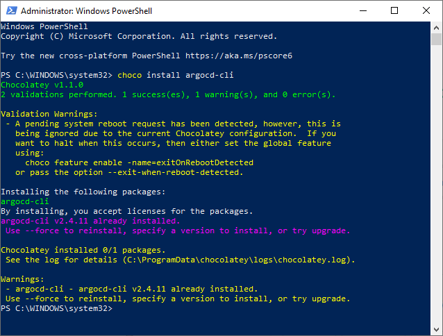
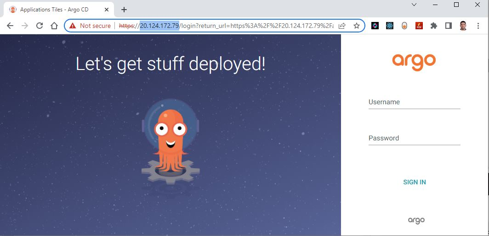

## Introduction

Before installing ArgoCD CLI, let's try to understand the difference between Argo CD CLI and Argo CD web UI

The Argo CD CLI and Argo CD web UI are two different interfaces for interacting with an Argo CD server. Here are some differences between the two:

**Argo CD CLI:**

- The Argo CD CLI is a command-line interface that can be used to interact with an Argo CD server.
- It is a lightweight and fast way to perform tasks such as deploying, updating, and managing applications in Argo CD.
- The CLI provides advanced features such as scripting, automation, and integration with other tools and systems.
- The CLI provides direct access to the Argo CD API, allowing users to perform any action that is supported by the API.

**Argo CD web UI:**

- The Argo CD web UI is a graphical user interface that can be used to interact with an Argo CD server.
- It provides a visual representation of the applications and their current state in Argo CD, making it easy to manage and troubleshoot applications.
- The web UI provides an intuitive and user-friendly interface that requires no programming or scripting knowledge.
- It provides additional features such as visualization of the application dependencies and comparison of the application configurations.

## Step 1.Install Argo CD CLI

**Install Argo CD CLI in windows using choco**

Here are the instructions to install Argo CD CLI in Windows using Chocolatey (choco):

1. Open the Windows Command Prompt or PowerShell as an administrator.
1. Install Chocolatey package manager by running the following command:
``` sh
Set-ExecutionPolicy Bypass -Scope Process -Force; [System.Net.ServicePointManager]::SecurityProtocol = [System.Net.ServicePointManager]::SecurityProtocol -bor 3072; iex ((New-Object System.Net.WebClient).DownloadString('https://chocolatey.org/install.ps1'))
```
1. Once Chocolatey is installed, run the following command to install the Argo CD CLI:
``` sh
choco install argocd-cli
```

1. Wait for the installation to complete. Chocolatey will automatically download and install the latest version of the Argo CD CLI.
1. Verify that the Argo CD CLI is installed correctly by running the following command:
``` sh
argocd version
```
output
``` sh
argocd: v2.4.7+81630e6
  BuildDate: 2022-07-18T21:49:23Z
  GitCommit: 81630e6d5075ac53ac60457b51343c2a09a666f4
  GitTreeState: clean
  GoVersion: go1.18.3
  Compiler: gc
  Platform: windows/amd64
argocd-server: v2.5.2+148d8da
```

This command should display the version of the Argo CD CLI installed on your system.

That's it! You have successfully installed the Argo CD CLI in Windows using Chocolatey. You can now use the CLI to interact with your Argo CD installation.


**Install Argo CD CLI in Mac**

Here are the instructions to install the Argo CD CLI on Mac:

1. Open the Terminal app on your Mac.
1. Install the Homebrew package manager by running the following command:
```
/bin/bash -c "$(curl -fsSL https://raw.githubusercontent.com/Homebrew/install/HEAD/install.sh)"
Once Homebrew is installed, run the following command to install the Argo CD CLI:
```
``` sh
brew install argocd
```
1. Wait for the installation to complete. Homebrew will automatically download and install the latest version of the Argo CD CLI.
1. Verify that the Argo CD CLI is installed correctly by running the following command:
``` sh
argocd version
```
This command should display the version of the Argo CD CLI installed on your system.

That's it! You have successfully installed the Argo CD CLI on your Mac. You can now use the CLI to interact with your Argo CD installation.

## Step 2. Access the Argo CD API Server


By default, the Argo CD API server is not exposed with an external IP. To access the API server, choose one of the following techniques to expose the Argo CD API server:

`Service Type Load Balancer`
Change the argocd-server service type to LoadBalancer by running following command in bash 

``` bash
kubectl patch svc argocd-server -n argocd -p '{"spec": {"type": "LoadBalancer"}}'
```
output

```
service/argocd-server patched
```

reference - <https://argo-cd.readthedocs.io/en/stable/getting_started/#4-login-using-the-cli>

verify the new external IP address assigned to `argocd-server` service

``` sh
kubectl get svc -n argocd
```
output
``` sh
NAME                               TYPE           CLUSTER-IP      EXTERNAL-IP     PORT(S)                      AGE
argocd-applicationset-controller   ClusterIP      10.25.250.229   <none>          7000/TCP                     139m
argocd-dex-server                  ClusterIP      10.25.247.199   <none>          5556/TCP,5557/TCP            139m
argocd-redis                       ClusterIP      10.25.211.159   <none>          6379/TCP                     139m
argocd-repo-server                 ClusterIP      10.25.233.23    <none>          8081/TCP                     139m
argocd-server                      LoadBalancer   10.25.115.123   20.124.172.79   80:30119/TCP,443:30064/TCP   139m
```
now you can browse the argocd with new public IP address.



## Step 3. Login to Argo CD


```
 argocd login --port-forward-namespace argocd 20.124.172.79
```

``` sh
WARNING: server certificate had error: x509: certificate signed by unknown authority. Proceed insecurely (y/n)? y
E0304 17:01:12.568936  151380 portforward.go:378] error copying from remote stream to local connection: readfrom tcp4 127.0.0.1:33532->127.0.0.1:33534: write tcp4 127.0.0.1:33532->127.0.0.1:33534: wsasend: An established connection was aborted by the software in your host machine.
Username: admin
Password:
'admin:login' logged in successfully
Context '20.124.172.79' updated
```

Note: 
- keyboard copy paste was not working on command prompt, so I've right clicked on the mouse to enter the correct password here.
- also make sure that you keep the password in the notepad before start this lab, Install ArgoCD lab has command to get the admin password.

now let's verify the argocd cli login is working as expected by running following commands.

```
argocd cluster list
```

```
SERVER                          NAME        VERSION  STATUS   MESSAGE                                                  PROJECT
https://kubernetes.default.svc  in-cluster           Unknown  Cluster has no applications and is not being monitored.
```

```
argocd app list
```

```
NAME  CLUSTER  NAMESPACE  PROJECT  STATUS  HEALTH  SYNCPOLICY  CONDITIONS  REPO  PATH  TARGET
```
there are no apps deployed yet.

Update the password using argocd cli

```
argocd account update-password
```

## Step 5. Logout argocd

use the following command for exit from the context

```
argocd logout 20.124.172.79
```
output

```
Logged out from '20.124.172.79'
```

verify the logout

```
 argocd app list
```
output

```
time="2023-03-04T17:10:28-08:00" level=fatal msg="rpc error: code = Unauthenticated desc = no session information"
```

That's it! You can now use the Argo CD CLI to interact with the Argo CD API server. Note that some API commands may require administrative privileges, so make sure you have the necessary permissions before using them.

## Reference

- <https://argo-cd.readthedocs.io/en/stable/cli_installation/>
<!-- - https://foxutech.medium.com/argo-cd-cli-installation-and-commands-65ab578ed75 -->