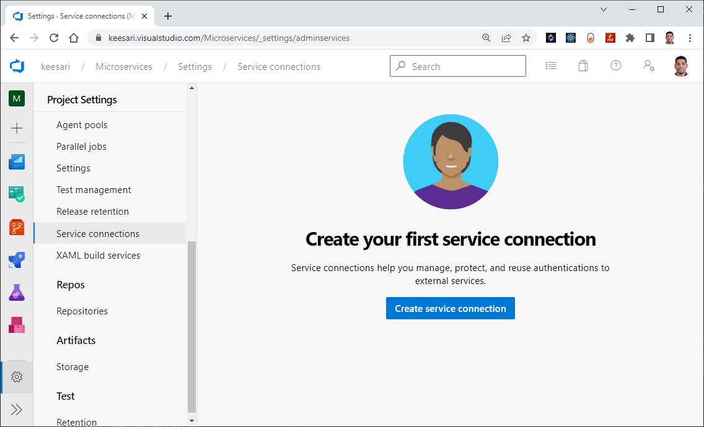
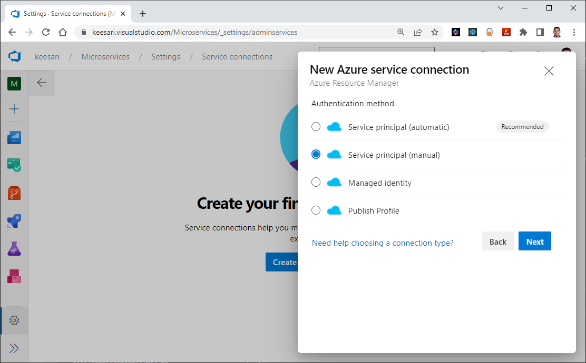
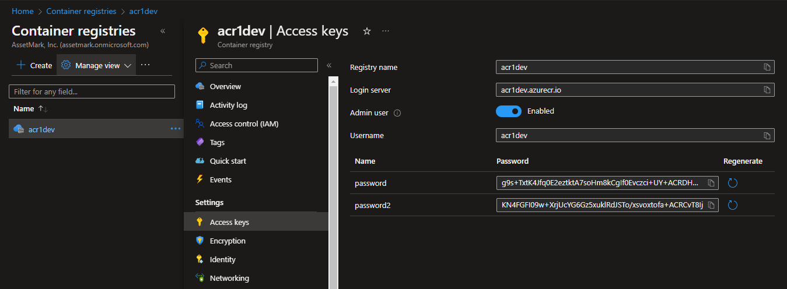
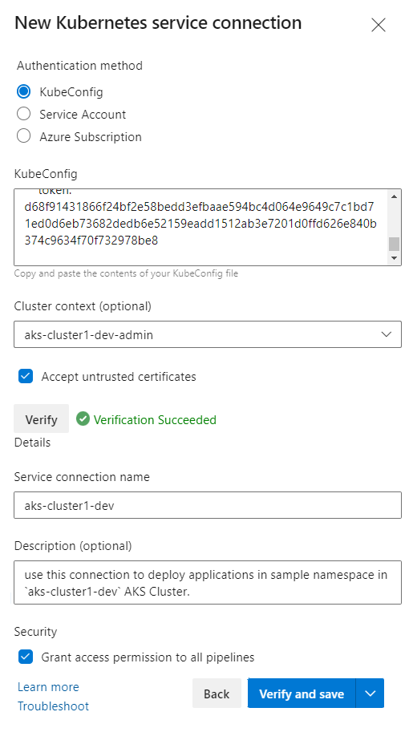
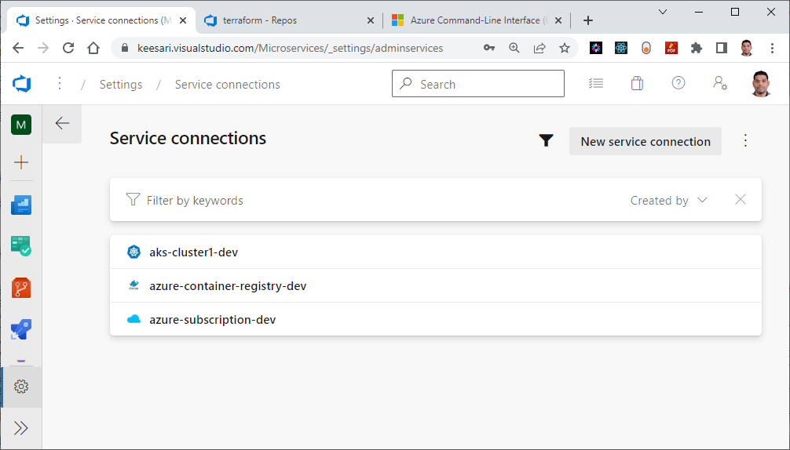
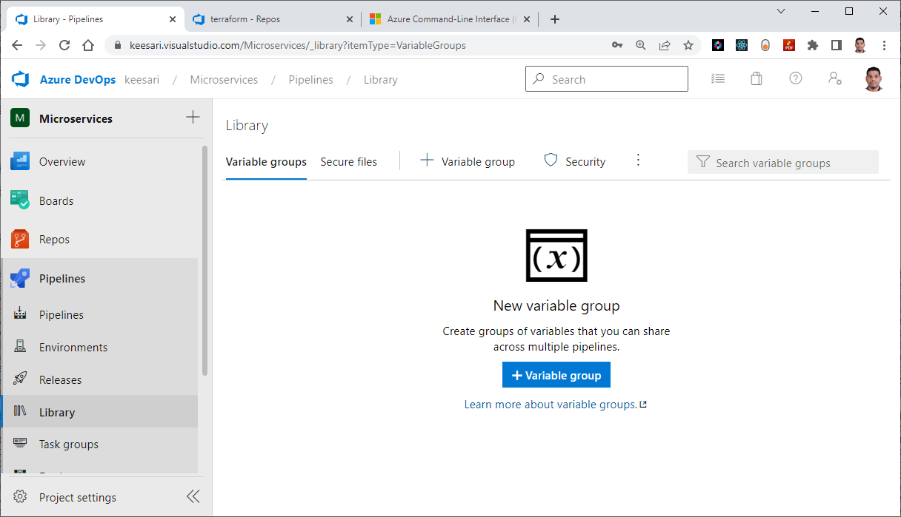
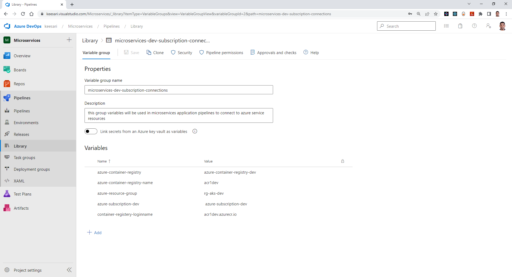

## Introduction

The purpose of creating new service connections in Azure DevOps is to allow Azure DevOps and Azure DevOps Pipeline to interact with Azure core services that are required for our application deployment activities. By creating these service connections, you can manage the integration between Azure DevOps and connected azure core services, such as:

- **Azure Resource Manager**: Allows you to manage your Azure resources, such as virtual machines and databases.

- **Docker Registry:** Allows you to store, manage, and distribute Docker images.

- **Kubernetes:** Allows you to manage your containers and applications running in a Kubernetes cluster.

## Technical Scenario

As a `Cloud Engineer`, you have been asked to create new service connections in azure DevOps before start creating any azure devops pipelines to ensure that the right resources and services are available to your pipelines.

## Objective

In this lab you will create and learn how to create new azure DevOps service connections, in the background these new service connections will create the new Service Principles in the Azure AD.

- **Task-1:** Create new service connection for Azure subscription Access
- **Task-2:** Create new service connection for Azure container registry (ACR)
- **Task-3:** Create new service connection for Azure Kubernetes services (AKS)
- **Task-4:** Create new Library - variable group

## Architecture diagram

This diagram depicts the end to end connection between Azure DevOps and external services or resources such as Azure, Docker registry and AKS.


## Task-1: Create new service connection for Azure subscription Access

To create a new service connection in Azure DevOps, follow these steps:

1. Go to Project settings in Azure DevOps.
1. In the Project Settings, select the "**Service connections**" section.
1. Click the "**New Service connection**" button.
   
1. Select the **Azure Resource Manager**.
   
1. Select the **Service principal (manual)**.
  
1. Provide the necessary information for the service connection, such as the name, description, and access credentials.
   
1. Click the "Verify connection" button to test the connection.
   
1. If the connection is successful, click the "Save" button.

Once you've created a service connection, you can use it in your pipelines for tasks that need to access the connected service.

!!! Important
    Here we've selected the existing **Terraform service principle** which was created as part of the Terraform Foundation Labs.


## Task-2: Create new service connection for Azure container registry (ACR)

To create a new service connection for an Azure Container Registry (ACR) in Azure DevOps, follow these steps:

1. Go to **Project settings** in Azure DevOps.
1. In the Project Settings, select the "**Service connections**" section.
1. Click the "**New Service connection**" button.
1. Select "**Docker Registry**" as the type of service connection.

1. Select `Other` or "**Azure Container Registry**" as registry type.
1. In the "Azure Container Registry" section, select your ACR from the **dropdown list**.
1. Provide a **name** and **description** for the service connection.

1. if you select `Others` then collect the details from here in Azure ACR

1. Click the "Save" button to test the connection and create the service connection.

Once you've created the service connection, you can use it in your pipelines to perform tasks that require access to your ACR, such as pushing and pulling Docker images.


## Task-3: Create new service connection for Azure Kubernetes services (AKS)


To create a new service connection for AKS in Azure DevOps, you can follow these steps:

1. Go to your Azure DevOps organization and navigate to the `Project Settings` page.
1. In the Project Settings page, select the `Service Connections` section.
1. Click on the `New Service Connection` button.
1. In the "New Service Connection" menu, select `Kubernetes` as the connection type.

1. Fill in the connection details, such as the Connection name, AKS cluster name, and the Kubernetes API server URL.

1. Click on `Verify connection` to ensure that the details you have entered are correct.
1. Finally, click on the `Create` button to create the new service connection for your AKS cluster in Azure DevOps.

Once you have created the service connection, you can use it to automate tasks such as deploying applications to your AKS cluster, managing cluster configurations, and monitoring cluster health.

``` sh
Name: aks-cluster1-dev
Description: use this connection to deploy applications in sample namespace in `aks-cluster1-dev` AKS Cluster.
```

Here is the list of new service connections you've created so far.



## Step-4: Create new Library - variable group

Follow these steps to create a new Library Variable Group in Azure DevOps:

- Go to your Azure DevOps project and navigate to the project settings page.
- In the settings page, select the `Pipelines` option and then click on "Variable groups".
- Click the `New` button to create a new variable group.
- Give your new variable group a name and description.
- Add variables to your group by clicking the `Add` button and specifying a name, value, and any other relevant details.
- Once you have added all of the variables you need, click the `Create` button to save your new variable group.



```
Azure DevOps  / Keesari / Microservices / Pipelines / Library
```



``` sh
Name: microservices-dev-subscription-connections
Description: this group variables will be used in microservices application pipelines to connect to azure service resources
```

Your new variable group will now be available for use in your Azure DevOps pipelines and releases. You can also share the variable group with other projects or teams in your organization by granting them access to it.

## References:
- <https://learn.microsoft.com/en-us/azure/devops/pipelines/library/connect-to-azure?view=azure-devops>
<!-- - <https://azuredevopslabs.com/labs/devopsserver/azureserviceprincipal/> -->
