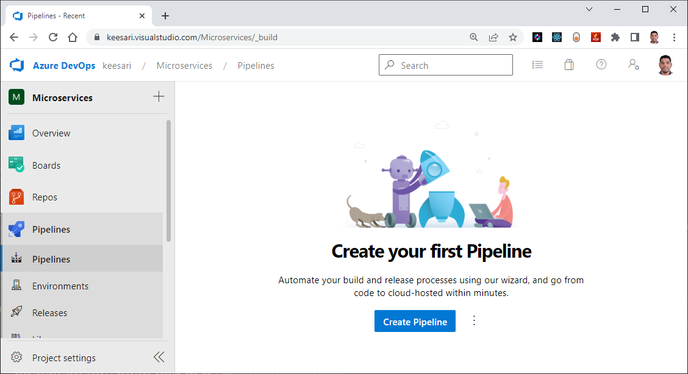
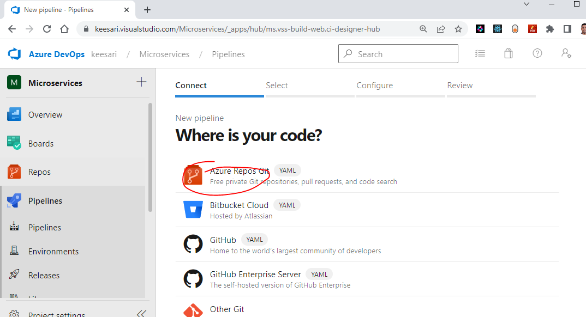
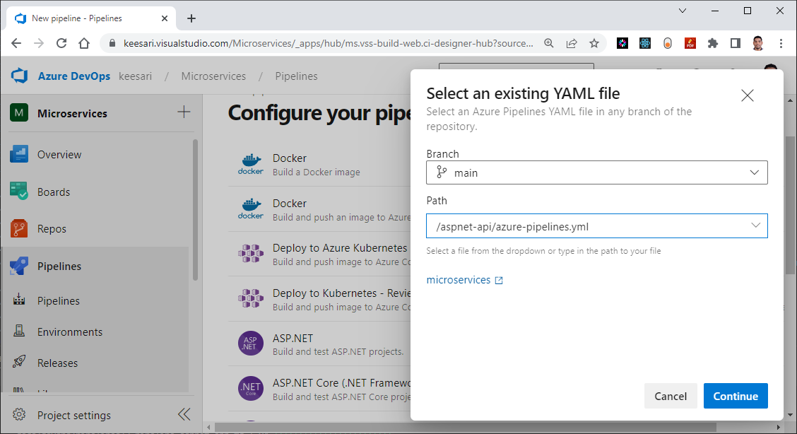
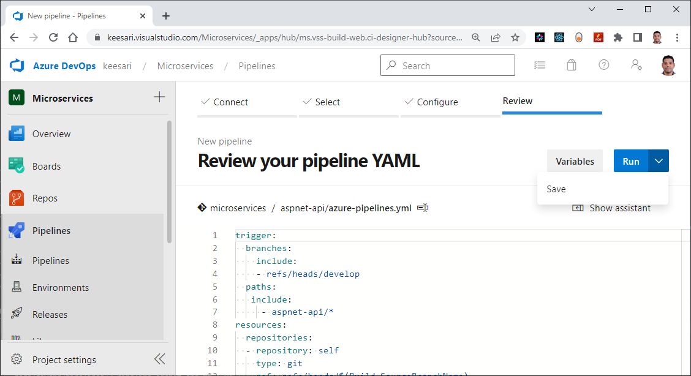
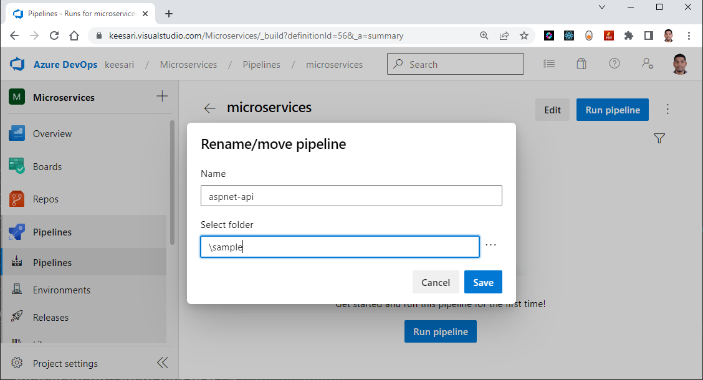

# Create Azure DevOps pipeline - for .NET Core Web API

## Introduction:

In this lab we are going to create an azure DevOps pipeline for our first Microservice built using .NET Core Web API. This pipeline will  automate the continuous integration and continuous deployment (CI/CD) of build, test, and deployment process of a .NET Core Web API. 

The Build Pipeline we are creating here is designed exclusively for containerized microservices, specifically those based on .NET Core Web API. This pipeline is tailored for seamless deployment on Azure Kubernetes Services (AKS).

## Technical Scenario

As a `DevOps Engineer`, you've been asked to create a new Azure DevOps pipeline using YAML for .NET Core Web API, this pipeline should provides a flexible way to automate the build and deployment process of .NET Core Web API applications. It should also allow developers to focus on writing code while the pipeline takes care of the rest.


## Prerequisites

- Azure DevOps account  
- Source code repository
- Service connections
- Docker image
  
## Implementation details

In this exercise we will accomplish & learn how to implement following:

- Step-1: Create the pipeline
- Step-2: Setup environment
- Step-3: Create Variables and Variable Groups
- Step-4: Build and push an image to container registry
- Step-5: Run your tests
- Step-6: Collect code coverage
- Step-7: Update the image tag in ArgoCD or Helm chart
- Step-8: Run the pipeline


## Step-1: Create the pipeline

!!! Important
    Before following the create pipeline wizard instructions, let's quickly create a new file called `azure-pipelines.yaml` in the root folder of our first Microservice and commit this change.


Follow these instructions for creating a new Azure DevOps pipeline:

- Open your Azure DevOps account and navigate to the project where you want to create the pipeline.
- Click on the `Pipelines` menu and then click on the `Create pipeline` button.
  
- Select `Azure repos git` YAML 
  
- Select the source code repository where your .NET Core Web API code is hosted. 
- Select `Select an existing YAML file`  
- Select the branch that you want to use for the pipeline. You can either choose the main branch or a specific branch.
- Choose the template for your pipeline. in this case we are going to use choose an existing template.
- Click on `continue` button
  
- Click on the Save from `Run` dropdown list.
  
- Rename the pipeline.
  

That's it! You now have an Azure DevOps pipeline for your .NET Core Web API. your can configure the pipeline according to your needs. You can customize the pipeline by adding or removing stages, jobs, and tasks.


## Step-2: Setup environment

As part of this step we are going to add or create few configuration changes in the current pipeline.


``` yaml
trigger:
  branches:
    include:
    - refs/heads/develop
  paths:
   include:
     - aspnet-api/*
resources:
  repositories:
  - repository: self
    type: git
    ref: refs/heads/$(Build.SourceBranchName)
```
The `trigger` section specifies that the pipeline should be triggered when changes are made to the `develop` branch, and specifically to any files in the `aspnet-api/` directory.

The `resources` section defines a repository resource named "self" that points to the current repository, and uses the branch name from the trigger to determine which branch to build from.

## Step-3: Create Variables and Variable Groups

``` yaml
variables:
- group: microservices-dev-subscription-connections
- name: appName
  value : 'aspnet-api'
- name: dockerfilePath
  value : '$(Build.SourcesDirectory)/$(appName)/Dockerfile'
- name: imageName
  value: sample/$(appName)
- name: system_accesstoken
  value : $(System.AccessToken)
```

- group: `microservices-dev-subscription-connections` This is the name of a group in an Azure DevOps project, containing resources related to microservices development.
- `name: appName` This variable stores the name of the application being developed. In this case, the name is `aspnet-api`.
- `name: dockerfilePath` This variable stores the path to the Dockerfile used to build the application's Docker image.
- `name: imageName` This variable stores the name of the Docker image that will be built. 
- `name: system_accesstoken` This variable is used to store a token that allows the build or release pipeline to access system resources or perform actions on behalf of the user. The value is obtained using the `$(System.AccessToken)` variable.
  
## Step-4: Build and push an image to container registry

Here is the YAML pipeline definition for building and pushing a Docker image to a container registry:

``` yaml
stages:
- stage: Build
  displayName: Build and push stage
  jobs:
  - job: Build
    displayName: Build
    pool:
      vmImage: 'ubuntu-latest'
    steps:
    - checkout: self
      persistCredentials: true
    #  Build and push an image to container registry
    - task: Docker@2
      displayName: Login to ACR
      inputs:
        command: login
        containerRegistry: $(azure-container-registry)

    - task: Docker@2
      displayName: Build an image for $(appName)
      inputs:
        command: build
        buildContext: '$(Build.SourcesDirectory)/$(appName)'
        repository: $(imageName)
        dockerfile: $(dockerfilePath)
        containerRegistry: $(azure-container-registry)
        tags: |
          latest
          $(build.buildNumber)

    - task: Docker@2
      displayName: Push an image to container registry
      inputs:
        command: push
        repository: $(imageName)
        tags: |
          latest
          $(build.buildNumber)
          
    - powershell: |
        Set-Content -Path "$(Build.ArtifactStagingDirectory)/$(appName)" -Value (docker inspect $(container-registery-loginname)/$(imageName):latest -f '{{ .Id }}')
      displayName: Saving container hashes
```
Here's what each section of the YAML code represents:

- **stages:** This defines the stages of the pipeline. In this case, there is only one stage, called "Build", which is responsible for building and pushing a Docker image to a container registry.
- **jobs:** This defines the jobs that will be executed as part of the "Build" stage. In this case, there is only one job, called "Build".
- **pool:** This specifies the agent pool that the job will run on. In this case, the job will run on an Ubuntu-based agent with the latest available image.
- **steps:** This section lists the individual steps that will be executed as part of the job. The steps are executed in the order that they appear in the list.

**Verify the ACR**

```sh
az account set -s "anji.keesari"
az acr login --name acr1dev
```

```sh
az acr repository list --name acr1dev --output table
```
output

``` sh
mcr.microsoft.com/dotnet/aspnet
mcr.microsoft.com/dotnet/sdk
sample/aspnet-api
sample/aspnet-app
sample/react-app
```

```sh
az acr repository show-tags --name acr1dev --repository sample/aspnet-api --output table
```

output
```sh
Result
-----------
20230220.1
20230226.1
20230323.7
20230323.8
latest
```

## Step-5: Run your tests

- The primary purpose of this task is to automatically execute various tests on your codebase to ensure its quality and functionality.
- It's an essential part of the Continuous Integration (CI) and Continuous Deployment (CD) pipeline, where code changes are tested automatically to identify and resolve issues early in the development process.

``` yaml
use this task for running test
```

## Step-6: Collect code coverage

- After running your automated tests, this task collects information about which parts of your code were executed during the testing process.
- It uses a code coverage tool specific to your programming language or platform. 
- These tools instrument your code to track which lines, functions, or branches are executed during testing.

``` yaml
use this task for running test
```

## Step-7: Update the image tag in ArgoCD or Helm chart

This is the last step of the pipeline and it is very important part of this pipeline, this step will update the latest docker image tag in deployment.yaml manifest file in the Helm chart or ArgoCD, depending on how your microservices are getting deployed to AKS, Helm chart and ArgoCD manifests will be managed in separate git repos; but in our case here we are keeping it in the same repo for the simplicity.

Use the follow PowerShell script to update the image tag in ArgoCD or Helm chart:

``` powershell
# Update the argocd or helmcharts project deployment.yaml file

- powershell: |
    git config --global user.email "devopsagent@example.com"
    git config --global user.name "$(Build.DefinitionName)"
    git checkout --force develop
    # git pull
    
    $deploymentFile = "$(Build.SourcesDirectory)/helmcharts/microservices-chart/templates/$(appName)/deployment.yaml"
    
    $imageLine = Select-String -Path $deploymentFile -Pattern $(imageName)
    $tag=$imageLine.ToString().Split(":")[4]
    echo "tag to be replaced"
    $tag

    (Get-Content $deploymentFile -Encoding UTF8) -replace $tag , $(Build.BuildNumber) | Set-Content $deploymentFile
    
    git add .
    git commit -a -m "helmcharts deployment updated by $(Build.Repository.Name) $(Build.SourceVersionMessage) - $(Build.BuildNumber)"
    git push origin HEAD:refs/heads/develop

  displayName: Updating helmcharts project
  enabled: true
```

This PowerShell script performs the following actions:

- Sets the Git user name and email to the build definition name and a dummy email address.
- Checks out the develop branch.
- Defines the path to the deployment file to be updated.
- Searches for the line in the deployment file that contains the current image tag.
- Extracts the current tag value from the line and stores it in the $tag variable.
- Replaces the current tag value with the build number in the deployment file.
- Adds the modified file to the Git staging area.
- Commits the changes to Git with a message containing the repository name, source version message, and build number.
- Pushes the changes to the develop branch.

Here is the complete contents of `azure-pipelines.yaml` file

``` yaml title="azure-pipelines.yml"
trigger:
  branches:
    include:
    - refs/heads/develop
  paths:
   include:
     - aspnet-api/*
resources:
  repositories:
  - repository: self
    type: git
    ref: refs/heads/$(Build.SourceBranchName)

variables:
- group: microservices-dev-subscription-connections
- name: appName
  value : 'aspnet-api'
- name: dockerfilePath
  value : '$(Build.SourcesDirectory)/$(appName)/Dockerfile'
- name: imageName
  value: sample/$(appName)
- name: system_accesstoken
  value : $(System.AccessToken)

stages:
- stage: Build
  displayName: Build and push stage
  jobs:
  - job: Build
    displayName: Build
    pool:
      vmImage: 'ubuntu-latest'
    steps:
    - checkout: self
      persistCredentials: true
    #  Build and push an image to container registry
    - task: Docker@2
      displayName: Login to ACR
      inputs:
        command: login
        containerRegistry: $(azure-container-registry)

    - task: Docker@2
      displayName: Build an image for $(appName)
      inputs:
        command: build
        buildContext: '$(Build.SourcesDirectory)/$(appName)'
        repository: $(imageName)
        dockerfile: $(dockerfilePath)
        containerRegistry: $(azure-container-registry)
        tags: |
          latest
          $(build.buildNumber)

    - task: Docker@2
      displayName: Push an image to container registry
      inputs:
        command: push
        repository: $(imageName)
        tags: |
          latest
          $(build.buildNumber)
          
    - powershell: |
        Set-Content -Path "$(Build.ArtifactStagingDirectory)/$(appName)" -Value (docker inspect $(container-registery-loginname)/$(imageName):latest -f '{{ .Id }}')
      displayName: Saving container hashes

    # Update the argocd or helmcharts project deployment.yaml file

    - powershell: |
        git config --global user.email "devopsagent@example.com"
        git config --global user.name "$(Build.DefinitionName)"
        git checkout --force develop
        # git pull
        
        $deploymentFile = "$(Build.SourcesDirectory)/helmcharts/microservices-chart/templates/$(appName)/deployment.yaml"
        
        $imageLine = Select-String -Path $deploymentFile -Pattern $(imageName)
        $tag=$imageLine.ToString().Split(":")[4]
        echo "tag to be replaced"
        $tag

        (Get-Content $deploymentFile -Encoding UTF8) -replace $tag , $(Build.BuildNumber) | Set-Content $deploymentFile
        
        git add .
        git commit -a -m "helmcharts deployment updated by $(Build.Repository.Name) $(Build.SourceVersionMessage) - $(Build.BuildNumber)"
        git push origin HEAD:refs/heads/develop

      displayName: Updating helmcharts project
      enabled: true
```

## Step-8: Run the pipeline

trigger `Run pipeline`


Build and push an image to container registry


Update the image tag in Helm chart

## Reference

- <https://learn.microsoft.com/en-us/azure/devops/pipelines/ecosystems/dotnet-core?view=azure-devops&tabs=dotnetfive>
