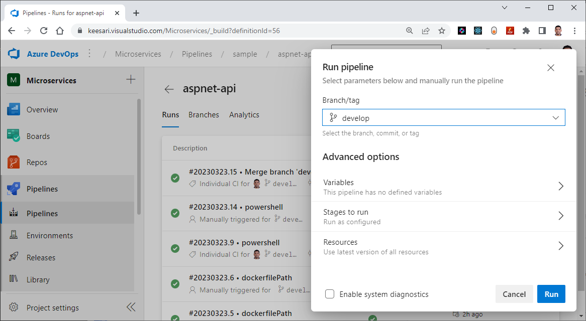
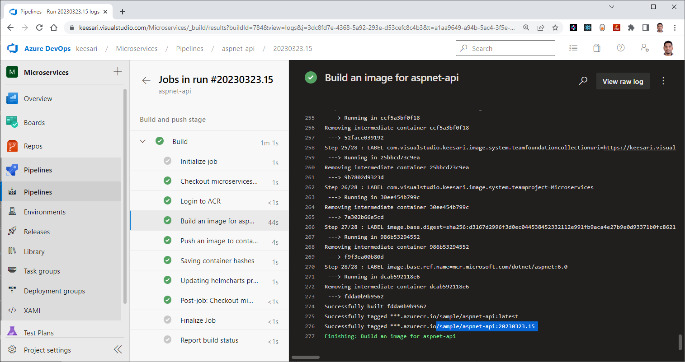

# Create your second pipeline - for ASP.NET Core MVC Project

## Introduction:

In this lab we are going to create an azure DevOps pipeline for our second Microservice built using ASP.NET Core MVC. This pipeline will  automate the continuous integration and continuous deployment (CI/CD) of build, test, and deployment process of a ASP.NET Core MVC project. 


## Technical Scenario

As a `DevOps Engineer`, you've been asked to create a new Azure DevOps pipeline using YAML for ASP.NET Core MVC project, this pipeline should provides a way to automate the build and deployment process of ASP.NET Core MVC Project. It should also allow developers to focus on writing code while the pipeline takes care of the rest.


## Prerequisites

- Azure DevOps account  
- ASP.NET Core MVC Project
- Service connections
- Docker image
  
## Implementation details

In this exercise we will accomplish & learn how to implement following:

- Step-1: Create the pipeline
- Step-2: Setup environment
- Step-3: Create Variables and Variable Groups
- Step-4: Build and push an image to container registry
- Step-5: Run your tests
- Step-6: Collect code coverage
- Step-7: Update the image tag in ArgoCD or Helm chart
- Step-8: Run the pipeline


## Step-1: Create the pipeline

!!! Important
    Before following the create pipeline wizard instructions, let's quickly create a new file called `azure-pipelines.yaml` in the root folder of our second Microservice (aspnet-app) and commit this change.


Follow these instructions for creating a new Azure DevOps pipeline:

- Open your Azure DevOps account and navigate to the project where you want to create the pipeline.
- Click on the `Pipelines` menu and then click on the `Create pipeline` button.
- Select `Azure repos git` YAML 
- Select the source code repository where your .NET Core Web API code is hosted. 
- Select `Select an existing YAML file`  
- Select the branch that you want to use for the pipeline. You can either choose the main branch or a specific branch.
- Choose the template for your pipeline. in this case we are going to use choose an existing template.
- Click on `continue` button
- Click on the Save from `Run` dropdown list.
- Rename the pipeline.

That's it! You now have an Azure DevOps pipeline for your ASP.NET Core MVC Project. your can configure the pipeline according to your needs. You can customize the pipeline by adding or removing stages, jobs, and tasks.


## Step-2: Setup environment

As part of this step we are going to add or create few configuration changes in the current pipeline.


``` yaml
trigger:
  branches:
    include:
    - refs/heads/develop
  paths:
   include:
     - aspnet-app/*
resources:
  repositories:
  - repository: self
    type: git
    ref: refs/heads/$(Build.SourceBranchName)
```


## Step-3: Create Variables and Variable Groups

``` yaml
variables:
- group: microservices-dev-subscription-connections
- name: appName
  value : 'aspnet-app'
- name: dockerfilePath
  value : '$(Build.SourcesDirectory)/$(appName)/Dockerfile'
- name: imageName
  value: sample/$(appName)
- name: system_accesstoken
  value : $(System.AccessToken)
```

## Step-4: Build and push an image to container registry

Here is the YAML pipeline definition for building and pushing a Docker image to a container registry:

``` yaml
stages:
- stage: Build
  displayName: Build and push stage
  jobs:
  - job: Build
    displayName: Build
    pool:
      vmImage: 'ubuntu-latest'
    steps:
    - checkout: self
      persistCredentials: true
    #  Build and push an image to container registry
    - task: Docker@2
      displayName: Login to ACR
      inputs:
        command: login
        containerRegistry: $(azure-container-registry)

    - task: Docker@2
      displayName: Build an image for $(appName)
      inputs:
        command: build
        buildContext: '$(Build.SourcesDirectory)/$(appName)'
        repository: $(imageName)
        dockerfile: $(dockerfilePath)
        containerRegistry: $(azure-container-registry)
        tags: |
          latest
          $(build.buildNumber)

    - task: Docker@2
      displayName: Push an image to container registry
      inputs:
        command: push
        repository: $(imageName)
        tags: |
          latest
          $(build.buildNumber)
          
    - powershell: |
        Set-Content -Path "$(Build.ArtifactStagingDirectory)/$(appName)" -Value (docker inspect $(container-registery-loginname)/$(imageName):latest -f '{{ .Id }}')
      displayName: Saving container hashes
```
Here's what each section of the YAML code represents:

**Verify the ACR**

```sh
az account set -s "anji.keesari"
az acr login --name acr1dev
```

```sh
az acr repository list --name acr1dev --output table
```
output

``` sh
sample/aspnet-api
sample/aspnet-app
sample/react-app
```

```sh
az acr repository show-tags --name acr1dev --repository sample/aspnet-app --output table
```

output
```sh
Result
-----------
20230220.1
latest
```
<!-- 
## Step-5: Run your tests
``` yaml
Pending
```
## Step-6: Collect code coverage
``` yaml
Pending
``` 
-->
## Step-7: Update the image tag in ArgoCD or Helm chart

This is the last step of the pipeline and it is very important part of this pipeline, this step will update the latest docker image tag in deployment.yaml manifest file in the Helm chart or ArgoCD, depending on how your microservices are getting deployed to AKS, Helm chart and ArgoCD manifests will be managed in separate git repos; but in our case here we are keeping it in the same repo for the simplicity.

Use the follow PowerShell script to update the image tag in ArgoCD or Helm chart:

``` powershell
# Update the argocd or helmcharts project deployment.yaml file

- powershell: |
    git config --global user.email "devopsagent@example.com"
    git config --global user.name "$(Build.DefinitionName)"
    git checkout --force develop
    # git pull
    
    $deploymentFile = "$(Build.SourcesDirectory)/helmcharts/microservices-chart/templates/$(appName)/deployment.yaml"
    
    $imageLine = Select-String -Path $deploymentFile -Pattern $(imageName)
    $tag=$imageLine.ToString().Split(":")[4]
    echo "tag to be replaced"
    $tag

    (Get-Content $deploymentFile -Encoding UTF8) -replace $tag , $(Build.BuildNumber) | Set-Content $deploymentFile
    
    git add .
    git commit -a -m "helmcharts deployment updated by $(Build.Repository.Name) $(Build.SourceVersionMessage) - $(Build.BuildNumber)"
    git push origin HEAD:refs/heads/develop

  displayName: Updating helmcharts project
  enabled: true
```


Here is the complete contents of `azure-pipelines.yaml` file

``` yaml title="azure-pipelines.yml"
trigger:
  branches:
    include:
    - refs/heads/develop
  paths:
   include:
     - aspnet-app/*
resources:
  repositories:
  - repository: self
    type: git
    ref: refs/heads/$(Build.SourceBranchName)

variables:
- group: microservices-dev-subscription-connections
- name: appName
  value : 'aspnet-app'
- name: dockerfilePath
  value : '$(Build.SourcesDirectory)/$(appName)/Dockerfile'
- name: imageName
  value: sample/$(appName)
- name: system_accesstoken
  value : $(System.AccessToken)

stages:
- stage: Build
  displayName: Build and push stage
  jobs:
  - job: Build
    displayName: Build
    pool:
      vmImage: 'ubuntu-latest'
    steps:
    - checkout: self
      persistCredentials: true
    #  Build and push an image to container registry
    - task: Docker@2
      displayName: Login to ACR
      inputs:
        command: login
        containerRegistry: $(azure-container-registry)

    - task: Docker@2
      displayName: Build an image for $(appName)
      inputs:
        command: build
        buildContext: '$(Build.SourcesDirectory)/$(appName)'
        repository: $(imageName)
        dockerfile: $(dockerfilePath)
        containerRegistry: $(azure-container-registry)
        tags: |
          latest
          $(build.buildNumber)

    - task: Docker@2
      displayName: Push an image to container registry
      inputs:
        command: push
        repository: $(imageName)
        tags: |
          latest
          $(build.buildNumber)
          
    - powershell: |
        Set-Content -Path "$(Build.ArtifactStagingDirectory)/$(appName)" -Value (docker inspect $(container-registery-loginname)/$(imageName):latest -f '{{ .Id }}')
      displayName: Saving container hashes

    # Update the argocd or helmcharts project deployment.yaml file

    - powershell: |
        git config --global user.email "devopsagent@example.com"
        git config --global user.name "$(Build.DefinitionName)"
        git checkout --force develop
        # git pull
        
        $deploymentFile = "$(Build.SourcesDirectory)/helmcharts/microservices-chart/templates/$(appName)/deployment.yaml"
        
        $imageLine = Select-String -Path $deploymentFile -Pattern $(imageName)
        $tag=$imageLine.ToString().Split(":")[4]
        echo "tag to be replaced"
        $tag

        (Get-Content $deploymentFile -Encoding UTF8) -replace $tag , $(Build.BuildNumber) | Set-Content $deploymentFile
        
        git add .
        git commit -a -m "helmcharts deployment updated by $(Build.Repository.Name) $(Build.SourceVersionMessage) - $(Build.BuildNumber)"
        git push origin HEAD:refs/heads/develop

      displayName: Updating helmcharts project
      enabled: true
```

## Step-8: Run the pipeline

trigger `Run pipeline`



Build and push an image to container registry


Update the image tag in Helm chart

