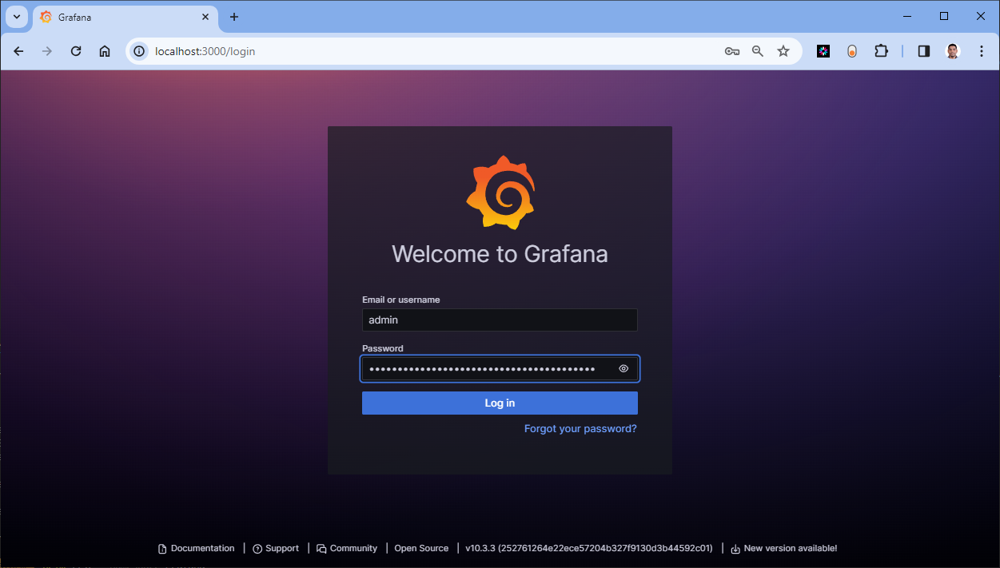
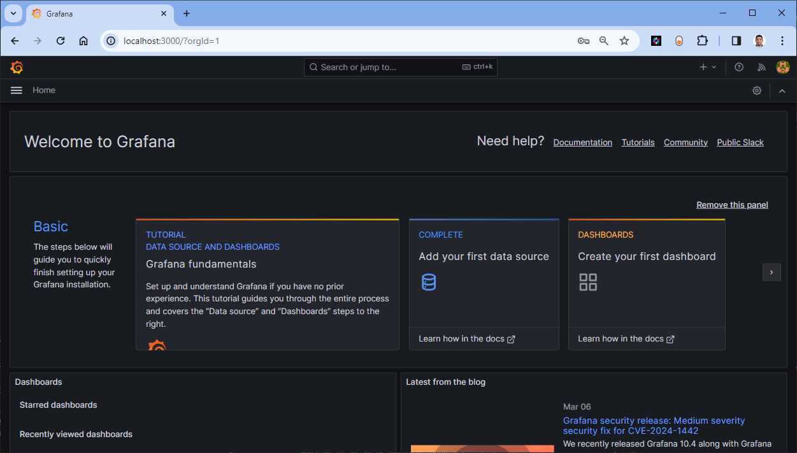
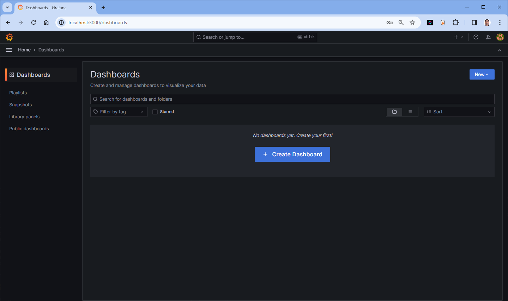

# Install Grafana Helmchart in Azure Kubernetes Services (AKS)


## Introduction

Grafana is an open-source analytics and visualization platform that allows you to monitor, analyze, and understand your metrics. It provides a flexible and powerful tool for observing your systems and applications. In this guide, I will walk you through the process of installing Grafana using Helmchart in Azure Kubernetes Services (AKS). This tutorial is designed for beginners, providing step-by-step instructions along with the necessary `kubectl` commands and outputs.


Azure Kubernetes Service (AKS) is a managed Kubernetes service provided by Microsoft Azure, allowing you to deploy, manage, and scale containerized applications using Kubernetes. Helm is a package manager for Kubernetes that simplifies the deployment and management of applications. Grafana Helmchart is a Helm chart that simplifies the deployment of Grafana in Kubernetes clusters.

In this tutorial, I will guide you through the process of installing Grafana using Helmchart in an AKS cluster.

## Objective

In this exercise we will accomplish & learn how to implement following:

- **Step 1:** Login into Azure
- **Step 2.** Connect to AKS Cluster
- **Step 3.** Add Grafana Helm Repository
- **Step 4.** Install Grafana Helmchart
- **Step 5.** Verify Grafana Resources in AKS
- **Step 6.** Access Grafana Dashboard Locally - port forwarding
- **Step 7.** Configure Ingress for Grafana

## Prerequisites

Before you begin, ensure you have the following prerequisites:

- An Azure account with access to AKS.
- `Azure CLI` installed on your local machine.
- `kubectl` installed on your local machine.
- `Helm` installed on your local machine.


## Step 1: Login into Azure

Verify that you are logged into the right Azure subscription before start anything in visual studio code

``` sh
# Login to Azure
az login 

# Shows current Azure subscription
az account show

# Lists all available Azure subscriptions
az account list

# Sets Azure subscription to desired subscription using ID
az account set -s "anji.keesari"
```

Follow the on-screen instructions to complete the login process.

## Step 2: Connect to AKS Cluster

Once logged in and set your subscription then connect to your AKS cluster. with your AKS cluster name:

Use the `az aks get-credentials` command to connect to the AKS cluster.


``` sh
# Azure Kubernetes Service Cluster User Role
az aks get-credentials -g "rg-aks-dev" -n "aks-cluster1-dev"

# Azure Kubernetes Service Cluster Admin Role
az aks get-credentials -g "rg-aks-dev" -n "aks-cluster1-dev" --admin

# get nodes
kubectl get no
kubectl get namespace -A
```

## Step 3: Add Grafana Helm Repository

Before installing Grafana, you need to add the Helm repository for Grafana:

```bash
helm repo add grafana https://grafana.github.io/helm-charts
helm repo update
```

```bash
helm list -aA
helm list --namespace grafana
```

## Step 4: Install Grafana Helmchart

Now, you can install Grafana using Helmchart. Execute the following command:

```bash
# use this command if you need to create namespace along with helm install
helm install grafana grafana/grafana --namespace grafana --create-namespace --version 7.3.4

# use this command if you already have namespace created
helm install grafana grafana/grafana --version 7.3.4 -n grafana
```

This command installs Grafana in your AKS cluster. You can customize the installation by providing values files or using Helm chart options.

## Step 5: Verify Grafana Resources in AKS

To verify that Grafana has been successfully installed, you can list the Kubernetes resources:

```bash
kubectl get pods -n grafana
kubectl get all -n grafana
kubectl get ConfigMap,Secret,Ingress -n grafana
kubectl logs deployments/grafana -n grafana
```

You should see Grafana pods and services running in your cluster.

## Step 6: Access Grafana Dashboard Locally

To access the Grafana dashboard locally, you need to create a port forward:

```bash
kubectl port-forward service/grafana 3000:80 --namespace grafana
```

```bash
http://localhost:3000/login
```

Now, you can access Grafana by opening your web browser and navigating to `http://localhost:3000/login`. Use the default username (admin) to log in.

You need to retrieve the `admin` password by running the following commands:

``` sh
# bash
kubectl get secret --namespace grafana grafana -o jsonpath="{.data.admin-password}" | base64 --decode ; echo
# pwsh
kubectl get secret --namespace grafana grafana -o jsonpath="{.data.admin-password}" | ForEach-Object { [System.Text.Encoding]::UTF8.GetString([System.Convert]::FromBase64String($_)) }
```

After running the above commands, you should be able to access Grafana at `http://localhost:3000` in your web browser. Log in using the username admin and the password obtained from the previous command.

Grafana > Login page
[{:style="border: 1px solid black; border-radius: 10px;"}](images/grafana/image-1.png){:target="_blank"}

Grafana > Welcome page
[{:style="border: 1px solid black; border-radius: 10px;"}](images/grafana/image-2.png){:target="_blank"}

Grafana > Connection page
[{:style="border: 1px solid black; border-radius: 10px;"}](images/grafana/image-3.png){:target="_blank"}

Grafana > Dashboard page
[{:style="border: 1px solid black; border-radius: 10px;"}](images/grafana/image-4.png){:target="_blank"}


## Step 7: Configure Ingress for Grafana

If you want to access Grafana externally, you can configure Ingress. First, create an Ingress resource:

```yaml
apiVersion: networking.k8s.io/v1
kind: Ingress
metadata:
  name: grafana-ingress
spec:
  rules:
  - host: yourdomain.com
    http:
      paths:
      - path: /
        pathType: Prefix
        backend:
          service:
            name: grafana
            port:
              number: 80
```

Apply the Ingress configuration:

```bash
kubectl apply -f ingress.yaml
```

Replace `yourdomain.com` with your actual domain name.

## Conclusion

You have successfully installed Grafana using Helmchart in Azure Kubernetes Services. Grafana provides powerful visualization and monitoring capabilities for your applications running in AKS. You can now explore and visualize your metrics to gain insights into your system's performance.

## Reference

- [Azure Kubernetes Service Documentation](https://docs.microsoft.com/en-us/azure/aks/){:target='_blank'}
- [Helm Documentation](https://helm.sh/docs/){:target='_blank'}
- [Grafana Helm Chart Repository](https://grafana.github.io/helm-charts){:target='_blank'}
- [Kubernetes Documentation](https://kubernetes.io/docs/){:target='_blank'}
- [Azure CLI Documentation](https://docs.microsoft.com/en-us/cli/azure/){:target='_blank'}
