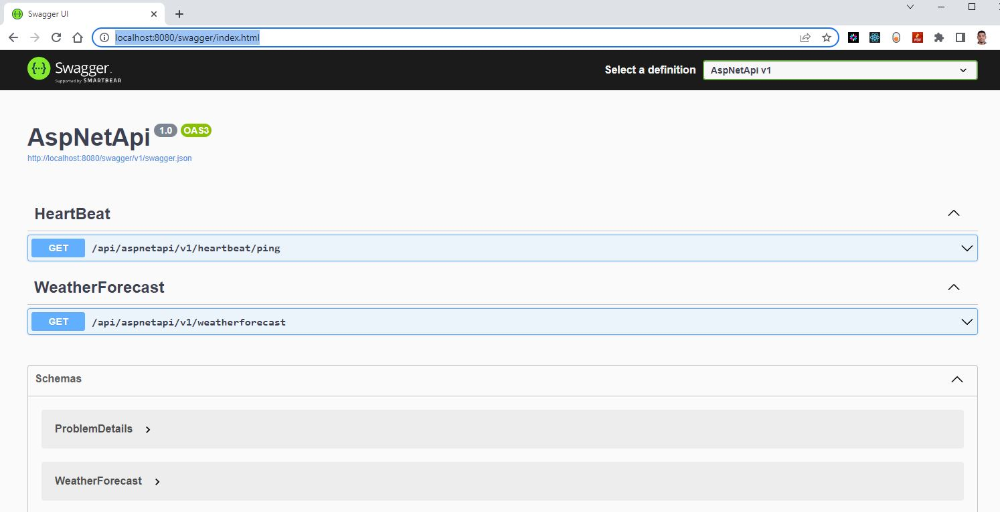
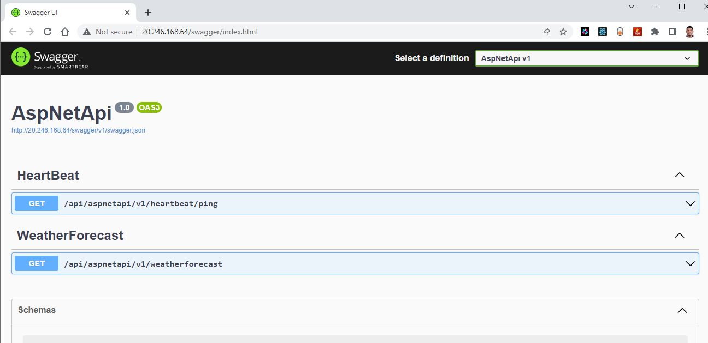

To deploying an application to Azure Kubernetes Service (AKS) involves several steps. Here's an overview of the process:


1. **Create an AKS cluster:** The first step is to create an AKS cluster on Azure if you haven't already. This can be done through the Azure portal or using Azure CLI or terraform. [Create Azure Kubernetes Service (AKS) using terraform](../azure/11-aks.md)

1. **Prepare an application for AKS deployment:** Next step is to prepare an application for AKS deployment, here you will create ACR and push the Docker container image to  Azure Container Registry (ACR). [Prepare an application for Azure Kubernetes Service (AKS)](1-prepare-app.md)

1. **Create a Kubernetes deployment manifest:** After the Docker image is available in the registry, you will need to create a Kubernetes deployment file that specifies the image, the number of replicas to run, and other settings. You can use the "kubectl create" command to create the deployment.

1. **Create a Kubernetes service manifest:** You will also need to create a Kubernetes service file that exposes your application to the cluster. A Kubernetes service manifest is a YAML file that describes how to expose your application to the outside world. The service manifest should include information such as the port that your application is listening on, and how the service should route traffic to your application.

1. **Apply the manifests to your AKS cluster:** Use the `kubectl` command-line tool to apply the deployment and service manifests to your AKS cluster.

1. **Expose the service externally:** By default, the Kubernetes service will only be accessible within the AKS cluster. To expose the service to the outside world, you'll need to create an Azure Load Balancer, which can be done through the Azure portal.

1. **Verify that the application is running:** Once the Load Balancer is created, you should be able to access your application by navigating to the public IP address of the Load Balancer in a web browser.


By following these steps, you can deploy your application to Azure Kubernetes Service (AKS) and take advantage of the scalability and resiliency of the platform. You can also use Azure DevOps or other tools to automate the deployment process and simplify ongoing management of your application on AKS.
## Prerequisites 

- AKS cluster
- Azure Container Registry (ACR)
- Container Image
- Visual Studio Code

## Implementation details

Open the microservices project folder in Visual Studio code and creating new files for deploying application in Azure Kubernetes services (AKS)


**login to Azure**

Verify that you are logged into the right Azure subscription before start anything in visual studio code

``` sh
# Login to Azure
az login 

# Shows current Azure subscription
az account show

# Lists all available Azure subscriptions
az account list

# Sets Azure subscription to desired subscription using ID
az account set -s "anji.keesari"
```

**Connect to Cluster**
``` sh
# Azure Kubernetes Service Cluster User Role
az aks get-credentials -g "rg-aks-dev" -n "aks-cluster1-dev"

# Azure Kubernetes Service Cluster Admin Role
az aks get-credentials -g "rg-aks-dev" -n "aks-cluster1-dev" --admin

# get nodes
kubectl get no
kubectl get namespace -A
```

## Step-1: Create a new namespace

We are going to deploy our application in separate namespace in AKS instead of in `default` namespace. use this command to create new namespace in Kubernetes cluster. Let's name our namespace as `sample`

``` sh
kubectl create namespace sample 
```
## Step-1: Create a Kubernetes deployment manifest

Deployment manifest is a YAML file that describes the desired state of the Kubernetes objects that make up a deployment in Azure Kubernetes Service (AKS). The AKS deployment manifest includes information such as the container image to use, the number of replicas to create, the ports to expose, and any other required configuration options. 

Here is the deployment YAML file for deploying our first Microservice `aspnet-api`. we will name this file as `deployment.yaml` and store it in `aspnet-api` folder.

``` yaml title="deployment.yaml"
apiVersion: apps/v1
kind: Deployment
metadata:
  name: aspnet-api
  namespace: sample
spec:
  replicas: 1
  selector: 
    matchLabels:
      app: aspnet-api
  strategy:
    type: RollingUpdate
    rollingUpdate:
      maxSurge: 1
      maxUnavailable: 1
  minReadySeconds: 5 
  template:
    metadata:
      labels:
        app: aspnet-api
    spec:
      nodeSelector:
        "kubernetes.io/os": linux
      serviceAccountName: default
      containers:
        - name: aspnet-api
          image: acr1dev.azurecr.io/sample/aspnet-api:20230226.1
          imagePullPolicy: Always
          ports:
            - name: http
              containerPort: 80
              protocol: TCP

# kubectl apply -f deployment.yaml -n sample
```

## Step-2: Create a Kubernetes service manifest

A Kubernetes service manifest is a YAML file that defines a Kubernetes service object, which provides a stable IP address and DNS name for accessing a set of pods in a Kubernetes cluster. The service manifest includes information such as the name of the service, the type of service (e.g., ClusterIP, NodePort, LoadBalancer), and the selector that determines which pods the service will forward traffic to.

This manifest creates a service named `aspnet-api` that selects pods with the label app: `aspnet-api` and exposes them on port 80 using the ClusterIP service type. The service forwards incoming traffic to the pods on port 80.

Here is the service YAML file for our first Microservice `aspnet-api`. we will name this file as `service.yaml` and store it in `aspnet-api` folder.

``` yaml title="service.yaml"
apiVersion: v1
kind: Service
metadata:
  name: aspnet-api
  namespace: sample
  labels: {}
spec:
  type: ClusterIP
  ports:
    - port: 80
      targetPort: 80
      protocol: TCP
      name: http
  selector: 
    app: aspnet-api

# kubectl apply -f service.yaml -n sample
```

 There are 3 service types in Kubernetes:

- `NodePort:` Exposes the service on a static port on each node in the cluster, allowing external traffic to access the service via any node's IP address and the specified static port.
- `LoadBalancer:` Creates a cloud provider load balancer that distributes incoming traffic to the service across multiple nodes in the cluster.
- `ExternalName:` Maps the service to the contents of the externalName field (e.g., a DNS name) instead of selecting pods.

## Step-3: Apply the manifests to your AKS cluster

Use these commands to apply these files in AKS.

``` sh
kubectl apply -f deployment.yaml -n sample
# deployment.apps/aspnet-api created

kubectl apply -f service.yaml -n sample
# service/aspnet-api created
```
Now let's check the status of our deployment and service files in AKS by running following commands.

get pods
```
kubectl get pods -n sample
```
output
```
NAME                          READY   STATUS    RESTARTS   AGE
aspnet-api-6b7d8fbf9f-mqtnd   1/1     Running   0          20m
```
get services
```
kubectl get svc -n sample 
```
output
```
NAME         TYPE        CLUSTER-IP   EXTERNAL-IP   PORT(S)   AGE
aspnet-api   ClusterIP   10.25.74.8   <none>        80/TCP    31m
```

!!! Note
    EXTERNAL-IP is blank here, we'll have to update this to `LoadBalancer` type for testing.
## Step-4: Port forwarding

Kubernetes port forwarding is a feature that allows you to access a Kubernetes service running inside a cluster from outside the cluster. It works by forwarding traffic from a local port on your machine to a port on a pod in the cluster.

``` sh
kubectl port-forward svc/aspnet-api 8080:80 -n sample
```
output
```
Forwarding from 127.0.0.1:8080 -> 80
Forwarding from [::1]:8080 -> 80
Handling connection for 8080
Handling connection for 8080
```

This command forwards port 8080 on your local machine to port 80 on the "aspneet-api" service in the AKS cluster.

With the port forwarding established, you can now access the service using a web browser. In this example, you would access the service by opening a web browser and entering the following URL:

<http://localhost:8080/swagger/index.html>



Port forwarding can be useful for testing and debugging applications running inside a Kubernetes cluster, allowing you to interact with them as if they were running locally on your machine. 

## Step-5: Expose the service externally

To expose a Kubernetes service externally in Azure Kubernetes Service (AKS), you can use the `LoadBalancer` service type to create a public IP address and a load balancer in front of the service.

Here's an example AKS service manifest that exposes a service externally:
``` yaml
apiVersion: v1
kind: Service
metadata:
  name: aspnet-api
  namespace: sample
  labels: {}
spec:
  type: LoadBalancer
  ports:
    - port: 80
      targetPort: 80
      protocol: TCP
      name: http
  selector: 
    app: aspnet-api

# kubectl apply -f service.yaml -n sample
```
In this example, the type field is set to `LoadBalancer`, which tells AKS to create a public IP address and a load balancer in front of the service. 

run the `kubectl apply` again to create the service.

``` sh
kubectl apply -f service.yaml -n sample
# service/aspnet-api configured
```
Once the service is created, you can use the `kubectl get services` command to retrieve the external IP address assigned to the service:

``` sh
kubectl get services aspnet-api -n sample
```
The output should include the external IP address:
```
NAME         TYPE           CLUSTER-IP   EXTERNAL-IP     PORT(S)        AGE  
aspnet-api   LoadBalancer   10.25.74.8   20.246.168.64   80:30363/TCP   7h21m
```

!!! Note
    EXTERNAL-IP is updated here with new public IP address, now you should be able to access your service externally.

## Step-6: Verify that the application is running

You can now use the external IP address to access the service from outside the cluster.

<http://20.246.168.64/swagger/index.html>




That's it! Your application is now running in a container in your AKS cluster, and is accessible from the public internet.

## Reference
- <https://learn.microsoft.com/en-us/azure/aks/tutorial-kubernetes-deploy-application?tabs=azure-cli>