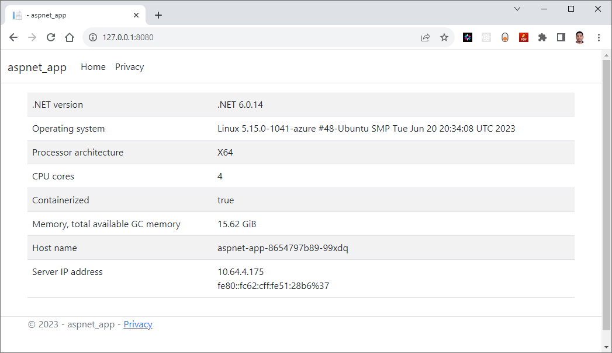
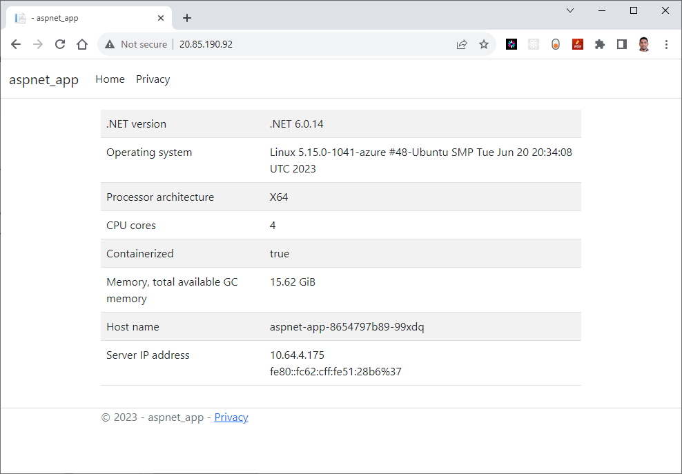

<!-- #  Deploying an ASP.NET Core MVC application in (AKS): -->

## Introduction

These step-by-step instructions guide you through the process of deploying an ASP.NET Core MVC application in Azure Kubernetes Service (AKS). In this tutorial, you will learn how to create Kubernetes YAML manifest files essential for application deployment, and you'll deploy the application using the `kubectl` tool. Additionally, we'll ensure the application is accessible over the internet by the end of the process.


## Prerequisites:
Before you begin, make sure you have the following prerequisites:

1. **Azure Account:** You need an active Azure account.

2. **Azure CLI:** Install the Azure Command-Line Interface (CLI) on your local machine.

3. **Kubectl:** Install `kubectl`, the Kubernetes command-line tool, on your local machine.

4. **Docker:** You'll need Docker installed to build container images for your application.
5. **Azure Container Registry (ACR)** [Create Azure Container Registry (ACR) using terraform](../azure/9-acr.md)
6. **Azure Kubernetes Service (AKS)** [Create Azure Kubernetes Service (AKS) using terraform](../azure/11-aks.md)

## Objective

In this exercise we will accomplish & learn how to implement following:

- **Step 1:** Create Your ASP.NET Core MVC Application
- **Step 2:** Dockerize Your Application
- **Step 3:** Push the Docker Image to Azure Container Registry (ACR)
- **Step 4:** Create Kubernetes YAML Manifests
- **Step 5:** Apply the manifests to your AKS cluster
- **Step-6:** Port forwarding
- **Step-6:** Expose the service externally
- **Step-7:** Verify that the application is running

## Implementation details

Below are the step-by-step implementation details. Before you begin this lab, please ensure that you are already connected to your Azure subscription and have access to your AKS cluster.

**login to Azure**

Verify that you are logged into the right Azure subscription before start anything in visual studio code

``` sh
# Login to Azure
az login 

# Shows current Azure subscription
az account show

# Lists all available Azure subscriptions
az account list

# Sets Azure subscription to desired subscription using ID
az account set -s "anji.keesari"
```

**Connect to Cluster**
``` sh
# Azure Kubernetes Service Cluster User Role
az aks get-credentials -g "rg-aks-dev" -n "aks-cluster1-dev"

# Azure Kubernetes Service Cluster Admin Role
az aks get-credentials -g "rg-aks-dev" -n "aks-cluster1-dev" --admin

# get nodes
kubectl get no
kubectl get namespace -A
```

## Step 1: Create Your ASP.NET Core MVC Application

If you haven't already, create an ASP.NET Core MVC application. You can use Visual Studio code. Ensure your application runs locally before containerizing it.

Check this for more information - [Create your first website using .NET Core MVC](https://microservices.anjikeesari.com/microservices/6.aspnet-app/#step-1-create-a-new-aspnet-core-web-app-mvc-project)

## Step 2: Dockerize Your Application

- Create a Dockerfile in your application's root directory to containerize your ASP.NET Core application.
- Build the Docker image:
- Test the image locally:

Check this for more information - [Create your first website using .NET Core MVC](https://microservices.anjikeesari.com/microservices/6.aspnet-app/#step-4-add-dockerfiles-to-the-mvc-project)

## Step 3: Push the Docker Image to Azure Container Registry (ACR)

To deploy your image to AKS, you need to store it in a container registry like Azure Container Registry (ACR). 

1. Create an ACR in your Azure subscription using the Azure Portal or Azure CLI.
2. Push your Docker image to the ACR:

Check this for more information - [Create your first website using .NET Core MVC](https://microservices.anjikeesari.com/microservices/6.aspnet-app/#step-6-docker-run-locally)


## Step 4: Create Kubernetes YAML Manifests

Now, create YAML manifests for your ASP.NET Core MVC application. You'll typically need two files: one for the Deployment and another for the Service.

**Create a new namespace**

We are going to deploy our application in separate namespace in AKS instead of in `default` namespace. use this command to create new namespace in Kubernetes cluster. Let's name our namespace as `sample`

``` sh
kubectl create namespace sample
```

**Deployment YAML (deployment.yaml)**

```yaml
apiVersion: apps/v1
kind: Deployment
metadata:
  name: aspnet-app
  namespace: sample
spec:
  replicas: 1
  selector: 
    matchLabels:
      app: aspnet-app
  strategy:
    type: RollingUpdate
    rollingUpdate:
      maxSurge: 1
      maxUnavailable: 1
  minReadySeconds: 5 
  template:
    metadata:
      labels:
        app: aspnet-app
    spec:
      nodeSelector:
        "kubernetes.io/os": linux
      serviceAccountName: default
      containers:
        - name: aspnet-app
          image: acr1dev.azurecr.io/sample/aspnet-app:20230312.1
          imagePullPolicy: Always
          ports:
            - name: http
              containerPort: 80
              protocol: TCP

# kubectl apply -f deployment.yaml -n sample
```

**Service YAML (service.yaml)**

```yaml
apiVersion: v1
kind: Service
metadata:
  name: aspnet-app
  namespace: sample
  labels: {}
spec:
  type: ClusterIP #LoadBalancer
  ports:
    - port: 80
      targetPort: 80
      protocol: TCP
      name: http
  selector: 
    app: aspnet-app

# kubectl apply -f service.yaml -n sample
```

## Step 5: Apply the manifests to your AKS cluster

Apply the YAML manifests to deploy your ASP.NET Core MVC application:

```bash
kubectl apply -f deployment.yaml
kubectl apply -f service.yaml
```
Verify the kubernetes objects deployment

```bash
kubectl get all -n sample 

# output
NAME                                      READY   STATUS    RESTARTS   AGE
pod/aspnet-api-79b4cbf4bb-5dljg           1/1     Running   0          20h
pod/aspnet-app-8654797b89-99xdq           1/1     Running   0          50m

NAME                         TYPE        CLUSTER-IP      EXTERNAL-IP   PORT(S)   AGE
service/aspnet-api           ClusterIP   10.25.69.201    <none>        80/TCP    178d
service/aspnet-app           ClusterIP   10.25.243.72    <none>        80/TCP    50m

NAME                                 READY   UP-TO-DATE   AVAILABLE   AGE
deployment.apps/aspnet-api           1/1     1            1           12d
deployment.apps/aspnet-app           1/1     1            1           50m

NAME                                            DESIRED   CURRENT   READY   AGE
replicaset.apps/aspnet-api-79b4cbf4bb           1         1         1       12d
replicaset.apps/aspnet-app-8654797b89           1         1         1       50m
```
## Step-6: Port forwarding

Kubernetes port forwarding is a feature that allows you to access a Kubernetes service running inside a cluster from outside the cluster. It works by forwarding traffic from a local port on your machine to a port on a pod in the cluster.


Once the deployment is complete, you can access your ASP.NET Core MVC application via port-forwarding. 

```bash
kubectl port-forward svc/aspnet-app 8080:80 -n sample

#output
Forwarding from 127.0.0.1:8080 -> 80
Forwarding from [::1]:8080 -> 80
Handling connection for 8080
Handling connection for 8080
Handling connection for 8080
```



## Step-6: Expose the service externally

Once the deployment is complete, you can access your ASP.NET Core MVC application via the `LoadBalancer` external IP address. You can find the IP address using the following command:

Here's an example AKS service manifest that exposes a service externally:

``` yaml
apiVersion: v1
kind: Service
metadata:
  name: aspnet-app
  namespace: sample
  labels: {}
spec:
  type: LoadBalancer
  ports:
    - port: 80
      targetPort: 80
      protocol: TCP
      name: http
  selector: 
    app: aspnet-app

# kubectl apply -f service.yaml -n sample
```
In this example, the type field is set to `LoadBalancer`, which tells AKS to create a public IP address and a load balancer in front of the service. 

run the `kubectl apply` again to create the service.

``` sh
kubectl apply -f service.yaml -n sample
# service/aspnet-api configured
```
Once the service is created, you can use the `kubectl get services` command to retrieve the external IP address assigned to the service:

``` sh
kubectl get services aspnet-app -n sample

# The output should include the external IP address:
NAME         TYPE           CLUSTER-IP     EXTERNAL-IP    PORT(S)        AGE
aspnet-app   LoadBalancer   10.25.243.72   20.85.190.92   80:30227/TCP   71m
```

!!! Note
    EXTERNAL-IP is updated here with new public IP address, now you should be able to access your service externally.


## Step-7: Verify that the application is running

You can now use the external IP address to access the ASP.NET Core MVC application from outside the cluster.

<http://20.85.190.92/>




## Conclusion

Your ASP.NET Core MVC application should now be running on Azure Kubernetes Service (AKS).