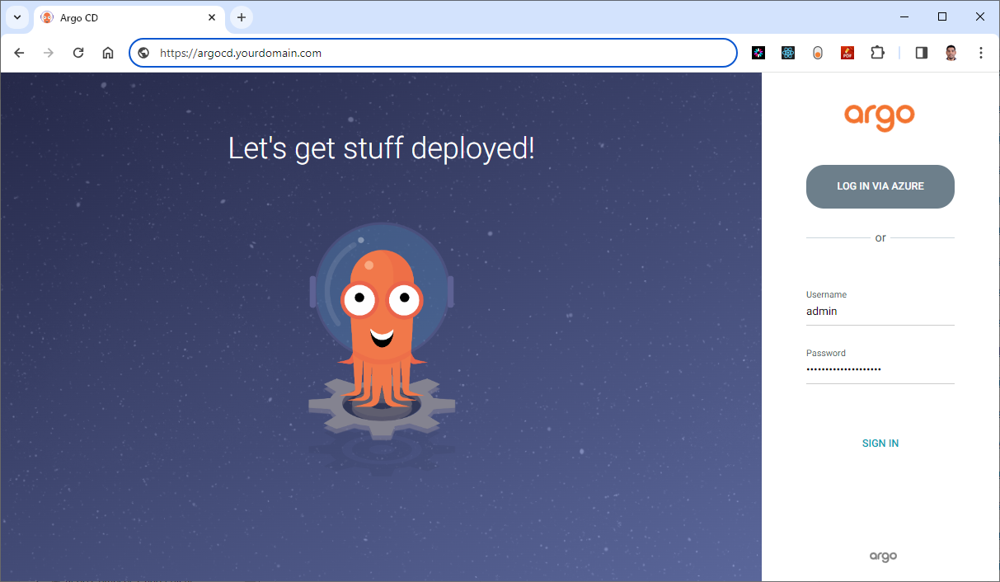
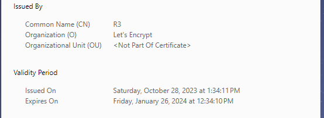

## Introduction

Ensuring the security of your website is crucial, and implementing HTTPS through a valid SSL/TLS certificate is a importent step. In this guide, we'll use Let's Encrypt, a trusted Certificate Authority (CA) known for providing free certificates.

This tutorial will show you how to obtain a Cert-Manager Certificate using Let's Encrypt for our Argocd website's domain URL. We'll use Terraform, a powerful infrastructure-as-code tool, to simplify and automate the HTTPS implementation.

## Technical Scenario

As a `Cloud Engineer`, your task is to secure the domain URL of your ArgoCD deployment in a Kubernetes environment. The challenge is not only to obtain certificates from reputable authorities like Let's Encrypt but also to ensure their fully automated renewal every three months.


## Prerequisites

Before proceeding with this exercise, ensure you have the following in place:


- An active Azure subscription [Link](https://azure.microsoft.com/en-us/free/)
- Terraform installed and configured [Guide](https://www.terraform.io/downloads)
- Azure CLI installed [Guide](https://learn.microsoft.com/en-us/cli/azure/install-azure-cli)
- Kubectl installed and set up [Guide](https://kubernetes.io/docs/tasks/tools/install-kubectl-windows/)
- A Functioning Kubernetes cluster
- Setup Cert-Manager in AKS using Terraform
- Installed ArgoCD in AKS cluster


## Objective

In this exercise, we will cover the following steps to implement issue the Let's Encrypt SSL Certificate to the Website:

1. **Step-1:** Install Cert-Manager

2. **Step-2:** Create Clusterissuer Issuer YAML file

3. **Step 3:** Veryfiy ArgoCD Pods status in AKS cluster

4. **Step 4:** Configure Ingress for ArgoCD

5. **Step 5:** Add new DNS zone record set for Argocd custom domain

6. **Step 6:** Verify Certificates

7. **Step 7:** Access ArgoCD via HTTPS

<!-- ## Architecture Diagram

Below is a high-level architecture diagram depicting the components involved in Cert-Manager:

[Diagram Placeholder - Working on it...]
 
 -->


**login to Azure**

Verify that you are logged into the right Azure subscription before start anything in visual studio code

``` sh
# Login to Azure
az login 

# Shows current Azure subscription
az account show --output table

# Lists all available Azure subscriptions
az account list --output table

# Sets Azure subscription to desired subscription using ID
az account set -s "anji.keesari"
```

**Connect to Cluster**

To interact with your Azure Kubernetes Service (AKS) cluster, you need to establish a connection. Depending on your role, you can use either the User or Admin credentials:

``` sh
# Azure Kubernetes Service Cluster User Role
az aks get-credentials -g "rg-aks-dev" -n "aks-cluster1-dev"

# Azure Kubernetes Service Cluster Admin Role
az aks get-credentials -g "rg-aks-dev" -n "aks-cluster1-dev" --admin

# verify the aks connection by running following commands
kubectl get no
kubectl get namespace -A
```
## Implementation Details

The steps given below will guide you through the process of setting up and using Cert-Manager in our AKS cluster. By the end of this exercise, you'll have a functional environment for automating the management of TLS certificates within Kubernetes.

## Step-1: Install Cert-Manager


Cert-Manager is a Kubernetes add-on that helps with the management of certificates. In our previous lab, we've already created cert-manager using terraform. [Setup Cert-Manager in AKS using Terraform](./5-cert-manager.md)

```sh
kubectl get all -n cert-manager

#output
NAME                                           READY   STATUS    RESTARTS   AGE
pod/cert-manager-5674b9b755-97hvg              1/1     Running   0          32d
pod/cert-manager-cainjector-557c547f54-7hh2r   1/1     Running   0          32d
pod/cert-manager-webhook-86868b95db-sqddc      1/1     Running   0          32d

NAME                           TYPE        CLUSTER-IP      EXTERNAL-IP   PORT(S)    AGE
service/cert-manager           ClusterIP   10.25.117.167   <none>        9402/TCP   88d
service/cert-manager-webhook   ClusterIP   10.25.63.104    <none>        443/TCP    88d

NAME                                      READY   UP-TO-DATE   AVAILABLE   AGE
deployment.apps/cert-manager              1/1     1            1           88d
deployment.apps/cert-manager-cainjector   1/1     1            1           88d
deployment.apps/cert-manager-webhook      1/1     1            1           88d

NAME                                                 DESIRED   CURRENT   READY   AGE
replicaset.apps/cert-manager-5674b9b755              1         1         1       88d
replicaset.apps/cert-manager-cainjector-557c547f54   1         1         1       88d
replicaset.apps/cert-manager-webhook-86868b95db      1         1         1       88d
```

Now, let's streamline the process further by Issue the Let's Encrypt SSL Certificate to one our ArgoCD Website .

## Step-2: Create Clusterissuer YAML file

The purpose of a ClusterIssuer in AKS (Azure Kubernetes Service) is to manage the issuance and renewal of TLS certificates for an AKS cluster.

Create a file `clusterissuer-nginx.yaml`` with the following content:

``` yaml title="clusterissuer-nginx.yaml"
apiVersion: cert-manager.io/v1
kind: ClusterIssuer
metadata:
  name: letsencrypt
spec:
  acme:
    server: https://acme-v02.api.letsencrypt.org/directory
    email: anjkeesari@gmail.com
    privateKeySecretRef:
      name: letsencrypt
    solvers:
    - http01:
        ingress:
          class: nginx
          podTemplate:
            spec:
              nodeSelector:
                "kubernetes.io/os": linux

#kubectl apply -f cert-manager/clusterissuer.yaml -n sample
```

loading cluster issuer file using terraform

``` tf title="cert_manager.tf"
locals {
  clusterissuer = "cert-manager/clusterissuer-nginx.yaml"
}

# Create clusterissuer for nginx YAML file

data "kubectl_file_documents" "clusterissuer" {
  content = file(local.clusterissuer)
}
```

Create ClusterIssuer using terraform

``` tf title="cert_manager.tf"
# Apply clusterissuer for nginx YAML file

resource "kubectl_manifest" "clusterissuer" {
  for_each  = data.kubectl_file_documents.clusterissuer.manifests
  yaml_body = each.value
  depends_on = [
    data.kubectl_file_documents.clusterissuer
  ]
}
```
**Testing**

Get more information about clusterissuer:


```
kubectl describe clusterissuer letsencrypt
```

Output

``` sh
Name:         letsencrypt
Namespace:
Labels:       <none>
Annotations:  <none>
API Version:  cert-manager.io/v1
Kind:         ClusterIssuer
Metadata:
 .
 .
 .
Status:
  Acme:
    Last Private Key Hash:  XyQWbNfKPyMk77tcC5HPrjudqf/Fnl7YbHCPqniQz0Y=
    Last Registered Email:  anjkeesari@gmail.com
    Uri:                    https://acme-v02.api.letsencrypt.org/acme/acct/1278195356
  Conditions:
    Last Transition Time:  2023-08-27T19:25:54Z
    Message:               The ACME account was registered with the ACME server
    Observed Generation:   1
    Reason:                ACMEAccountRegistered
    Status:                True
    Type:                  Ready
Events:                    <none>
```

## Step-3: Veryfiy ArgoCD Pods status in AKS cluster


The installation of ArgoCD in our AKS environment involves distinct steps, and the process has different step. Installing ArgoCD in AKS is done in this lab - [Install ArgoCD CLI](./../devops/argocd/install-argocd-cli.md)

Now, let's ensure the smooth functioning of ArgoCD by verifying the status of its pods within the AKS cluster before issuing the let's encrypt SSL certificate to the website.

```sh
kubectl get all -n argocd

# output
NAME                                                    READY   STATUS    RESTARTS   AGE
pod/argocd-application-controller-0                     1/1     Running   0          31d
pod/argocd-applicationset-controller-848fc4dcfb-8bxvb   1/1     Running   0          32d
pod/argocd-dex-server-56888697cd-652xv                  1/1     Running   0          32d
pod/argocd-notifications-controller-5cd6fc4886-7ds87    1/1     Running   0          32d
pod/argocd-redis-b54b4ccd8-pgtd5                        1/1     Running   0          32d
pod/argocd-repo-server-78998f9d78-gfskb                 1/1     Running   0          32d
pod/argocd-server-c799cf854-v8tjn                       1/1     Running   0          32d

NAME                                       TYPE           CLUSTER-IP      EXTERNAL-IP     PORT(S)                      AGE
service/argocd-applicationset-controller   ClusterIP      10.25.250.229   <none>          7000/TCP                     263d
service/argocd-dex-server                  ClusterIP      10.25.247.199   <none>          5556/TCP,5557/TCP            263d
service/argocd-redis                       ClusterIP      10.25.211.159   <none>          6379/TCP                     263d
service/argocd-repo-server                 ClusterIP      10.25.233.23    <none>          8081/TCP                     263d
service/argocd-server                      LoadBalancer   10.25.115.123   20.124.172.79   80:30119/TCP,443:30064/TCP   263d

NAME                                               READY   UP-TO-DATE   AVAILABLE   AGE
deployment.apps/argocd-applicationset-controller   1/1     1            1           263d
deployment.apps/argocd-dex-server                  1/1     1            1           263d
deployment.apps/argocd-notifications-controller    1/1     1            1           263d
deployment.apps/argocd-redis                       1/1     1            1           263d
deployment.apps/argocd-repo-server                 1/1     1            1           263d
deployment.apps/argocd-server                      1/1     1            1           263d

NAME                                                          DESIRED   CURRENT   READY   AGE
replicaset.apps/argocd-applicationset-controller-848fc4dcfb   1         1         1       263d
replicaset.apps/argocd-dex-server-56888697cd                  1         1         1       263d
replicaset.apps/argocd-notifications-controller-5cd6fc4886    1         1         1       263d
replicaset.apps/argocd-redis-b54b4ccd8                        1         1         1       263d
replicaset.apps/argocd-repo-server-78998f9d78                 1         1         1       263d
replicaset.apps/argocd-server-c799cf854                       1         1         1       263d

NAME                                             READY   AGE
statefulset.apps/argocd-application-controller   1/1     263d
```
## Step-4: Configure Ingress for ArgoCD

Ensure that ArgoCD is accessible via an Ingress. Create a file `argocd-ingress.yaml`:

Added the following annotations to the regular ingress file to make it HTTPS.

**annotations**

```sh
  appgw.ingress.kubernetes.io/ssl-redirect: "true"
  cert-manager.io/cluster-issuer: letsencrypt
  cert-manager.io/acme-challenge-type: http01
```
**spec->tls**

```sh
  tls:
  - hosts:
    - argocd.yourdomain.com
    secretName: tls-secret
```

Here is the sample Application Gateway Ingress controller YAML file with SSL enabled:

``` yaml title="argocd-ingress.yaml"
apiVersion: networking.k8s.io/v1
kind: Ingress
metadata:
  name: argocd
  namespace: argocd
  annotations:
    kubernetes.io/ingress.class: azure/application-gateway
    appgw.ingress.kubernetes.io/backend-path-prefix: "/"
    appgw.ingress.kubernetes.io/health-probe-status-codes: "200-499"
    appgw.ingress.kubernetes.io/ssl-redirect: "true"
    cert-manager.io/cluster-issuer: letsencrypt
    cert-manager.io/acme-challenge-type: http01
spec:
  tls:
  - hosts:
    - argocd.yourdomain.com
    secretName: tls-secret
  rules:
    - host: argocd.yourdomain.com
      http:
        paths:
          - path: /
            pathType: Prefix
            backend:
              service:
                name: argocd-server
                port:   
                  number: 80
          - path: /argocd/*
            pathType: Prefix
            backend:
              service:
                name: argocd-server
                port:
                 number: 80
status:
  loadBalancer:
    ingress:
      - ip: 20.100.100.100
      
# kubectl apply -f argocd/argocd-ingress.yaml -n argocd
```


loading argocd-ingress file using terraform

``` tf title="helm_argocd.tf"
locals {
  argocd_ingress = "argocd/argocd-ingress.yaml"
}

# Create argocd ingress file
data "kubectl_file_documents" "argocd_ingress" {
  content = file(local.argocd_ingress)
}
```

Create argocd ingress using terraform

``` tf title="helm_argocd.tf"

# Apply argocd ingress file
resource "kubectl_manifest" "argocd_ingress" {
  for_each  = data.kubectl_file_documents.argocd_ingress.manifests
  yaml_body = each.value
  depends_on = [
    data.kubectl_file_documents.argocd_ingress
  ]
}

```

## Step-5: Add new record in Azure DNS Zone for Argocd custom domain

Follow these steps to add Records sets from Azure portal

- Inside the Azure DNS Zone, click on "+Records sets" button.
- Configure the new record set in "Add record set"
- Name: Enter the subdomain or record name (e.g., argocd).
- Type: Choose the record type (e.g., A for IP address of argocd).
- TTL (Time to Live): Set the TTL for the record.
- IP Address or Alias: Enter the IP address of argocd.
- Click on "OK" to create the new record.

CLI commands to add records sets

```sh
# add-record example
az network dns record-set a add-record --ipv4-address "20.100.100.100" --record-set-name "argocd" --resource-group "rg-publicdns-dev" --zone-name "yourdomain.com"

# delete-record example
az network dns record-set a delete --name "argocd" --resource-group "rg-publicdns-dev" --zone-name "yourdomain.com" --yes
```
## Step-6: Verify Certificates

Check if the certificate has been successfully obtained. It might take a few minutes:

```sh
kubectl get certificate -n argocd

# output
NAME         READY   SECRET       AGE
tls-secret   True    tls-secret   85d
```

Describe certificate to see the details, you will also notice this message `Certificate is up to date and has not expired`

```sh
kubectl describe certificate/tls-secret -n argocd

Name:         tls-secret
Namespace:    argocd
Labels:       <none>
Annotations:  <none>
API Version:  cert-manager.io/v1
Kind:         Certificate
Metadata:
 .
 .
 .
Spec:
  Dns Names:
      argocd.yourdomain.com
  Issuer Ref:
    Group:      cert-manager.io
    Kind:       ClusterIssuer
    Name:       letsencrypt
  Secret Name:  tls-secret
  Usages:
    digital signature
    key encipherment
Status:
  Conditions:
    Last Transition Time:  2023-08-29T22:33:37Z
    Message:               Certificate is up to date and has not expired
    Observed Generation:   1
    Reason:                Ready
    Status:                True
    Type:                  Ready
  Not After:               2024-01-26T20:34:10Z
  Not Before:              2023-10-28T20:34:11Z
  Renewal Time:            2023-12-27T20:34:10Z
  Revision:                2
Events:                    <none>
```
## Step-7: Access ArgoCD via HTTPS

Once the certificate is issued, access your ArgoCD instance securely via HTTPS:

```sh
https://argocd.yourdomain.com

```
Custom doamin with Valid SSL Certificate:



Certificate Issued By and validity period details:



You've successfully issued an SSL certificate to our ArgoCD website using Let's Encrypt.

## Reference:

Here is a list of resources that were used as references during the development of this technical scenario:
<!-- 
1. [Cert-Manager Documentation - Installing with Helm](https://cert-manager.io/docs/installation/helm/#option-2-install-crds-as-part-of-the-helm-release)
2. [Artifact Hub - Cert-Manager Helm Chart](https://artifacthub.io/packages/helm/cert-manager/cert-manager)
3. [Azure AKS Ingress TLS Documentation](https://learn.microsoft.com/en-us/azure/aks/ingress-tls?tabs=azure-cli)
4. [Setup Let's Encrypt ClusterIssuer with Terraform](https://stackoverflow.com/questions/68511476/setup-letsencrypt-clusterissuer-with-terraform) -->
