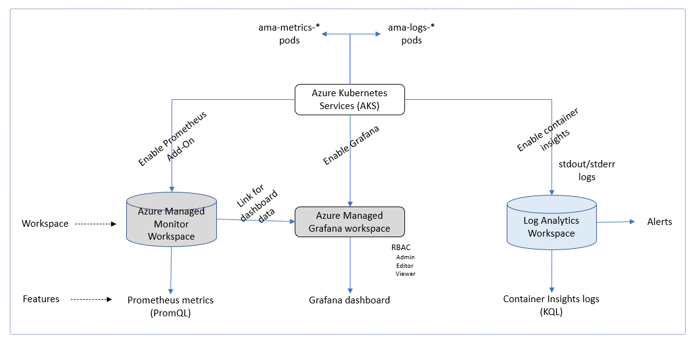

# **Monitor AKS with Azure Managed Services for Prometheus & Grafana**

## **Introduction**

Monitoring is essential for effectively managing Kubernetes clusters and ensuring the smooth operation of applications within them. By implementing robust monitoring, organizations can:

- **Ensure Performance**: Track key metrics such as CPU, memory, and storage to prevent bottlenecks, optimize workloads, and allocate resources efficiently.  
- **Enhance Reliability**: Detect issues like node failures, pod crashes, or application errors early to minimize downtime and ensure a seamless user experience.  
- **Enable Troubleshooting**: Leverage real-time logs and metrics to diagnose and resolve issues swiftly.  

Azure Monitor simplifies Kubernetes monitoring with a comprehensive suite of tools for Kubernetes environments:

- **Managed Prometheus**: A fully managed service for collecting metrics, enabling developers to focus on insights rather than infrastructure.  
- **Container Insights**: Provides detailed telemetry data, including performance metrics and logs, offering visibility into workloads on Azure Kubernetes Service (AKS).  
- **Managed Grafana**: Offers customizable and visually appealing dashboards, empowering teams to make data-driven decisions.  

## **Architecture Diagram**

The following diagram shows the high level architecture of monitor AKS with azure managed services for Prometheus & Grafana

[{:style="border: 1px solid black; border-radius: 10px;"}](images/image-1.png){:target="_blank"}

Before enabling monitoring in AKS, understanding the key open-source tools, Prometheus and Grafana, is crucial as they form the backbone of many Kubernetes monitoring solutions.

## **Prometheus**
Prometheus is a widely adopted open-source monitoring and alerting system, well-suited for cloud-native environments like Kubernetes. Initially developed by SoundCloud, it is now part of the Cloud Native Computing Foundation (CNCF).

Key Features:

- **Time-Series Database**: Stores metrics data as time-series for easy trend analysis.  
- **Pull-Based Data Collection**: Scrapes metrics from endpoints, reducing reliance on external pushes.  
- **Kubernetes Integration**: Natively integrates with Kubernetes, automatically discovering services and pods.  
- **PromQL**: A powerful query language for analyzing collected metrics.  
- **Alerting**: Built-in rules trigger notifications based on specific conditions.  

## **Grafana**

Grafana is a leading open-source visualization and analytics platform that integrates seamlessly with a wide range of data sources, including Prometheus.

Key Features:

- **Customizable Dashboards**: Create personalized dashboards with various visualization options.  
- **Multiple Data Sources**: Supports integration with Prometheus, Elasticsearch, Azure Monitor, and more.  
- **Alerting**: Provides robust alerting mechanisms that integrate with tools like Slack, PagerDuty, or email.  

## **Azure Managed Services for Monitoring**
Azure enhances Kubernetes monitoring by providing managed services that extend popular open-source tools like Prometheus and Grafana.

### **Azure Managed Prometheus**
Azure offers Prometheus as a fully managed service through Azure Monitor, removing the need for manual infrastructure management.

Key Features:

- **Fully Managed**: No setup, scaling, or maintenance required.  
- **Native AKS Integration**: Simplifies metrics collection with automatic Kubernetes object discovery.  
- **Preconfigured Features**: Includes built-in alerts, rules, and dashboards.  
- **Centralized Metrics Storage**: Stores Prometheus metrics in an Azure Monitor workspace.  
- **Seamless Integration**: Works with Azure services, including AKS and Azure Managed Grafana.  
- **Comprehensive Analysis**: Query metrics using PromQL or visualize them in Metrics Explorer and Grafana.  

For more detailed information about Prometheus and its capabilities, refer to the [official Azure documentation](https://learn.microsoft.com/en-us/azure/azure-monitor/essentials/prometheus-metrics-overview).

### **Azure Monitor Workspace**

Azure Monitor workspaces store metric data collected by Azure Monitor, focusing primarily on Prometheus metrics.

Difference Between Azure Monitor Workspace and Log Analytics Workspace:

| Feature                 | Azure Monitor Workspace       | Log Analytics Workspace       |
|-------------------------|-------------------------------|--------------------------------|
| **Data Type**           | Prometheus metrics           | Logs, traces, and some metrics data |
| **Use Case**            | Metrics-based monitoring     | Centralized log and trace analysis |
| **Query Language**      | PromQL                       | KQL (Kusto Query Language)    |
| **Visualization Tools** | Metrics Explorer, Managed Grafana | Log Analytics, Workbooks, and third-party tools |

**Note**: Azure Monitor workspaces currently focus on Prometheus metrics but aim to unify storage for all Azure Monitor-collected metrics.

To explore more about Azure Monitor workspace capabilities, visit the [official documentation](https://learn.microsoft.com/en-us/azure/azure-monitor/essentials/azure-monitor-workspace-overview/).

### **Azure Managed Grafana Workspace**

Azure Managed Grafana Workspace offers a fully managed Grafana service, allowing teams to visualize and analyze monitoring data without managing infrastructure.

Key Features:

- **Fully Managed Service**: Handles setup, updates, scaling, and maintenance.  
- **Integrated with AKS**: Connects seamlessly to AKS and Azure Managed Prometheus.  
- **Pre-Built Dashboards**: Provides curated dashboards for common use cases.  
- **Azure AD Integration**: Secure access with role-based permissions via Azure Active Directory (Azure AD).  
- **Custom Visualization**: Supports a wide range of visualization plugins and custom dashboards.  

To explore more about Azure managed workspace capabilities, visit the [official documentation](https://learn.microsoft.com/en-us/azure/managed-grafana/overview/).

**Workspaces and Features**

Different Azure services require specific workspaces for monitoring data storage and management.

| **Feature**            | **Workspace**                  | **Description**                                          |
|------------------------|--------------------------------|----------------------------------------------------------|
| **Managed Prometheus** | Azure Monitor Workspace       | Stores Prometheus metrics from AKS and other Azure services. |
| **Container Insights** | Log Analytics Workspace       | Stores logs and performance data from AKS containers.    |
| **Managed Grafana**    | Azure Managed Grafana Workspace | Hosts the managed Grafana service for data visualization.|

**Explanation of Workspaces**

- **Azure Monitor Workspace**: Focuses on real-time metrics storage, particularly Prometheus metrics.  
- **Log Analytics Workspace**: A centralized repository for log data, used for deep insights and dashboards.  
- **Azure Managed Grafana Workspace**: Dedicated to visualizing data with Grafana’s customizable dashboards.  

